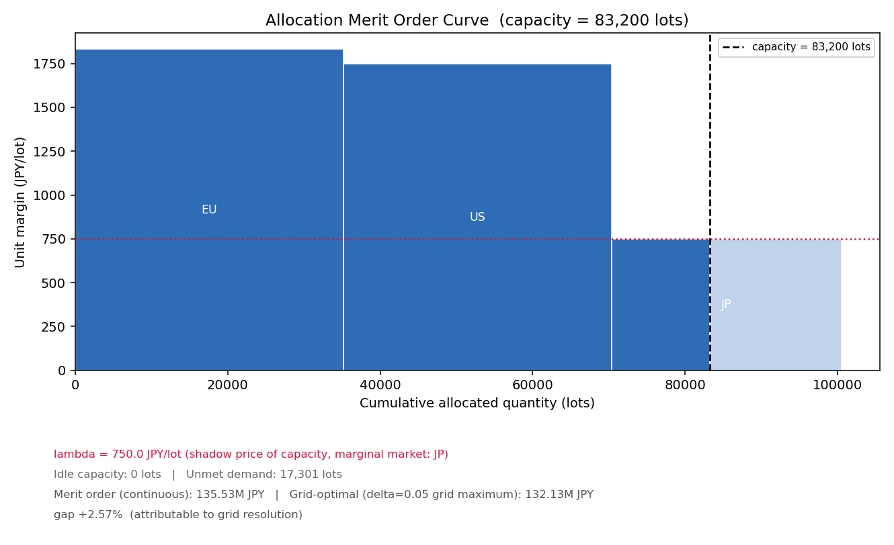
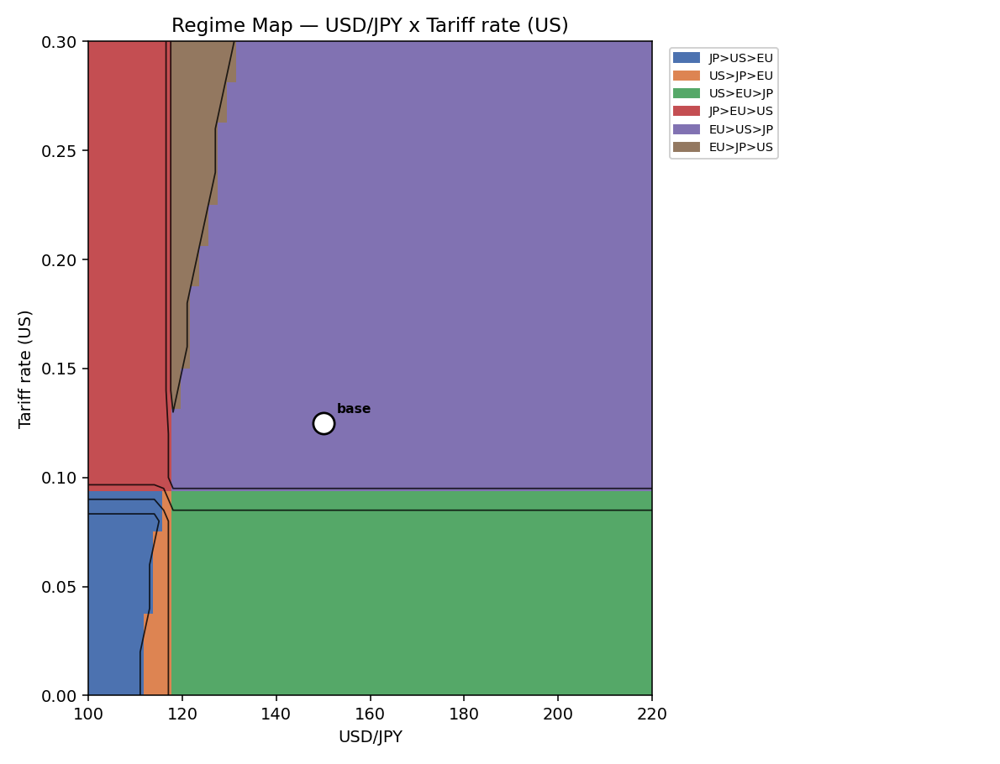

# WOM (Weekly Operation Model)

**週次PSIで、サプライチェーンの意思決定を「見える化」し、動かして確かめる。**

[](https://doi.org/10.5281/zenodo.21431264)

> **English (Summary)**
>
> WOM (Weekly Operation Model) is a Python/tkinter desktop tool that simulates an
> end-to-end supply chain — from raw material sourcing through manufacturing,
> distribution, and sales — on a **weekly PSI (Production / Sales / Inventory)**
> cadence. It connects three layers (Physical nodes on a world map → Planning
> logic (SC Tree + PSI) → Management KPIs / Profit-Price-Cost simulation), so you
> can see, week by week, how a demand shock, a capacity constraint, a tariff
> change, or a buffer-stock placement decision actually plays out — and how it
> shows up in P&L. It is not a solver that hands you "the optimal answer"; it is
> a model you run, watch, and reason about.
>
> Built as an ongoing AI-assisted "vibe coding" collaboration. For AI coding
> agents, the common entry point is `AGENTS.md`. Claude Code may also read
> `CLAUDE.md` for Claude-specific historical context, but canonical WOM knowledge
> is maintained under `docs/`.

---

## AI coding agents / Vibe Coding entry point

If you are an AI coding agent working on WOM, start by reading **`AGENTS.md`** at the repository root.

`AGENTS.md` is the AI-neutral entry point for Claude Code, ChatGPT Codex, Grok, Gemini, and other AI-assisted development environments. It explains what to read before editing, how to distinguish implementation facts from design intent, and how to keep WOM knowledge in the repository rather than only in chat logs.

Recommended starting path:

```text
AGENTS.md
  -> docs/development/README.md
  -> docs/architecture/README.md
  -> docs/design/README.md
  -> docs/scenarios/README.md
```

`CLAUDE.md` may still contain Claude-specific context and historical notes, but the canonical WOM knowledge should be maintained under `docs/`.

---

## これは何か

WOMは、**「週次」というリズムで経営の意思決定とサプライチェーンの現場オペレーションを接続する**、実行可能なシミュレーションモデルです。

- 需要予測・生産能力・リードタイム・安全在庫・関税や為替といった条件を入力すると、
- 週次のPSI（Production / Sales / Inventory：生産・出荷・在庫）が原材料調達から販売チャネルまで一気通貫で計算され、
- その結果が World Map（拠点の地理的配置）・Network（サプライチェーン構造）・Management（経営KPI・損益）の3つの視点で、そのままGUIに現れます。

目的は「最適解を求める」ことではなく、**需要変動・制約・在庫配置ルールが週次オペレーションと損益にどう波及するかを、最後まで実行して確認できること**です。

---

## 画面イメージ

**起動〜モデルロード**


**World Map（拠点の地理的配置）**


**Network / PSIチャート（Buffer Stock推移など）**


**Management Cockpit（Strategic KPI・Node P&L）**


**PPC Cockpit（Profit Zone）**


**メリットオーダー曲線（配分版・v1r4m0）**

市場を単位マージンの降順に積み、能力線との交点で λ が決まる。注記の `gap +2.57% (attributable to grid resolution)` は、連続解と231点格子の差が**全量、格子の目の粗さで説明できる**ことを示している。



**レジーム地図（為替 × 米国関税率・v1r4m0）**

色は市場の優先順位、境界線は**判断が反転する条件**。白丸が現在地（150円 / 関税12.5%）で、117円付近の縦の境界を割ると優先市場が入れ替わる。



> このほかに **Merit Order Shift**（外部環境の前後比較・`alloc_merit_shift.png`）と
> **レジーム地図（為替 × 原材料価格）**（`alloc_regime_map.png`）も生成されます。
> 4枚とも `docs/images/` に置いてあります。読み方は note 記事
> 「[利益地形図で読み解く事業計画](https://note.com/osuosu1123/n/nde1d9b686a6e)」で解説しています。
>
> ```bash
> python -m tools.plot_allocation_merit_regime --model-dir data/sample/soysauce-jpy-2027-alloc --demo
> ```

---

## 主な機能

| 機能 | 概要 |
|---|---|
| 週次PSI計画エンジン | BackwardPlanner（需要逆伝播）→ ForwardPlanner（供給制約適用）で、原材料〜販売チャネルまでの週次PSIを一気通貫で計算 |
| World Map | 拠点の実位置を地図上に表示（tkintermapview） |
| Network | SCTree構造をNetworkXでHammockグラフ表示 |
| PPC（Profit Price Cost）エンジン | サプライヤー原価→関税/為替→転送価格→市場売価→粗利をロットレベルで計算 |
| Landed Cost / Tariff & FX | 関税・為替・輸送費シナリオを比較（現地生産 vs 越境輸入の判断材料に） |
| Buffering Stock 配置最適化 | 安全在庫をどのノードに置くのがコスト最適か、サービスレベル制約付きで自動探索 |
| Node P&L（拠点別損益） | どのノードにコストが集中しているかをGUI上で可視化 |
| プラグイン機構 | 季節生産・長期休暇・能力上書き・需要平準化などをコアを変更せず追加可能 |

**v1r4m0 で追加（生産配分の利益分析 — 年次「どの市場に何個供給するか」）**

| 機能 | 概要 |
|---|---|
| 利益地形図（`ask_global_allocation`） | 配分比率の単体を δ=0.05 で全数評価（3市場なら231点）し、「最適な一点」ではなく**利益の面**を返す。峰・尾根・台地・判断が反転する境界を見るための図 |
| メリットオーダー曲線 | 市場を単位マージンの降順に積み、能力線との交点から **λ（能力のシャドープライス）** を得る。「能力を1 lot 増やすと利益がいくら増えるか」を金額で示す |
| レジーム地図 | 為替 × 関税率 などの外部環境パラメータ平面を塗り分け、**どこで優先市場が入れ替わるか**（決定反転の境界）を描く。平面は常に2次元なので市場数 N に依存しない |
| パレート＋平行座標 | Cost / Quality / Lead Time のトレードオフを非劣解として示し、各案の供給構造を平行座標で読む |
| 構造由来の取りこぼし（`structural_optimality_gap`） | 「単価の良い順に積む」という貪欲な判断が、関税の崖のような**閾値構造**によって全体最適を外す量を金額で算出。ゼロなら貪欲法で判断してよい、非ゼロならそこに構造がある、という読み方をする |

---

## クイックスタート（5分で動かす）

### 前提
- Python 3.10+
- 本リポジトリをclone済み（**`wom-v1r4m0` ブランチを推奨**・最新機能を含む）

```bash
git clone https://github.com/Yasushi-Osugi/wom_v1r0m0.git
cd wom_v1r0m0
git checkout wom-v1r4m0
```

### 1) 依存パッケージのインストール

```bash
pip install tkintermapview pandas numpy matplotlib openpyxl networkx pytest
```

### 2) GUI起動

```bash
python -m main
```

起動後、メニューから **「Load Model Folder...」** を選び、`data/sample/` 配下のいずれかのサンプルモデル（例：`rice-japan-2027-2028`）を指定 → **Run Planning** を実行すると、World Map / Network / Management / PPC の各タブに結果が表示されます。

### 3) CLI（ヘッドレス）で回す場合

```bash
python -m main --cli --start-week 2027-W01 --num-weeks 156
```

---

## サンプルモデル

| モデル | 業界 | 何を確認できるか |
|---|---|---|
| `rice-japan-2027-2028` | 国産米SC | 季節収穫（供給）と通年消費（需要）のギャップを在庫バッファで吸収する仕組み |
| `iphone-2027-2029` | グローバル製造業 | Multi-MOM配分、PUSH/PULLブレークポイント（DBR設計） |
| `Cookie-jp-2026` | 食品（国内生産 vs 輸入） | Landed Cost比較、複数段DADチェーンでの安全在庫バッファ最適配置 |
| `ev-thailand-2026` / `ev-europe-2026` | 自動車（現地生産 vs 越境輸入） | 複数Tier-1サプライヤーのコスト集計、拠点別損益（Node P&L） |
| `soysauce-jpy-2027-alloc` | 調味料（3市場へのグローバル配分） | **利益地形図**（231点の配分スキャン）、メリットオーダー曲線、レジーム地図、関税の崖による構造的な取りこぼしの検出。A系統（年次の市場配分）を扱う唯一のケースで、`ga_*.csv` を持つ |
| `india-ghee-2026` / `oil-global-2027` / `apparel-us-2026` / `smartx-2027-2029` ほか | 各種 | `data/sample/` 配下に全18ケース。上記以外も同じ手順でロードできる |

各モデルの背景・分析結果は note記事で解説しています（下記「関連記事」参照）。

---

## アーキテクチャ概要

WOMは2つの軸で構成されています。**実装の三層**と、**計画の三層**です。

**実装の三層**

```
Physical Layer  ←→  Planning Layer  ←→  Management Layer
(実ノード/地図)      (SCTree + PSI)       (KPI / PPC / P&L)
```

**計画の三層**（v1r4m0 で第1層が加わり、三層が揃いました）

```
第1層  配分  Management Planning   どの市場に、どれだけ供給するのが経営的に望ましいか
         ↓                          → 利益地形図・メリットオーダー・レジーム地図
第2層  配置  Backward Planning     いつ・どこで生産を開始しなければならないか
         ↓                          → Demand Anchored Lot への展開
第3層  実行  Forward Planning      その計画は、能力・在庫・LT の下で本当に実行できるか
         ↓                          → 週次 PSI・CO（Carry Over）
      損益評価  PPC                 実行可能なオペレーションから実際に得られる利益はいくらか
```

第1層は年次の「どの市場に何個」を、第3層は週次の「実行できるか」を扱います。**年間計画として成立することと、週次実行計画として成立することは別の問題**であり、その差を見ることがWOMの目的の一つです。

なお、可視化モジュールは対象問題によって2系統に分かれています。混同しやすいので明記します。

| 系統 | 対象問題 | 時間粒度 | 実装 |
|---|---|---|---|
| A系統 | どの市場に何個供給するか | 年次 | `wom/allocation/` |
| B系統 | どのサプライヤーから調達するか | 週次 | `wom/visualization/` |

同じ「メリットオーダー」でも、A系統は市場を**単位マージンの降順**に、B系統はサプライヤーを**単位コストの昇順**に積みます。並び順が逆になります。

サプライチェーンは InBound（調達・製造側）と OutBound（在庫・販売側）に分かれ、`supply_point` ノードで橋渡しされます。設計思想・データモデル・既知の実装上の注意点は、AI-neutralな知識基盤として **`AGENTS.md`** と **`docs/`** 配下に整理しています。`CLAUDE.md` はClaude Code向けの文脈や過去の開発履歴を含む補助ファイルとして扱い、WOMの正本となる知識は `docs/` に蓄積します。

---

## 関連note記事

WOMの設計思想や、実際の業界モデルを使った分析事例を記事として公開しています。

| 回 | タイトル | リンク |
|---|---|---|
| 第1回 | AIでサプライチェーンを可視化(米の例) | https://note.com/osuosu1123/n/ndacd400201a4 |
| 第2回 | スマートフォンの例 |https://note.com/osuosu1123/n/nc88e8cd0192e |
| 第3回 | クッキー事例（国内生産 vs 輸入、Landed Cost） | https://note.com/osuosu1123/n/n11c413ea31d5 |
| 第4回 | 現地生産 vs 越境輸入 — 欧州EV市場の例 | https://note.com/osuosu1123/n/n665ddf3b2609 |
| 最新 | **利益地形図で読み解く事業計画**（v1r4m0：配分の利益地形、メリットオーダー、レジーム地図、関税の崖） | https://note.com/osuosu1123/n/nde1d9b686a6e |

---

## 今後の拡張候補

**N市場化（Phase 6）** — 現在の利益地形図は3市場固定です。δ=0.05 の格子点数は市場数 N に対して `C(20+N-1, N-1)` で増え、N=21（`oil-global-2027` の市場数）では約1,378億点となって grid scan そのものが破綻します。市場を3つずつのグループに束ねる**階層化単体格子**なら三角図13枚 × 231点 = 3,003点に収まる見込みで、その近似誤差は `structural_optimality_gap` で金額として測れます。

- 6-1 `true_optimum` の実計算化 — **実装済み**（関税の崖の on/off を全列挙し、閾値を配分量の上下界として制約に持たせて厳密に解く）
- 6-2 次元の一般化（`MARKETS` / `simplex_grid` の N 次元化）
- 6-3 階層化単体格子（`hierarchical_simplex`）

**層間ハンドオフと経営コックピット（Phase 7-9）** — 現在、第1層で選んだ配分は第2層に自動で渡りません。計画案を1つの記録（Planning State）として層間で受け渡し、「いま見ている数字がどの前提・どの配分・どこまで検証した結果か」を常に示せるようにしたうえで、GUI を機能別メニューから**意思決定中心**の画面体系へ再設計する構想です。設計案は `requests/` 配下にあります。

**従来からの継続テーマ**

- summary_PL（SKU集計）とNode P&L（PPC集計）の整合性向上（通貨換算・価格伝播の統一）
- Profit CenterをHQ側（MOM nodesまたはsupply_point）にも持たせる仕組み（真の意味での拠点別・法人別損益、移転価格税制対応）
- InBound側のリードタイムオフセット拡張

これらのテーマに関心のある方からのIssue・Pull Requestを歓迎します。

---

## ライセンス

MIT License

---

## 開発の背景

WOMは、著者（大杉泰司）とAIとの継続的な「vibe coding」セッションを通じて開発されています。初期の設計・実装文脈はClaude Code向けの `CLAUDE.md` に多く蓄積されましたが、v1r1m5以降は `AGENTS.md` と `docs/` 配下にAI-neutralな開発知識を整理しています。1人のドメインエキスパートが、複数のAI開発支援環境と協働しながら、サプライチェーン・シミュレーションツールを継続的に拡張できることも、このプロジェクトが示している価値の一つです。
