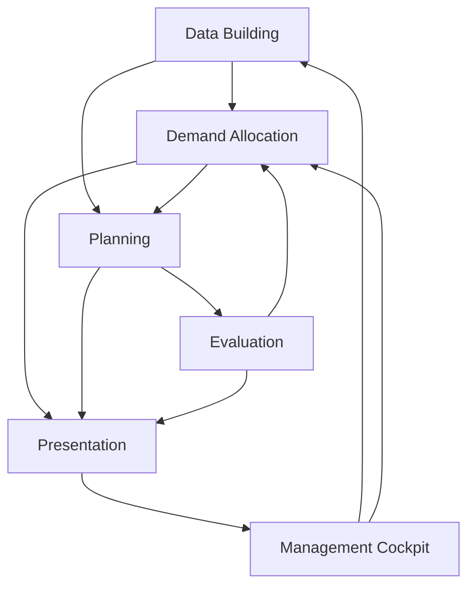

# WOM Knowledge Vault

**6つの主要機能から、設計・依頼・コード・テストへ。**

公開版: `wom-v1r4m0 / 4260494`

実験版: `wom-v1r5m0 / 7d6c7d7`。取得確認日: 2026-09-21。

## 機能別の入口

| 機能 | 役割 |
|---|---|
| [[10_Functions/01_Data_Building|Data Building]] | ネットワーク・需要・能力・原価・価格の前提を定義する。 |
| [[10_Functions/02_Demand_Allocation|Optimization on Demand Allocation]] | 限られた供給能力を市場・需要に配分し、利益構造と採用案を比較する。 |
| [[10_Functions/03_Planning|Planning]] | 選択された需要を週次PSIへ展開し、供給・能力・在庫・注文残を計算する。 |
| [[10_Functions/04_Evaluation|Evaluation]] | 物量の実現性と金額上の結果を区別して評価する。 |
| [[10_Functions/05_Presentation|Presentation]] | 構造・時系列・利益地形・選択肢を説明可能にする。 |
| [[10_Functions/06_Management_Cockpit|Management Cockpit]] | 前提・配分案・実行結果を一つの意思決定手順で扱う。 |

## 全体関係

矢印は業務機能上の関係を示す整理案。全経路が自動接続済みという意味ではない。

- [[00_Start/Function_Map.canvas|配置図（Canvas）]]
- [[00_Start/Source_Index|全資料索引]]
- [[00_Start/Source_Policy|基準・出典・更新方法]]
- [[00_Start/Decisions_and_Gaps|未確定事項・記述の不一致]]
- [[00_Start/Glossary|用語対応]]
