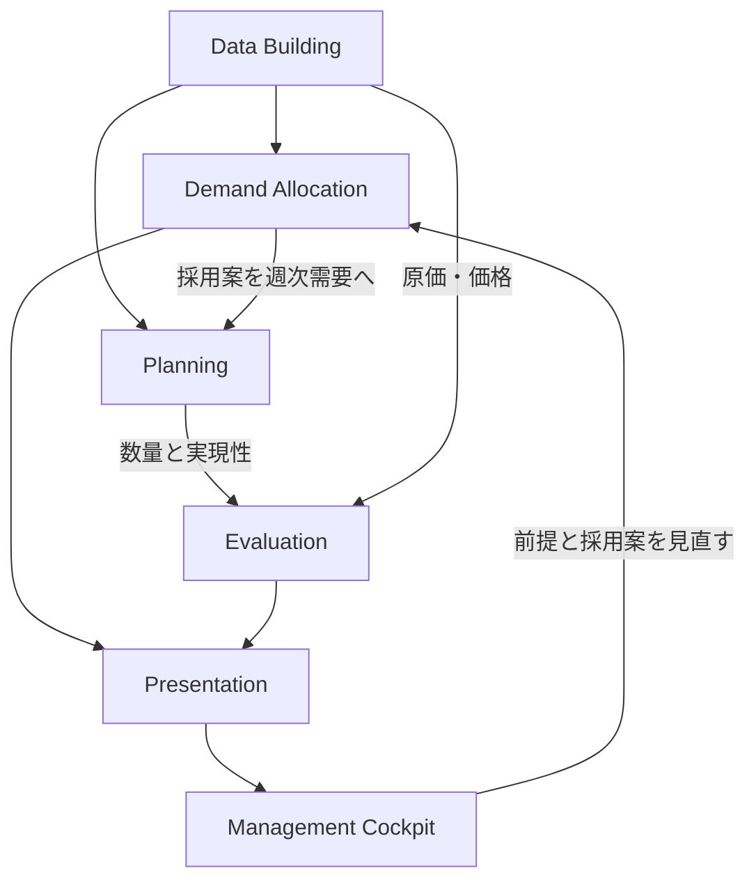

# 業務フローとインターフェース

矢印は業務上の受渡しを表す。全ての経路が同一画面で自動接続済みという意味ではない。

| 受渡し | 内容 | 境界で確認すること |
|---|---|---|
| Data Building → Allocation | 市場需要・能力・CostBlock・シナリオ | 単位、通貨、期間、uom |
| Allocation → Planning | 採用市場配分を地域・週へ展開 | 整数総量、需要ゼロ週、対象外地域 |
| Backward → Forward | 需要と配置をSupply計算の初期状態へ | Demand不変、必要週と供給週 |
| Yard → Assembly | 同一需要IDの全部材と能力 | 払出と完成の対応、未完了kit保持 |
| PSI → PPC | bridgeが読む供給計画上の販売数量 | Sとactual、末端と中間、販売認識 |
| Allocation/PPC → 差異評価 | 採用案と実行結果 | 数量・FX前提・残差を分離 |
| 評価 → 人の判断 | 利益、在庫、充足、資金、制約 | 最適ベンチマークと採用判断を分離 |

A系統（市場需要配分）とB系統（調達候補の多目的分析）は、同名のMerit OrderやRegime Mapを持っていても同じインターフェースではない。
