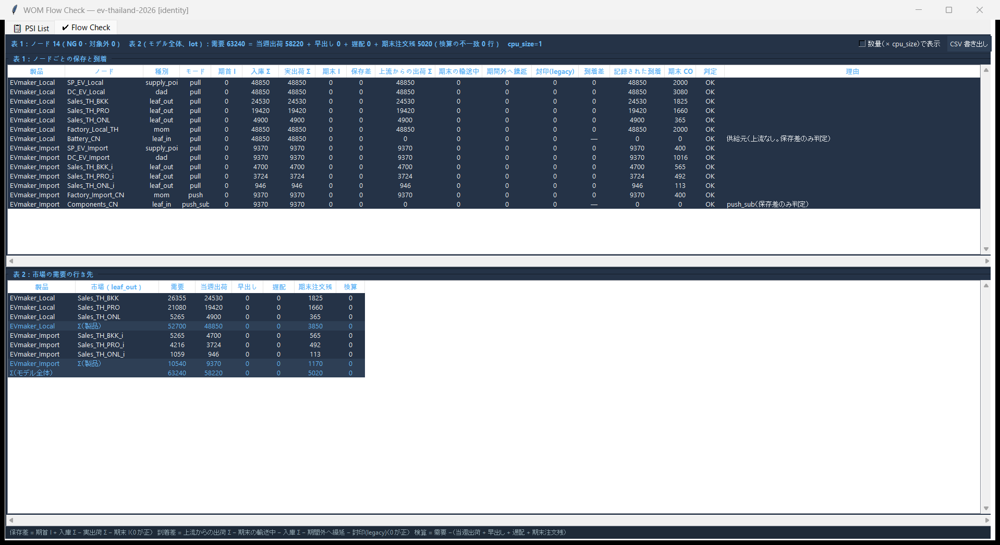
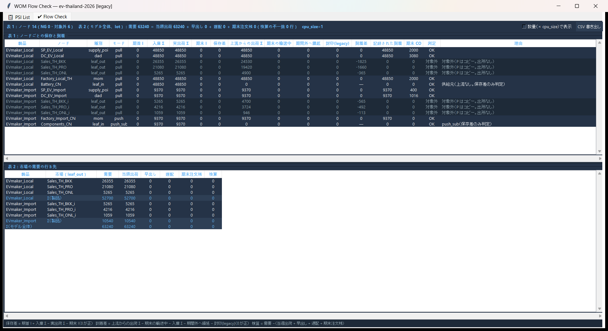
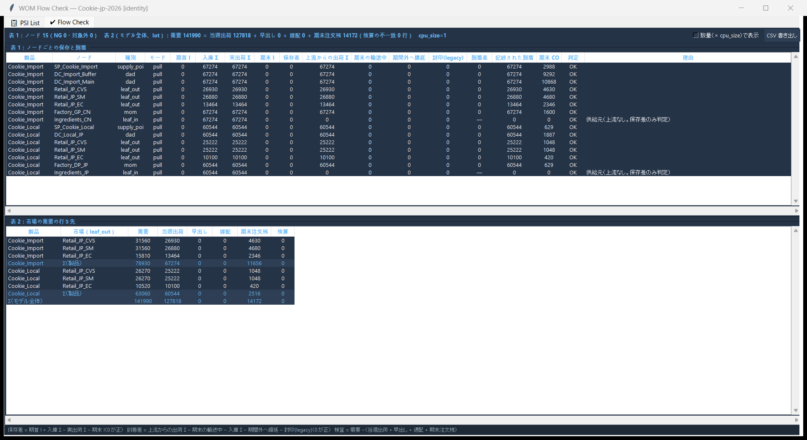

# 流れの見える化（Flow Check）・cap_hard の名前の整理・warmup の試行　報告

- 依頼書：`requests/RequestLetter_FlowCheck_CapNaming_WarmupTrial_to_CodeKun.md`
- 前提：決定記録 `docs/design/WOM_Forward_LotID_Decision_Record_2026-09-29.md`（v1.2）、`docs/development/WOM_LotIdentityFlow_Report.md`、`docs/development/WOM_LOVEM_StageC_Report.md`、`docs/design/planning_warmup_and_reporting_horizon.md`
- 実装：Code君（Claude Code, Windows）、2026-09-30
- 作業フォルダ／ブランチ：`wom-v1r5m1_cap_trial`
- **着手時の SHA：`16a2d59`**
- **commit・push はしていない。golden は再生成していない。`data/sample/` の原本は変更していない**（Part 3 は `output/warmup_trial/` のコピーで実施）。
- スクリーンショット：`docs/development/flow_check_warmup/`

---

## 0. 要約

1. **Part 1**
   - **V1**：S を「要求（Demand Position）」と書き改めた。画面の凡例 4 か所、コメント・docstring、設計文書 4 件、CLAUDE.md を、まとめて直した（§1.1）。
   - **V2**：PSI List に Ship（実出荷）列と合計行（Σ）を加えた。PSI Chart には実出荷の細い線を、Export には `ship_qty` 列を加えた。
   - **V3**：Flow Check（表 1：ノードごとの保存と到着、表 2：市場の需要の行き先）を `wom/engine/flow_check.py` に作った。GUI の Network タブのサブタブ「✔ Flow Check」と、headless の CSV から同じ関数を呼ぶ。
2. **V3 の受け入れ**
   - **ev-thailand（identity）**：表 2 は「需要 63,240 ＝ 当週出荷 58,220 ＋ 遅配 0 ＋ 期末注文残 5,020」で、段階 C と一致した。表 1 は全ノードが OK。
   - **ev-thailand（legacy）**：市場 leaf の 6 ノードが「対象外（P はコピー。出所なし）」になり、到着差の合計は **−5,020** で、段階 C の 5,020 と一致した。
   - **Cookie（identity）**：DC_Import_Buffer と DC_Import_Main の実出荷 Σ が、どちらも **67,274** になった。
   - **15 ケース（identity）**：表 1 の NG は **1 件**（ev-thailand-2026_update の Factory_Local_TH の保存差 52,400。legacy でも同じ）。既知の「複数の Tier-1 部材の構成で P が重複する」不具合を検出したもので、原因の証拠を §3.4 に示す（直していない）。
3. **Part 2**：identity では `cap_hard_sealed` を加算せず 0 のままにし、`cap_hard_deferred_lots`（繰り延べを受けた lot、重複なし）と `cap_hard_deferred_lot_weeks`（のべ lot 週）を記録する。headless のスナップショットは、identity のときだけ `forward` にこの 2 つを書く。legacy は変わらない。
4. **legacy は 1 ビットも変わらない**：16 ケースで、全ノード・全バケット・全週の Lot_ID 列、`_actual_s`、Forward/Backward の結果、スナップショット、PPC の出力ファイル 6 種まで、HEAD `16a2d59` と一致した（§2）。
5. **Part 3（warmup の試行、identity、コピーで実施）**

   | モデル | 期末注文残を 0 にした最小の warmup_lt | §13.1 の式による必要週数 |
   |---|---:|---:|
   | ev-thailand | **14** | 14（一致） |
   | Cookie | **15** | 13（式では足りない。Backward が能力で押し戻した分を式が含まないため、§5.3） |
   | soysauce-jpy（対照） | — | warmup を外すと期末注文残 **14,926** が現れた（26 週のときは 0）。warmup が効いていることを確認した |

   - どの条件でも、Flow Check の NG は 0 件。
   - 助走週の日付の PPC イベントは 0 件（§5.5）。
6. **ev-thailand の 200 件**：原因をコードと証拠で特定した（§5.4）。push の Mode 4 は、部材の生産を「push ノードの 4 週（push_lead_time_weeks）先の要求」から作る。そのため、計画の最初の 4 週に要求がある lot は、生産週が負になり、どの週にも置かれない。段階 C の「部材の輸送 LT 2 週なら間に合う」という読みは、Mode 4 が輸送 LT ではなく push の lead time で前倒しすることを含んでいなかった。warmup_lt=14 で 200 件とも消えた。
7. テスト：全テストは **589 passed / 3 skipped / 1 failed**。
   - 失敗の 1 件は `test_merit_order_plot.py::test_plot_regime_matrix` の Tk の初期化エラー（`TclError: invalid command name "tcl_findLibrary"`）で、今回の変更とは関係しない描画のテスト。
   - 単独で流し直すと緑になった（同じファイル・`test_flow_check.py`・`test_gui_panel_invariants.py` の計 88 passed / 3 skipped）。§6 S8。
   - 新規 `tests/test_flow_check.py` の 9 件を含む。golden は 13 件とも legacy で緑。

---

## 1. Part 1・2 の変更点

### 1.1 V1　S の名前と説明（直した箇所の一覧）

| 種類 | 場所 | 変更 |
|---|---|---|
| 画面 | `wom/gui/app.py` Network タブ PSI Chart（計画結果から描く方） | 凡例 `S: Sales/Fulfilled` → `S: Request (Demand Position)` |
| 画面 | 同 PSI Chart（ノードの PSI から描く方） | 同上。docstring も |
| 画面 | Debug パネルの PSI グラフ | 凡例 `S: Sales/Shipment` → `S: Request (Demand Position)` |
| 画面 | PSI List の列見出し・合計の文言 | `S (Request)` / `Ship (actual)`、下部に「S はそのノードへの要求（Demand Position）。実出荷は Ship 列」 |
| コメント | `wom/model/plan_node.py`（保護対象、コメントのみ） | 冒頭の S の定義、バケット定数のコメント。あわせて「Forward：parent.P[w] → child.S[w+LT]」（S を供給として説明していた誤り）を「供給元の実出荷 → 受け手の P。Forward は S を書かない」に訂正 |
| コメント | `wom/engine/event_timeline.py` | `s_count` の「fulfilled lots」→「requested lots（要求。実出荷ではない）」 |
| コメント | `wom/gui/app.py` Charts の Harvest Input | 「S = 出荷＝収穫量」→「Demand レイヤーの S ＝農場への要求。実出荷ではない」 |
| docstring | `wom/gui/app.py` `_draw_cost_from_plan_node` | S × 価格の売上は「要求ベース」であり実出荷ではない旨を注記（計算は変えていない、§6 S2） |
| docstring | `wom/engine/sc_tree_to_df.py`、`wom/data/schema.py` | `demand_fulfilled` は S（要求）の件数であり実出荷ではない旨を注記。実出荷は新しい列 `ship_qty` |
| 文書 | `docs/design/wom_canonical_concepts.md` | `S = Sales / Shipment` → `S = Request (Demand Position)` と実出荷の説明 |
| 文書 | `docs/design/psi_ppc_separation.md` | `S = Sales or Shipment` → 同上。PPC の販売数量は実出荷であることを追記 |
| 文書 | `docs/design/demand_anchored_lot.md` | `S = lots requested or shipped` → 要求だけ。実出荷は別の記録 |
| 文書 | `docs/design/inbound_safety_stock.md` | 「子自身の S（出荷）」→「S（要求。この場面では実出荷と同じ週）」 |
| 文書 | `CLAUDE.md` | バケット定数の `S = 0 # Sales / 出荷` → 要求。KPI の表の Fill Rate・Sell-through・Revenue を実出荷ベースの説明に |

直さなかったもの（理由）：

- 過去の報告書（`docs/development/*_Report.md`）：当時の記録として残す。
- `docs/design/drafts/*`：他の人の草案・レビューの記録なので。
- `AGENTS.md` の「PSI: Production or Purchase, Ship or Sales, Inventory」：PSI という略語の説明であり、バケット S の定義ではないので。

### 1.2 V2　Ship 列・合計行・実出荷の線・Export

- PSI List（`PSIListPanel`）
  - S の右に Ship（`len(node._actual_ship[w])`）を加えた。`_actual_ship` が無いときは `—`。
  - Demand レイヤーでは Ship 列を隠す。
  - 最下行に Σ 行を加えた。S・Ship・P は期間の合計、I・CO は期末の値で、行の見出しは「Σ（I・CO は期末）」。
  - 行の Lot_ID の欄に、Ship の Lot_ID も並べる。
  - 表の中身は、Tk に依存しない関数 `psi_list_table(node, layer)` で作る（テストで確かめる）。
- PSI Chart：実出荷を細い紫の線（`Ship: actual shipment`）で重ねる。両方の描き方に対応した。
- Export to CSV／Excel：計画結果の DataFrame に `ship_qty`（実出荷 × cpu_size）列を加えた。Export は DataFrame をそのまま書くので、この列が含まれる。既存の列（`demand_fulfilled` など）は変えていない。

### 1.3 V3　Flow Check

- **計算**：`wom/engine/flow_check.py`（新規・Tk に依存しない）。`compute_flow_check(sc_tree, {product: ForwardPlanResult})` と `write_flow_check_csv(fc, out_dir)`。
- **記録（保護対象 `forward_planner.py` への追加。記録だけで、計画は変えない）**
  - `edge_flows`：(送り手, 受け手, 出荷週, 到着週, 件数)。対象は `_propagate_to_parent`・`_propagate_to_child`・push のデカップリング点から親への直接の送り・MOM→supply_point のブリッジ・Kitting の置場から組立ノードへの払い出し。計画期間の外に届く分も記録する。
  - `p_copied_node_ids`：P を需要 P のコピーで作ったノード。
  - `opening_inv_counts`：期首在庫の件数。
- **表 1 の列**
  - 依頼書の列に、次の 3 列を加えた（§7 の 1）。
    - 期間外へ繰延：休業・能力で繰り延べた lot のうち、計画期間の終わりを越えて P から外れた分。
    - 封印(legacy)：legacy の Step 0a で P から消えた lot。
    - 記録された到着：`edge_flows` による突き合わせ用。
  - **到着差 ＝ 上流からの出荷 Σ − 期末の輸送中 − 入庫 Σ − 期間外へ繰延 − 封印(legacy)**
  - **上流からの出荷 Σ** は、供給元の実出荷を経路（Lot_ID → 市場 leaf → 子）で振り分けて、独立に数える。legacy でデカップリング点より下流へ届ける処理が呼ばれない場合にも、不整合が見えるようにするため。
- **判定の規則**（上から順に当てはめる）
  1. 保存差 ≠ 0 → NG
  2. Kitting の組立ノード → 対象外（Kitting）
  3. P のコピー → 対象外（P はコピー。出所なし）。到着差の値はそのまま出す。
  4. 需要に無い ID を P・I・実出荷に持つ → 対象外（需要に無い ID）
  5. push_sub・上流の無い供給元 → 保存差だけを判定し、到着差は「—」
  6. 到着差 ≠ 0 → NG
  7. それ以外 → OK
- **表 2**
  - 需要・当週出荷・遅配・期末注文残・検算に加えて、「早出し」の列を置いた（要求週より前に出荷した数。identity では 0 のはず）。
  - 検算 ＝ 需要 −（当週出荷 ＋ 早出し ＋ 遅配 ＋ 期末注文残）
  - 製品ごとの小計と、モデル全体の行がある。
- **数量の列**：CSV は `*_qty`（× cpu_size）の列を持つ。画面は「数量（× cpu_size）で表示」の切り替えで表示する。
- **GUI**
  - Network タブの下段に 3 つ目のサブタブ「✔ Flow Check」を置いた。上段が表 1（NG は赤、対象外は灰色）、下段が表 2。
  - `_planning_thread` で製品ごとの ForwardPlanResult を集め、`load_planning_tree(..., forward_results=...)` で渡す。
  - 「CSV 書き出し」ボタンは `output/flow_check/<モデル名>/` に書く。
- **headless**
  - `run(..., flow_check_dir=None)`：指定したときだけ CSV を書く（スナップショットには入れない）。
  - CLI の `--flow-check-out`（既定 `output/flow_check`）では、`<これ>/<モデル名>/` に `flow_check_nodes.csv`・`flow_check_market.csv` を書く。

### 1.4 Part 2　cap_hard の名前（直した箇所の一覧）

| 場所 | 変更 |
|---|---|
| `forward_planner.py` `ForwardPlanResult` | `cap_hard_deferred_lots`・`cap_hard_deferred_lot_weeks` を追加。`record_cap_hard_deferred(node, week, lots)` は lot の一覧を受け取り、`cap_hard_sealed` を加算しない。重複なしの単位は（ノード, Lot_ID）。`cap_hard_events` は両方式で「cap_hard が効いた週」の記録のまま（legacy は封印の件数、identity は繰り延べの件数）。`__str__` も方式で表示を分ける |
| `tools/run_headless_from_folder.py` | スナップショットの `forward`：legacy は従来どおり、identity は `cap_hard_deferred_lots`・`cap_hard_deferred_lot_weeks`・`cap_soft_violation_count`（`cap_hard_sealed` は書かない）。CLI の表示も分けた（以前は identity で KeyError になる書き方だった）。能力系列のコメントの「封印」を「legacy は封印、identity は繰り延べ」に |
| `tools/sweep_flags.py` | `forward` を同じ規則で分けた |
| `tools/probe_composite_baseline.py` | 要約に `lot_flow_mode`・`cap_hard_deferred_lots`・`cap_hard_deferred_lot_weeks` を追加（`sealed` は残す） |
| `wom/lovem/observer.py` | forward_result の記録：identity は `cap_hard_deferred_*`、legacy は `cap_hard_sealed` |
| `docs/development/lovem/DATA_DICTIONARY.md` | `forward_cap_hard_events` の件数の意味が方式で違うこと、既知の未取得の項目を「封印（legacy）／繰り延べ（identity）」に |
| `wom/cockpit/s3_view_model.py` | S3 の結論の 2 行目：identity のときは「上限に張り付き（翌週へ繰り延べ）」、legacy は従来どおり「（需要が溢れた）」。コメントも |
| `wom/cockpit/s3_run.py` | コメントのみ |

identity の値（例）：smartphone は `cap_hard_deferred_lots` 55,413・lot 週 55,413。smartx は 19,887・19,887。rice（参考）は 183,888・1,913,694。ev_update は 1,166・1,166。

### 1.5 テスト

- 新規 `tests/test_flow_check.py`（9 件）
  - identity：全ノード OK、市場の検算 0、leaf の上流からの出荷 ＝ DC の実出荷 ＝ 入庫。
  - legacy：デカップリング点の下は対象外で、到着差が負。MOM の封印を記録し、MOM は OK。
  - 期末の輸送中の突き合わせ。
  - 計画の記録が無いときは対象外。
  - CSV の書き出し。
  - 記録は計画を変えない。
  - PSI List の Ship と Σ 行。
  - identity は繰り延べ・legacy は封印。
  - headless のスナップショットの forward の項目名と CSV。
- 書き換え（identity で `cap_hard_sealed` を読んでいた 3 件）：`test_capacity_soft.py`、`test_step7_capacity.py::test_build_mom_capacity_profile`、`test_lot_identity_flow.py::test_a1_*`。件数（2・1・正）は同じまま、`cap_hard_deferred_lots` で確かめ、`cap_hard_sealed == 0` も確かめる。

---

## 2. legacy が変わらないこと

- 方法：LotIdentityFlow と同じ指紋の比較（`legacy_fingerprint.py`、ハッシュシード 0）。今回加えた記録用のフィールド（`edge_flows`・`p_copied_node_ids`・`opening_inv_counts`・`cap_hard_deferred_*`）は比較から除いた。
- 比較の相手：HEAD `16a2d59` のコード（`git archive`）。
- 結果：**16 ケースすべて一致（ALL IDENTICAL: True）**。
  - 比べたもの：全ノード・全バケット・全週の Lot_ID 列、`_actual_s`、Forward/Backward の結果、スナップショット、PPC の出力ファイル 6 種。
- `tests/test_golden.py`：13 件とも legacy で緑（全テストの中で確認）。

---

## 3. Flow Check の受け入れ

### 3.1 ev-thailand-2026（identity）

表 1（期首 I・期間外へ繰延・封印はすべて 0 なので省略）：

| 製品 | ノード | 種別/モード | 入庫 Σ | 実出荷 Σ | 期末 I | 保存差 | 上流からの出荷 Σ | 期末の輸送中 | 到着差 | 記録された到着 | 期末 CO | 判定 | 理由 |
|---|---|---|---:|---:|---:|---:|---:|---:|---:|---:|---:|---|---|
| EVmaker_Local | SP_EV_Local | supply_point/pull | 48850 | 48850 | 0 | 0 | 48850 | 0 | 0 | 48850 | 2000 | OK |  |
| EVmaker_Local | DC_EV_Local | dad/pull | 48850 | 48850 | 0 | 0 | 48850 | 0 | 0 | 48850 | 3080 | OK |  |
| EVmaker_Local | Sales_TH_BKK | leaf_out/pull | 24530 | 24530 | 0 | 0 | 24530 | 0 | 0 | 24530 | 1825 | OK |  |
| EVmaker_Local | Sales_TH_PRO | leaf_out/pull | 19420 | 19420 | 0 | 0 | 19420 | 0 | 0 | 19420 | 1660 | OK |  |
| EVmaker_Local | Sales_TH_ONL | leaf_out/pull | 4900 | 4900 | 0 | 0 | 4900 | 0 | 0 | 4900 | 365 | OK |  |
| EVmaker_Local | Factory_Local_TH | mom/pull | 48850 | 48850 | 0 | 0 | 48850 | 0 | 0 | 48850 | 2000 | OK |  |
| EVmaker_Local | Battery_CN | leaf_in/pull | 48850 | 48850 | 0 | 0 | 0 | 0 | — | 0 | 0 | OK | 供給元（上流なし。保存差のみ判定） |
| EVmaker_Import | SP_EV_Import | supply_point/pull | 9370 | 9370 | 0 | 0 | 9370 | 0 | 0 | 9370 | 400 | OK |  |
| EVmaker_Import | DC_EV_Import | dad/pull | 9370 | 9370 | 0 | 0 | 9370 | 0 | 0 | 9370 | 1016 | OK |  |
| EVmaker_Import | Sales_TH_BKK_i | leaf_out/pull | 4700 | 4700 | 0 | 0 | 4700 | 0 | 0 | 4700 | 565 | OK |  |
| EVmaker_Import | Sales_TH_PRO_i | leaf_out/pull | 3724 | 3724 | 0 | 0 | 3724 | 0 | 0 | 3724 | 492 | OK |  |
| EVmaker_Import | Sales_TH_ONL_i | leaf_out/pull | 946 | 946 | 0 | 0 | 946 | 0 | 0 | 946 | 113 | OK |  |
| EVmaker_Import | Factory_Import_CN | mom/push | 9370 | 9370 | 0 | 0 | 9370 | 0 | 0 | 9370 | 400 | OK |  |
| EVmaker_Import | Components_CN | leaf_in/push_sub | 9370 | 9370 | 0 | 0 | 0 | 0 | — | 0 | 0 | OK | push_sub（保存差のみ判定） |

表 2：

| 製品 | 市場 | 需要 | 当週出荷 | 早出し | 遅配 | 期末注文残 | 検算 |
|---|---|---:|---:|---:|---:|---:|---:|
| EVmaker_Local | Sales_TH_BKK | 26,355 | 24,530 | 0 | 0 | 1,825 | 0 |
| EVmaker_Local | Sales_TH_PRO | 21,080 | 19,420 | 0 | 0 | 1,660 | 0 |
| EVmaker_Local | Sales_TH_ONL | 5,265 | 4,900 | 0 | 0 | 365 | 0 |
| EVmaker_Local | Σ（製品） | 52,700 | 48,850 | 0 | 0 | 3,850 | 0 |
| EVmaker_Import | Sales_TH_BKK_i | 5,265 | 4,700 | 0 | 0 | 565 | 0 |
| EVmaker_Import | Sales_TH_PRO_i | 4,216 | 3,724 | 0 | 0 | 492 | 0 |
| EVmaker_Import | Sales_TH_ONL_i | 1,059 | 946 | 0 | 0 | 113 | 0 |
| EVmaker_Import | Σ（製品） | 10,540 | 9,370 | 0 | 0 | 1,170 | 0 |
| **Σ（モデル全体）** | | **63,240** | **58,220** | 0 | **0** | **5,020** | 0 |

- 段階 C（`WOM_LOVEM_StageC_Report.md` §6・§7）の「市場の期末注文残 Local 3,850・Import 1,170、計 5,020」「当週出荷 58,220」と一致した。
- 表 1 は、すべて OK（保存差 0、到着差 0）。



### 3.2 ev-thailand-2026（legacy）

表 1 のうち、identity と違う行（ほかは同じ）：

| 製品 | ノード | 入庫 Σ | 実出荷 Σ | 上流からの出荷 Σ | 到着差 | 判定 |
|---|---|---:|---:|---:|---:|---|
| EVmaker_Local | Sales_TH_BKK | 26,355 | 26,355 | 24,530 | −1,825 | 対象外（P はコピー。出所なし） |
| EVmaker_Local | Sales_TH_PRO | 21,080 | 21,080 | 19,420 | −1,660 | 同上 |
| EVmaker_Local | Sales_TH_ONL | 5,265 | 5,265 | 4,900 | −365 | 同上 |
| EVmaker_Import | Sales_TH_BKK_i | 5,265 | 5,265 | 4,700 | −565 | 同上 |
| EVmaker_Import | Sales_TH_PRO_i | 4,216 | 4,216 | 3,724 | −492 | 同上 |
| EVmaker_Import | Sales_TH_ONL_i | 1,059 | 1,059 | 946 | −113 | 同上 |
| EVmaker_Import | Factory_Import_CN | 9,370 | 9,370 | 9,370 | 0 | OK（期末 CO 0：legacy の push は CO を持たない） |

- 到着差の合計は **−5,020**。段階 C の「legacy の市場 P のうち 5,020 ID は親の実出荷がない」と一致する。
- 表 2 は、需要 63,240 ＝ 当週出荷 63,240（legacy では市場の S と実出荷が一致するため）。



### 3.3 Cookie-jp-2026（identity）と 15 ケース

- Cookie_Import の実出荷 Σ：**DC_Import_Buffer 67,274、DC_Import_Main 67,274**（legacy は 67,274 と 78,142）。LotIdentityFlow 報告書 §5.3 と一致した。



15 ケース（identity／legacy）の結果：

| ケース | identity の NG | identity の対象外 | identity の表 2（需要 = 当週 + 遅配 + 期末注文残） | legacy の NG | legacy の対象外 |
|---|---:|---:|---|---:|---:|
| Cookie-jp-2026 | 0 | 0 | 141,990 = 127,818 + 0 + 14,172 | 0 | 7 |
| apparel-global-2028-2029 | 0 | 0 | 181,526 = 174,282 + 0 + 7,244 | 0 | 8 |
| apparel-us-2026 | 0 | 0 | 249,172 = 249,172 + 0 + 0 | 0 | 48 |
| bom-test-2026 | 0 | 1（Kitting） | 100 = 100 + 0 + 0 | 0 | 2 |
| ev-europe-2026 | 0 | 2（Kitting） | 53,140 = 49,420 + 0 + 3,720 | 0 | 8 |
| ev-thailand-2026 | 0 | 0 | 63,240 = 58,220 + 0 + 5,020 | 0 | 6 |
| smartphone-global-2026-2029 | 0 | 0 | 470,924 = 373,090 + 0 + 97,834 | 0 | 9 |
| oil-global-2027 | 0 | 0 | 191,058 = 177,016 + 0 + 14,042 | 0 | 21 |
| rice-japan-2027-2028（参考。実運用は legacy） | 0 | 2（需要に無い ID） | 235,316 = 0 + 142,914 + 92,402 | 0 | 16 |
| smartx-2027-2029 | 0 | 0 | 709,811 = 676,850 + 16,073 + 16,888 | 0 | 8 |
| soysauce-eu-2027 | 0 | 0 | 100,501 = 85,575 + 0 + 14,926 | 0 | 10 |
| soysauce-jpy-2027 | 0 | 0 | 100,501 = 100,501 + 0 + 0 | 0 | 10 |
| soysauce-us-2027 | 0 | 0 | 100,500 = 85,750 + 0 + 14,750 | 0 | 10 |
| soysauce-jpy-2027-alloc P_opt/800 | 0 | 0 | 83,200 = 73,907 + 0 + 9,293 | 0 | 10 |
| **ev-thailand-2026_update** | **1** | 0 | 63,240 = 63,240 + 0 + 0 | **1** | 6 |

- 表 2 の検算は、全ケース・両方式で 0。早出しも全ケース 0。
- legacy の「対象外」は、ほとんどがデカップリング点より下流の P のコピー（例外 2）。
- rice の identity の対象外 2 件は、Sanchiku_Niigata（期首在庫 46,297 件）と Sanchiku_Hokkaido（12,432 件）。計 58,729 件で、LotIdentityFlow の K3 の件数と一致する。この `OI_` の lot はどの需要とも照合されず、期首から期末まで在庫に残る。

### 3.4 NG の原因：ev-thailand-2026_update の Factory_Local_TH（直していない）

| | 入庫 Σ | 実出荷 Σ | 期末 I | 保存差 | 上流からの出荷 Σ | 到着差 |
|---|---:|---:|---:|---:|---:|---:|
| Factory_Local_TH（identity） | 105,400 | 52,700 | 300 | **52,400** | 105,400 | 0 |

- 構成：Factory_Local_TH（mom、EVmaker_Local）に、部材の leaf_in が 2 つある（Platform_Unit_Assy と Motor_Unit_Assy、どちらも `supply_role=assembly`）。Kitting の置場（stockyard）は無い。
- 証拠（両方式で同じ）
  - P には、同じ Lot_ID が 2 回ずつ入っている（のべ 105,400 件、異なる ID は 53,000 件）。
  - 重複は 103 週にわたる。
  - 例：2025-W50 に `EVmaker_Local:PRO:2026-W02:00001` が P に 2 回入り、その週に 1 回だけ出荷され、在庫（I）には残らない。
  - ほかにも 2025-W51 の `…:BKK:2026-W02:00001`、2025-W52 の `…:BKK:2026-W03:00001` が同じ形。
- 仕組み（コードの読み）
  - 置場の無い組立ノードでは、2 つの部材がそれぞれ自分の実出荷を親の P へ足す（`_propagate_to_parent`）。そのため、同じ ID が 2 件になる。
  - `_match_by_identity` は、供給を集合として照合する。一致した ID を 1 件出荷すると、供給側に残ったもう 1 件の同じ ID を在庫に残さない（`unmatched_supply = [lot for lot in supply if lot not in matched_set]`）。このため 2 件目は消え、保存差になる。
- CLAUDE.md の既知の不具合「複数の Tier-1 部材の構成で P が重複する（`_propagate_to_parent` の重複 extend）」、および設計メモ「合流と組立」（組立型には Kitting の置場が必要）と同じもの。Flow Check が、これを「保存差」の NG として正しく検出している。
- 到着差は 0（上流の 2 部材の出荷 105,400 ＝ 入庫 105,400）。
- 依頼書のとおり、直していない。直すなら、このモデルに置場（stockyard）を入れて Kitting Gate を働かせるか、`supply_role` を見直すことになる。

---

## 4. Part 2 の受け入れ

- identity のスナップショット（例：smartphone-global-2026-2029）：`"forward": {"cap_hard_deferred_lots": 55413, "cap_hard_deferred_lot_weeks": 55413, "cap_soft_violation_count": 0}`（`cap_hard_sealed` は無い）。
- legacy のスナップショット：`{"cap_hard_sealed": 1230, "cap_soft_violation_count": 0}`。HEAD と一致（§2）。
- テスト `test_headless_snapshot_forward_naming_and_flow_check_csv` で、両方式の項目名を確かめている。

---

## 5. Part 3　warmup の試行

### 5.1 やり方

- モデルを `output/warmup_trial/<モデル>__w<N>/` にコピーし、そのコピーの `planning_config.csv` の `warmup_lt` だけを N にした（ほかのキーはそのまま）。原本は変えていない。
- headless（identity）で計画し、PPC の出力はコピーの中の `_out_ppc/` に書いた。warmup の助走行は、`materialize_warmup` がコピーの中の CSV に書く。
- 測ったもの：表 2、期末注文残の原因の分類（LotIdentityFlow 報告書 §5.6 と同じ方法）、Flow Check の NG、PPC の売上・粗利、助走週の日付の PPC 台帳のイベント、実出荷の開始時点の在庫、実行時間。

### 5.2 必要週数（§13.1）の計算

市場から上流へ、各ノードの LT（`lt_wks`）＋安全在庫週（`ceil(ss_days/7)`）＋初期在庫週（`ceil(init_stock_days/7)`、どのモデルも 0）をたどり、push のノードでは `push_lead_time_weeks` を足した。supply_point へのブリッジは 0 週、親の無い MOM の LT は Backward で使われないので含めない。

| モデル | 経路（いちばん長いもの） | 内訳 | 合計 |
|---|---|---|---:|
| Cookie-jp-2026 | Cookie_Import：Retail → DC_Import_Main → DC_Import_Buffer → SP → Factory_GP_CN → Ingredients_CN | 1 ＋（1＋1）＋（5＋3）＋ 0 ＋ 2 | **13** |
| | Cookie_Local：Retail → DC_Local_JP → SP → Factory_DP_JP → Ingredients_JP | 1 ＋（1＋1）＋ 0 ＋ 1 | 4 |
| ev-thailand-2026 | EVmaker_Import：Sales_TH_PRO_i → DC_EV_Import → SP → Factory_Import_CN（push 4 週）→ Components_CN | 2 ＋（4＋2）＋ 0 ＋ 4 ＋ 2 | **14** |
| | EVmaker_Local：Sales_TH_PRO → DC_EV_Local → SP → Factory_Local_TH → Battery_CN | 2 ＋（1＋1）＋ 0 ＋ 4 | 8 |
| soysauce-jpy-2027（参考） | Rest_US_East → DC_US_NY → FG_WH_Noda → SP → Bottling_Noda（push 7 週）→ Brewing_Noda → Materials_JP | 1 ＋（6＋3）＋（1＋3）＋ 0 ＋ 7 ＋ 4 ＋ 2 | 27 |

### 5.3 結果

| 条件 | 計画の開始 | 需要 | 当週出荷 | 遅配 | 期末注文残 | 原因（件数の多い順） | Flow NG | PPC 売上 | PPC 粗利 | 粗利率 | 助走週の PPC イベント | 実出荷開始時点の在庫（lot） | 実行時間 |
|---|---|---:|---:|---:|---:|---|---:|---:|---:|---:|---:|---:|---:|
| Cookie w0（今の原本） | 2026-W02 | 141,990 | 127,818 | 0 | 14,172 | 開始端 12,784／能力 1,388 | 0 | 38.35億 | 6.223億 | 16.23% | 0 | 0 | 12.2s |
| Cookie w7（半分） | 2025-W47 | 141,990 | 135,934 | 0 | 6,056 | 開始端 4,752／能力 1,304 | 0 | 40.78億 | 6.602億 | 16.19% | 0 | 689 | 10.9s |
| Cookie w13（式の値） | 2025-W41 | 141,990 | 140,734 | 0 | 1,256 | 開始端 1,256 | 0 | 42.22億 | 6.808億 | 16.13% | 0 | 3,913 | 10.9s |
| Cookie w14 | 2025-W40 | 141,990 | 141,534 | 0 | 456 | 開始端 456 | 0 | 42.46億 | 6.843億 | 16.12% | 0 | 4,713 | 11.7s |
| **Cookie w15** | 2025-W39 | 141,990 | 141,990 | 0 | **0** | — | 0 | 42.60億 | 6.862億 | 16.11% | 0 | 5,169 | 13.6s |
| Cookie w16・18・20 | 2025-W38〜W34 | 141,990 | 141,990 | 0 | 0 | — | 0 | 42.60億 | 6.862億 | 16.11% | 0 | 5,169 | 8.3〜12.0s |
| Cookie w26（2 倍） | 2025-W28 | 141,990 | 141,990 | 0 | 0 | — | 0 | 42.60億 | 6.862億 | 16.11% | 0 | 5,169 | 9.6s |
| ev-thailand w0（今の原本） | 2026-W02 | 63,240 | 58,220 | 0 | 5,020 | 開始端 4,820／ID 照合不能 200 | 0 | 2,929.9億 | 1,657.4億 | 56.57% | 0 | 0 | 6.6s |
| ev-thailand w7（半分） | 2025-W47 | 63,240 | 62,550 | 0 | 690 | 開始端 484／ID 照合不能 206 | 0 | 3,147.9億 | 1,780.7億 | 56.57% | 0 | 750 | 7.5s |
| **ev-thailand w14（式の値）** | 2025-W40 | 63,240 | 63,240 | 0 | **0** | — | 0 | 3,191.2億 | 1,802.9億 | 56.50% | 0 | 966 | 8.6s |
| ev-thailand w28（2 倍） | 2025-W26 | 63,240 | 63,240 | 0 | 0 | — | 0 | 3,191.2億 | 1,802.9億 | 56.50% | 0 | 966 | 8.1s |
| soysauce-jpy w0（対照：warmup を外す） | 2027-W01 | 100,501 | 85,575 | 0 | **14,926** | 開始端 13,926／ID 照合不能 1,000 | 0 | 5.306億 | 1.489億 | 28.05% | 0 | 0 | 12.3s |
| soysauce-jpy w26（今の原本） | 2026-W28 | 100,501 | 100,501 | 0 | 0 | — | 0 | 6.150億 | 1.725億 | 28.04% | 0 | 4,303 | 17.1s |

読み方：

- **ev-thailand**：§13.1 の式の値（14）で期末注文残が 0 になった。式の値の半分（7）では、開始端と ID 照合不能が少し残る。
- **Cookie**：式の値（13）では 1,256 件が残り、15 週で 0 になった。
  - w13 で残った lot の例：`Cookie_Import:CVS:2026-W16:00245`。工場 Factory_GP_CN への要求が 2025-W42 まで前倒しされ、その上流（Ingredients_CN、LT 2 週）の要求が計画の開始より前に落ちている（Backward の past_due）。
  - この前倒しは LT の合計ではない。Backward が工場の能力を超えた需要を前の週へ押し戻した結果である（w0 で「能力」に分類された 1,388 件と同じ仕組み）。§13.1 の式は、この押し戻しの深さを含まない（設計書 §12 の「真の能力不足」「Capacity shortage」の側）。
  - 春節の休業（Factory_GP_CN の 2026-W05〜W06 と 2027-W02〜W03）が押し戻しを深くしている可能性がある。ただし、切り分けてはいない。
- **soysauce-jpy**：warmup を外すと期末注文残 14,926 件が現れた。warmup_lt=26 が効いていることを確かめた。式の値（27）より 1 週短い 26 でも 0 である。
- **PPC**：期末注文残が 0 になると、PPC の売上・粗利は legacy と同じ値になった（Cookie 42.60 億、ev-thailand 3,191.2 億、soysauce-jpy 6.150 億。LotIdentityFlow 報告書 §5.1 の legacy の値）。
- **Flow Check**：どの条件でも NG は 0 件。
- **実行時間**：計画の週数が増えても、ほぼ変わらない（計測は他の処理と並行したので、数秒のばらつきがある）。

### 5.4 ev-thailand の 200 件（依頼書 3.4）

- **結論：warmup_lt=14 で消えた。** 原因は、push の Mode 4 が生産を置く週の範囲にあると、コードと証拠から判断した。
- コード（`wom/engine/push_pull.py` `PushProductionPlanner.setup` の Mode 4 の分岐）：

  ```python
  for w in range(n_weeks):
      future_w = w + lt_weeks                     # lt_weeks = push_lead_time_weeks = 4
      future_lots = list(ref.psi4demand[future_w][S]) if future_w < n_weeks else []
      ...
      leaf_node.psi4supply[dst_w][P].extend(leaf_lots)   # 部材（leaf_in）の週 w の生産
  ```

  部材の週 w の生産は、push ノード（ref＝Factory_Import_CN）の週 w＋4 の要求から作られる。w は 0 から始まるので、**push ノードの要求週が計画の最初の 4 週（index 0〜3）にある lot は、生産週が負になり、どの週にも置かれない**。
- 証拠（warmup なし）
  - 期末に Factory_Import_CN の CO に残る 400 件は、どれも要求週が 2026-W02〜W05（index 0〜3）である（LotIdentityFlow 報告書 §5.7 の表）。
  - 計画期間中、この 400 件の ID は、どのノードの P・I にも一度も現れない。
  - Factory_Import_CN の最初の入庫（2026-W04 の 92 件）は、市場 W13・W14 の lot だった。
- 段階 C で「未確認」とされた 200 件（要求週 W04・W05、index 2・3）について
  - 段階 C は、部材の輸送 LT 2 週だけで逆算し、「W02・W03 に出荷されれば間に合う」とした。
  - しかし Mode 4 は、輸送 LT ではなく push の lead time 4 週で生産を前倒しする。そのため、生産週は index −2・−1 になり、置かれない。
  - 前半の 200 件（index 0・1）は、同じ理由で生産週が −4・−3 になる。
- warmup との関係
  - w7 では、計画の開始が 7 週前へ出るので、元の W02〜W05 の要求は index 7〜10 になり、生産される（残った「ID 照合不能」206 件は、別の lot）。
  - ただし、計画の開始が前へ出た分、助走期の最初の 4 週に要求を持つ lot が新たに生じる。w7 の例：`EVmaker_Import:BKK:2026-W04:00001`。工場への要求が 2025-W49（index 2）なので、生産週は index −2 になり、置かれない。
  - w14 では、市場の需要の要求がすべて index 4 以降に来るので、置かれない lot が無くなった。
- 断定の程度
  - コードの条件（`future_w = w + lt_weeks`、w ≥ 0）と、要求週の分布（全件 index 0〜3）が一致しているので、原因として示した。
  - 実際の生産の配置を lot ごとに追ったのは例の数件だけで、全 400 件を追ってはいない。
- **直していない。**

### 5.5 助走週の扱い（設計書 §9 との照合）

- **PPC の台帳に、助走週の日付のイベントは 1 件も無い**（全条件で 0 件）。PPC は市場の販売 1 件ごとにイベントを作り、調達・加工・物流・関税などの原価を、その販売の週にまとめて計上している。
  - Cookie w16 の台帳：8,112 件。最も早い週は 2026-W02（実需要の開始週）。種類は supplier_cost・conversion_cost・logistics_cost・transfer_price_set・tariff_cost・landed_cost_total・sga_cost・market_revenue・mom_profit・backward_allowable。
- 助走週に作った物の原価は、その lot が売れた週の原価に含まれる。**売上の認識週は実需要の期間の中にある。**
- **在庫の保有費用（助走週に積み上げた在庫を持つ費用）は、PPC には項目が無く、計上されない。** Cookie w16 では、実需要の開始時点で 5,169 lot の在庫がある（SP 1,388、DC_Import_Buffer 2,364、DC_Import_Main 788、DC_Local_JP 629）。
- 設計書 §9 は「PPC は原則として実需要期間以降を評価。助走期の費用の扱いは別途、会計・Reporting の設計が必要」としている。今の PPC は、結果として実需要期間だけを評価している。ただし、§9 が求める `planning_week`・`business_week`・`reporting_included` の区別は持っていない。在庫の保有費用を扱う場合は、この区別を入れる必要がある（今回は変えていない）。

### 5.6 `warmup_lt` の推奨（決めるのは大杉さん）

| モデル | 推奨 | 理由 |
|---|---|---|
| ev-thailand-2026 | **14** | §13.1 の式の値で、期末注文残が 0 になり、push の Mode 4 の立ち上がり期の 200 件も消えた。28 にしても何も変わらない |
| Cookie-jp-2026 | **15**（余裕を見るなら 16） | 式の値の 13 では、Backward の能力の押し戻しで 1,256 件が残る。15 で 0。16〜26 でも同じ結果 |
| soysauce-jpy-2027 | **26 のまま**（変えない） | 外すと 14,926 件が現れる。26 で 0 |
| ほかの identity で期末注文残が出るモデル（apparel-global、ev-europe、smartphone、oil、smartx、soysauce-eu/us） | 未試行 | 同じ方法で試す価値がある。能力の制約が強いモデル（smartphone は期末注文残の 65,274 件が「能力」）では、warmup で消えない分が残る見込み |
| rice-japan-2027-2028 | 入れない（legacy のまま） | identity の対象外（決定記録 D5） |

- 式の値は下限の目安であり、能力の押し戻しがあるモデルでは足りない。モデルごとに試行して決めるのがよい。
- 原本の `planning_config.csv` は書き換えていない。

---

## 6. 副作用（どこで／何が／なぜ（推定）／実機での見方／期待との差）

### S1　ev-thailand-2026_update の保存差の NG（既知の不具合の検出）

- どこで：ev-thailand-2026_update の Factory_Local_TH。
- 何が：Flow Check の表 1 で、保存差 52,400 の NG（両方式）。
- なぜ：置場の無い組立ノードに 2 つの部材が同じ Lot_ID を届け、照合で 2 件目が消える（§3.4）。
- 実機での見方：Network → Flow Check の表 1 で、赤い行になる。PSI List で Factory_Local_TH を選ぶと、P が S のほぼ 2 倍ある。
- 期待との差：依頼書の「15 ケースで NG が 1 件も無い」は満たさない。原因は今回の変更ではなく、既存の不具合。

### S2　S（要求）を「充足・売上」として使っている計算が残っている（直していない）

- どこで：
  - `wom/engine/sc_tree_to_df.py` の `demand_fulfilled`・`fill_rate`・`stockout_qty`（leaf_out と DAD の行）
  - それを使う `wom/engine/money.py` の Revenue・COGS
  - Management・KPI の画面
  - ノードの Cost/Revenue チャート（`_draw_cost_from_plan_node`）
  - Charts の Harvest Input（Demand レイヤーの S）
- 何が：どれも S（要求）の件数を「充足・販売」として使っている。identity では、実出荷より多く出る（例：Cookie の DC_Import_Main は、S 78,142、実出荷 67,274）。
- なぜ：legacy では、市場 leaf の S と実出荷が一致していたので問題にならなかった。
- 実機での見方：Management の P&L の Revenue は、money エンジン（S ベース）と PPC の台帳（実出荷ベース）とで違う値になりうる（Management は PPC の台帳の値で上書きする経路がある）。
- 期待との差：依頼書 V1 は名前と説明の修正で、計算は変えないとした。
  - 今回は、実出荷を別の列（`ship_qty`）として加え、`demand_fulfilled` を使う箇所に注記を入れるにとどめた。
  - 計算を実出荷に切り替えると legacy の DAD 行の値が変わるので、別の依頼で判断してほしい。
- **追記（2026-09-30）**：`RequestLetter_SmartphoneWarmup_EVUpdateKitting_S2` の C で対応した。identity の計画では、充足・売上の計算が実出荷ベースになった（legacy は要求ベースのまま、値は変えていない）。Harvest Input は需要（要求）のまま、図に「需要」と書いた。詳しくは `docs/development/WOM_SmartphoneWarmup_EVUpdateKitting_S2_Report.md` §4。

### S3　identity の `cap_hard_sealed` が 0 になる

- どこで：スナップショットの `forward`、sweep の結果、ForwardPlanResult。
- 何が：identity では `cap_hard_sealed` が 0（または項目自体が無い）になり、代わりに `cap_hard_deferred_*` が出る。
- 実機での見方：headless の CLI の表示が `cap_hard_deferred=… lots/… lot-weeks` になる。
- 期待との差：依頼どおり。identity で `cap_hard_sealed` を読んでいた既存のテスト 3 件を書き換えた（§1.5）。

### S4　push の Mode 4 は、計画の最初の push_lead_time_weeks 週の要求を生産しない

- どこで：push の Mode 4（ev-thailand・soysauce・apparel-global など）。
- 何が：§5.4。warmup が無いと、立ち上がり期の lot が生産されない。
- 実機での見方：push ノードの PSI List で、期首からの CO が一定の件数のまま残る。
- 期待との差：warmup で解消する。コードは直していない。

### S5　Cookie では §13.1 の式の値の warmup では足りない

- どこで：Cookie_Import の Factory_GP_CN。
- 何が：式の値 13 では 1,256 件が残る（§5.3）。
- なぜ（推定）：Backward の MOM の能力の押し戻し（と春節の休業）で、要求が式の想定より前へ出る。
- 期待との差：設計書 §13.4 の自動算定を実装する場合は、この押し戻しの深さを加える必要がある。

### S6　headless の CLI が、既定で Flow Check の CSV を書く

- どこで：`python -m tools.run_headless_from_folder`（golden の作り直しの手順も、この CLI を使う）。
- 何が：`output/flow_check/<モデル名>/` に CSV を 2 つ書く（git の対象外）。スナップショット（golden）の中身は変わらない。
- 期待との差：依頼書の「headless では output/ の下に CSV を書き出す」に従った。不要なら `--flow-check-out ""` で止められる。

### S7　既存のテストが `data/sample/` に一時ファイルを作る（変更前から）

- どこで：`tests/test_gui_panel_invariants.py` の S3 のフィクスチャ。
- 何が：全テストの実行中、`data/sample/soysauce-jpy-2027-alloc/demand_forecast_GATE0S3PROBE.csv` が一時的に作られ、フィクスチャの終わりに消される。
- 期待との差：今回の変更とは関係しない。テストが途中で止まると原本のフォルダに残りうる。気づいたので記録だけしておく。

### S8　全テストの中で、描画のテストが Tk の初期化で 1 回だけ失敗した

- どこで：`tests/test_merit_order_plot.py::test_plot_regime_matrix`。
- 何が：全テストの実行（約 11 分、多数の Tk ウィンドウを作る）の中で、`TclError: invalid command name "tcl_findLibrary"` が出た。
- なぜ（推定）：同じプロセスで Tk の生成と破棄を繰り返したときの、Tcl の初期化の一時的な失敗。単独で流すと緑。
- 期待との差：今回の変更（Flow Check のパネルは、このテストでは作らない）とは関係しないと見ている。再現の条件は調べていない。

---

## 7. 本書と変えた点

1. **到着差の式に 2 項を加えた**：「期間外へ繰延」（休業・能力の繰り延べで計画期間の終わりを越え、P から外れた lot）と「封印(legacy)」（legacy の Step 0a で P から消えた lot）。依頼書の式（上流 Σ − 輸送中 − 入庫 Σ）だけでは、これらのノードで、計画が正しくても差が出るため。確認用に「記録された到着」の列も加えた。
2. **上流からの出荷 Σ を、届けた記録ではなく、供給元の実出荷と経路から独立に数えた**：legacy では、デカップリング点より下流へ届ける処理（`_propagate_to_child`）自体が呼ばれない。届けた記録を使うと 0 同士になり、受け入れ条件の「legacy の到着差に値が出る」が満たせないため。ForwardPlanResult の `edge_flows` は、期末の輸送中と突き合わせの確認に使う。
3. **表 2 に「早出し」の列を加えた**：要求週より前に出荷した lot を、検算で見逃さないため（実際はどのケースも 0）。
4. **push_sub と、上流の無い供給元（leaf_in）は、到着差を「—」にした**：上流が無いので、差に意味がないため。
5. **Flow Check の画面のスクリーンショット**：GUI 全体（WOMApp）を操作するのではなく、GUI と同じクラス（`FlowCheckPanel`・`PSIListPanel`）を小さなウィンドウに載せ、headless で計画した結果を渡して撮った。ウィンドウだけを PrintWindow で取り込んだ。
6. **重複なしの繰り延べの数え方**：（ノード, Lot_ID）の組を単位にした（同じ lot が 2 つのノードで繰り延べられれば 2）。
7. **Debug パネルの PSI グラフには、実出荷の線を加えていない**：途中の段階のスナップショットには実出荷の記録が無いため。凡例の名前だけを直した。

---

## 8. `python -m main` で確かめる手順

1. `python -m main` を起動し、モデルのフォルダ（例：`data/sample/ev-thailand-2026`）を読み込んで、Planning Engine を実行する。
2. **Network タブ → 下段のサブタブ「✔ Flow Check」**
   - 上の要約行に「表 1：ノード 14（NG 0・対象外 0）　表 2：需要 63240 ＝ 当週出荷 58220 ＋ 早出し 0 ＋ 遅配 0 ＋ 期末注文残 5020」と出る（ev-thailand、identity）。
   - 表 1 の赤い行が NG、灰色の行が対象外（理由の列に理由）。
   - 「数量（× cpu_size）で表示」で、数量に切り替わる。
   - 「CSV 書き出し」で、`output/flow_check/<モデル名>/` に書く。
3. **Network タブ → 「📋 PSI List」**：ノードを選ぶと、S（要求）の右に Ship（実出荷）の列があり、最下行に Σ（S・Ship・P は合計、I・CO は期末）が出る。
   - 例：Cookie-jp-2026 の `OUT:dad:DC_Import_Main:Cookie_Import` は、Σ で S 78,142・Ship 67,274。
   - Demand レイヤーに切り替えると、Ship 列は消える。
4. **Network タブ → 「PSI Chart」**：凡例が `S: Request (Demand Position)` になり、紫の細い線 `Ship: actual shipment` が重なる。
5. **legacy と見比べる**：モデルのフォルダをコピーし、コピーの `planning_config.csv` に `lot_flow_mode,legacy` を 1 行加えて読み込む（原本は変えない）。Flow Check の市場 leaf が灰色の「対象外（P はコピー。出所なし）」になり、到着差に負の値が出る。
6. **NG の例**：`data/sample/ev-thailand-2026_update` を読み込むと、Flow Check の Factory_Local_TH（EVmaker_Local）が赤い NG（保存差 52,400）になる。
7. **warmup の試行の結果**：`output/warmup_trial/<モデル>__w<N>/` に、コピーしたモデルと、その `_out_flow_check/`・`_out_ppc/` がある。GUI でこのフォルダを読み込めば、同じ条件の計画を見られる。
