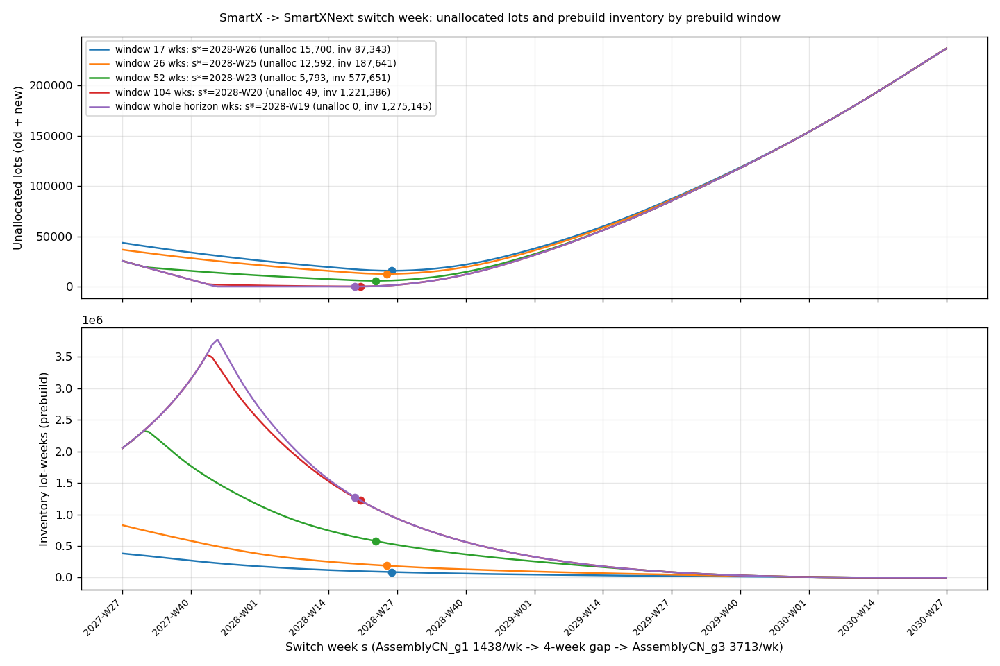
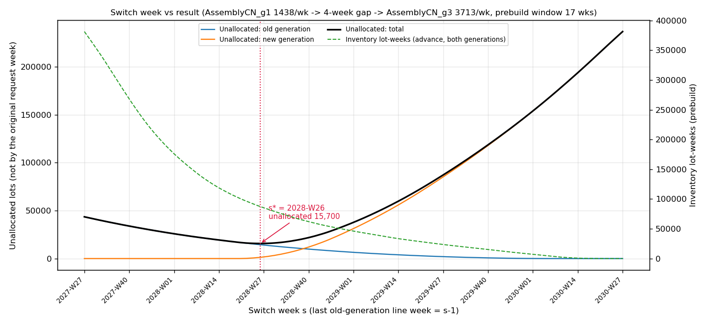

# 世代の切り替えのライン（smartx）と、能力を上位で扱う層の本実装　報告

- 依頼書：`requests/RequestLetter_GenerationLine_UpperLayer_to_CodeKun.md`
- 前の依頼の持ち越し：`docs/development/WOM_CapacityZeroBlank_Report.md` §4・§6.2（SmartXNext の発売前の週が「上限なし」になり、Backward が何年も前から作り溜めていた件）
- 土台：Astra君の調査と試作 `docs/development/WOM_SmartxBottleneck_Report.md`、`wom/capacity_layer/`
- 実装：Code君（Claude Code, Windows）、2026-10-07〜08
- リポジトリ：`Yasushi-Osugi/wom_development_composite_node`（このフォルダではリモート名 `composite_node`）、ブランチ `wom-v1r5m1_cap_trial`
- **着手時の SHA：`e0dfc7a928cff346b4a3c39b29f2393a3fe8b515`**（CapacityZeroBlank の commit の後）
- **保護対象のコアは変えていない**（`backward_planner.py`・`forward_planner.py`・`plan_copy.py`・`plan_node.py`・`sc_tree.py`・`push_pull.py` は無変更）。
- **commit・push はしていない。** 大杉さんが diff を確かめる。
- 付表・図：`docs/development/generation_line/`

本書は「観測結果／コードで確かめたこと／解釈／未確認」を分けて書く。

---

## 0. 受入のまとめ

| # | 受入 | 結果 |
|---|---|---|
| 1 | 能力の値（世代ごとのピークの週の需要と能力の表） | **合**。SmartX 1,438、SmartXNext 3,713。大杉さん了承済み（§2） |
| 2 | 混流しない（2 つのラインの P が同時に正にならない。空き期間の 4 週はどちらも 0） | **合**。OFF・ON とも、同時に正の週 0、空き期間 2028-W26〜W29 の生産 0（§5） |
| 3 | 切り替えの週の比較（候補ごとの表と図、`s*` と理由） | **合**。候補 157 週 × 前倒しの窓 5 通り。窓 17 週で `s*` = **2028-W26**（大杉さん決定）。窓ごとの比較を経営判断の材料として残した（§3） |
| 4 | `s*` での比較（上位の層 OFF／ON、製品別） | **合**（§6） |
| 5 | 元の要求を保つ（ON でも市場の Lot_ID と要求週が OFF と同じ。出荷を LOVEM の観測と 1 対 1 で照合） | **合**。市場の要求は OFF と ON で同一。市場の出荷の記録と LOVEM の actual_ship イベントが OFF 708,537 件・ON 692,909 件とも 1 対 1 で一致。ON の早出し 0（§7） |
| 6 | golden：変わるのは smartx だけ | **合**。`tests/golden/smartx-2027-2029.json` だけを、上位の層 OFF で作り直した（§4） |
| 7 | テスト（解き方の単体・能力の行を作る道具・プラグインの結合）、全テスト緑 | **合**。新規 12 件＋Astra君の 10 件。全テスト 767 passed／3 skipped、失敗 0（§9） |

GUI の確認：`python -m main` と同じ窓で、Network の図と PSI List（計画の木の全 34 ノード）が、上位の層 ON・OFF のどちらでも例外なく出ることを確かめた（§10）。

---

## 1. 大杉さんの決定（2026-10-07）

| # | 決定 |
|---|---|
| 依頼書 b・①〜③・d | 世代間で組立ラインを共有（SmartX → SmartXNext のみ、混流なし）。SmartXPro_CN は別のライン。能力はピークの週の需要 × 1.1。空き期間 4 週。目的はまず数量 |
| 能力 | **1,438 と 3,713 で了承** |
| 前倒しの窓 | **17 週**。`s*` = **2028-W26**。`capacity_layer_config.csv` も 17 週 |
| 窓の比較 | 17・26・52・104 週・全期間の比較の表を、経営判断の材料として報告書に残す（§3.2） |
| SmartXPro_CN の 1,202 lot | 2030-W14 の生産終了によるものとして、**今のデータのまま**（§6.3） |
| golden | 上位の層 OFF で作る。OFF は**前倒しの上限が無い計画**になる点を申し送りに書く（§11.1） |

---

## 2. ラインの能力（受入 1）

能力 ＝ その世代のピークの週の需要（全市場の合計、`demand_forecast.csv`）× 1.1 を**切り上げた**整数（`wom/capacity_layer/generation_line.line_capacity_from_demand`）。

| 世代（ラインのノード） | ピークの週 | ピークの週の需要 | × 1.1 | 能力（lot／週） |
|---|---|---:|---:|---:|
| SmartX（`AssemblyCN_g1`） | 2026-W01 | 1,307 | 1,437.7 | **1,438** |
| SmartXNext（`AssemblyCN_g3`） | 2030-W27 | 3,375 | 3,712.5 | **3,713** |

- 「少し上回る水準」なので、端数は切り上げた（3,712.5 を偶数丸めで 3,712 にしない）。
- 係数（既定 1.1）は道具の引数 `--factor`。能力を直接与える `--cap-old`／`--cap-new` もある。
- SmartXPro_CN の `AssemblyCN`（別のライン）、SmartXPro_IN の `AssemblyIN`・`SensorIN` は前からの値のまま。

---

## 3. 切り替えの週の比較（受入 3）

### 3.1 やり方

- 切り替えの週 `s` は**ラインの週**。SmartX の最後の生産週は `s−1`、空き期間は `s`〜`s+3`、SmartXNext の開始は `s+4`。市場の週は、そこから出荷の LT（3〜4 週）だけ後になる。
- 候補：2027-W27〜2030-W27 の**毎週**（157 候補）。1 候補の 2 世代の LP は合わせて約 0.6 秒なので、間引かずに全部解いた（窓 104 週・全期間は 1 候補 3〜4 秒）。
- 候補ごとに、ラインの能力の並び（§5 の表の形）を上位の問題に入れ、LP を 2 段で解く：①元の市場の要求週までに割り当てられる lot 数の最大化 → ②同じ最大量のなかで前倒しの lot・週の最小化（Astra君の試作と同じ）。分数解のセルは全候補で 0（整数解がそのまま得られた）。
- `s*` ＝ 未割当（旧＋新）が最小、同じなら在庫の lot・週（前倒しの lot × 週）が最小、同じなら早い週。
- 上位の問題は、モデルのコピーを headless で計画し、**Backward の直後の木**から作る（計画は変えない）。
- 道具：`python -m tools.generation_switch_sweep --model-dir data/sample/smartx-2027-2029 --out <dir> --window 17`

### 3.2 前倒しの窓ごとの比較（経営判断の材料）

| 前倒しの窓 | `s*` | SmartXNext の開始 | 未割当 SmartX | 未割当 SmartXNext | 未割当 計 | 在庫の lot・週 | 前倒しした SmartX の lot | 最も長い前倒し | 前倒しの在庫の最大 |
|---|---|---|---:|---:|---:|---:|---:|---:|---:|
| **17 週（採用）** | **2028-W26** | 2028-W30 | 14,426 | 1,274 | **15,700** | **87,343** | 9,367 | 17 週 | 6,912 |
| 26 週 | 2028-W25 | 2028-W29 | 11,666 | 926 | 12,592 | 187,641 | 13,847 | 26 週 | 10,152 |
| 52 週 | 2028-W23 | 2028-W27 | 5,398 | 395 | 5,793 | 577,651 | 25,300 | 52 週 | 17,558 |
| 104 週 | 2028-W20 | 2028-W24 | 34 | 15 | 49 | 1,221,386 | 36,616 | 104 週 | 24,365 |
| 全期間 | 2028-W19 | 2028-W23 | 0 | 0 | 0 | 1,275,145 | 38,178 | **140 週** | 25,080 |

（需要：SmartX 149,145 lot、SmartXNext 293,764 lot。在庫の lot・週は、前倒しで作った lot が市場の要求週まで待つ週数の合計。前倒しの在庫の最大は、ある週に要求週より前に作り終えて待っている lot 数の最大。出典 `docs/development/generation_line/star_details.json`）

**解釈**：

- 窓 17 週では、2028-W26 以降の SmartX の需要（23,308 lot、市場の週）のうち、窓に入る分（8,882）しか前倒しで作れず、残りの約 14,400 lot が割り当てられない。窓を広げるほど未割当は減るが、在庫が急に増える。
- 全期間の窓なら未割当 0 だが、SmartX の需要の末尾（2030-W26 まで）を**最大 140 週（2.7 年）前**に作ることになり、陳腐化の点で現実的でない。
- 窓を 17 → 52 週に広げると、未割当は 9,907 減り、在庫の lot・週は 490,308 増える（1 lot を救うのに約 49 lot・週）。52 → 104 週では、未割当 5,744 減に対し在庫 643,735 増（約 112 lot・週／lot）。保有費用と陳腐化の金額が入れば、この比が判断の材料になる（§11.3）。
- どの窓でも `s*` は 2028-W19〜W26 の狭い範囲にある。SmartXNext の需要の立ち上がり（2028-W27、55 lot から増加）に対して、切り替えをどこまで遅らせるか（SmartX をどこまで長く作るか）の兼ね合いで決まる。

### 3.3 2 つの基準が離れる様子

未割当の最小と在庫の最小は一致しない。未割当を少し増やしてもよいなら、在庫を大きく減らせる候補がある：

| 前倒しの窓 | 未割当が `s*`＋500 以内の範囲 | そのなかで在庫最小 | 未割当が `s*`＋2,000 以内の範囲 | そのなかで在庫最小 |
|---|---|---|---|---|
| 17 週 | 2028-W22〜W29 | W29：未割当 15,995、在庫 81,354 | 2028-W18〜W33 | W33：17,257、73,882 |
| 26 週 | 2028-W21〜W29 | W29：13,091、169,299 | 2028-W17〜W33 | W33：14,555、153,415 |
| 52 週 | 2028-W19〜W26 | W26：6,081、532,155 | 2028-W13〜W31 | W31：7,754、465,520 |
| 104 週 | 2028-W08〜W23 | W23：398、1,090,705 | 2027-W44〜2028-W27 | W27：1,680、935,308 |
| 全期間 | 2027-W45〜2028-W23 | W23：395、1,091,107 | 2027-W44〜2028-W27 | W27：1,680、935,308 |

窓 17 週では谷が浅く、2028-W22〜W29 のどこで切り替えても未割当の差は 500 lot 以内。`s*` は基準どおり 2028-W26 とした。

### 3.4 図

- 窓 5 通りの重ね合わせ：`docs/development/generation_line/sweep_windows.png`

  

- 窓ごとの図（横軸 `s`、縦軸に旧・新・合計の未割当と在庫の lot・週）：`docs/development/generation_line/sweep_w17/sweep.png` ほか
- 候補ごとの全数の表：`docs/development/generation_line/sweep_w<窓>/sweep.csv`（157 行、`s` ごとの世代別の割当・未割当・前倒し）、`best.json`、`capacity.json`

  

---

## 4. サンプルのデータと golden（受入 6）

### 4.1 サンプル

| ファイル | 変更 |
|---|---|
| `data/sample/smartx-2027-2029/capacity_plan.csv` | `AssemblyCN_g1`・`AssemblyCN_g3` の行（前は g1 が 278 行、g3 が 2028-W27〜の 130 行）を外し、**両方とも計画期間の全 278 週**を書いた（§5 の表の形、`s*` = 2028-W26）。ほかの行は順番も値も 1 バイトも変えていない（差分は 556 行追加・408 行削除で、すべてこの 2 ノード） |
| `data/sample/smartx-2027-2029/capacity_layer_config.csv`（新規） | `max_advance_weeks,17` |
| `data/sample/smartx-2027-2029/README.md`（新規） | `s*`・`g`・能力の値と決め方、作り直す手順 |

- 道具：`python -m tools.gen_generation_line_capacity --model-dir data/sample/smartx-2027-2029 --switch-week 2028-W26 --gap 4`
- 助走の週（2025-W36〜W52）の行は、道具は書かず `materialize_warmup` に作らせた（その node の最初の実週の値をコピーする規約。g1 は 1,438、g3 は 0）。書いた後にもう一度 materialize しても変わらないこと（冪等）をテストで確かめた。

### 4.2 golden

`tests/golden/smartx-2027-2029.json` だけを、**上位の層 OFF**（golden に記録されたプラグイン：BufferingStockOptimizer・CapacityOverride・HolidayCalendar）で作り直した。前の版は `output/generation_line/golden_before/` に控えた。

| 項目 | 前（CapacityZeroBlank の後） | 後 |
|---|---:|---:|
| PPC 売上（USD） | 661,330,146 | **700,825,463** |
| PPC 粗利（USD） | 597,743,054.84 | **633,321,737.24** |
| PPC 粗利率 | 90.385% | 90.368% |
| PPC の lot | 1,613 | 1,697 |
| psi：変わった製品 | — | **SmartX・SmartXNext だけ**（SmartXPro_CN・SmartXPro_IN は不変） |
| SmartX：`AssemblyCN_g1` の P | 90,088 | **149,145**（全需要） |
| SmartX：`SP_SmartX` の I（合計／最大） | 8,452／2,166 | **971,956／21,684**（作りだめ） |
| SmartX：市場の期末注文残 | 59,057 | **0** |
| SmartXNext：`AssemblyCN_g3` の P | 293,764 | **292,490** |
| SmartXNext：`SP_SmartXNext` の I（合計／最大） | 11,857,497／157,849 | **0／0**（発売前の作りだめが消えた） |
| SmartXNext：市場の期末注文残 | 0 | **1,274**（立ち上げの不足） |

**解釈**：

- 前の版の 2 つの問題（CapacityZeroBlank 報告書 §4）が解消した：SmartX の能力不足による注文残 59,057、SmartXNext の発売前 148 週が「上限なし」のため Backward が何年も前から作り溜めていた在庫（最大 157,849）。
- 新しい golden の SmartX は、切り替えの後の需要を**前倒しの上限なしに**作りだめている（`SP_SmartX` の I の合計 971,956 lot・週）。これは §3 の「全期間の窓」で `s` = 2028-W26 としたときの LP の在庫の lot・週（971,956）と**完全に一致**する。Backward の能力の押し戻しは窓を持たないため（§11.1）。
- SmartXNext の 1,274 lot は、ラインの開始（2028-W30）より前に要求週がある分。発売前の週の能力を 0 にしたので、前倒しもできず期末注文残になる（全期間の窓の LP の `s` = 2028-W26 の値 1,274 と一致）。
- SmartXPro_IN の遅配 16,073・能力による繰り延べ 19,887 は前と同じ（このラインは今回変えていない）。

---

## 5. 混流しない（受入 2）

`capacity_plan.csv` の 2 つのノード（ラインの週）：

| 週 | `AssemblyCN_g1`（SmartX） | `AssemblyCN_g3`（SmartXNext） |
|---|---:|---:|
| 2025-W36 〜 2028-W25 | 1,438 | **0** |
| 2028-W26 〜 2028-W29（空き期間） | **0** | **0** |
| 2028-W30 〜 2030-W52 | **0** | 3,713 |

計画の結果（`tools/generation_line_compare.py`、2 つのノードの `psi4supply[w][P]`）：

| | OFF | ON |
|---|---|---|
| P が同じ週に両方正 | **0 週** | **0 週** |
| 空き期間 2028-W26〜W29 の生産 | **0** | **0** |
| SmartX の最後の生産週 | 2028-W25 | 2028-W25 |
| SmartXNext の最初の生産週 | 2028-W30 | 2028-W30 |
| ラインの停止後の SmartX の生産・開始前の SmartXNext の生産 | 0・0 | 0・0 |

エンジンは変えていない。「0 ＝ 能力ゼロ」（前の依頼書）で、混流しないことをデータだけで表した。

---

## 6. `s*` での比較：上位の層 OFF／ON（受入 4）

`python -m tools.generation_line_compare --model-dir data/sample/smartx-2027-2029 --out <dir>`。OFF ＝ golden と同じプラグイン、ON ＝ それに Capacity Layer（窓 17 週）を足したもの。出典 `docs/development/generation_line/compare/`。

### 6.1 製品別

| 製品 | | 需要 | 元の要求週に出荷 | 遅配 | 早出し | 期末の注文残 | 上位の層の未割当 | 能力による繰り延べ（lot） | 在庫の lot・週（全ノード） | PPC 売上（USD） | PPC 粗利（USD） |
|---|---|---:|---:|---:|---:|---:|---:|---:|---:|---:|---:|
| SmartX（旧世代） | OFF | 149,145 | 149,145 | 0 | 0 | 0 | — | 0 | 990,092 | 106,041,155 | 95,705,433.60 |
| | ON | 149,145 | 134,719 | 0 | **0** | 14,426 | **14,426** | 0 | **101,183** | 95,793,431 | 86,457,203.40 |
| SmartXNext（新世代） | OFF | 293,764 | 292,490 | 0 | 0 | 1,274 | — | 0 | 25,007 | 324,946,110 | 297,932,048.40 |
| | ON | 293,764 | 292,490 | 0 | **0** | 1,274 | **1,274** | 0 | 25,007 | 324,946,110 | 297,932,048.40 |
| SmartXPro_CN | OFF | 160,146 | 160,146 | 0 | 0 | 0 | — | 0 | 6,487,260 | 163,188,954 | 146,484,132.12 |
| | ON | 160,146 | 158,944 | 0 | **0** | 1,202 | **1,202** | 0 | 6,273,581 | 161,969,056 | 145,389,084.56 |
| SmartXPro_IN | OFF | 106,756 | 90,683 | **16,073** | 0 | 0 | — | **19,887** | 335 | 106,649,244 | 93,200,123.12 |
| | ON | 106,756 | **106,756** | **0** | **0** | 0 | 0 | **0** | 48,121 | 106,649,244 | 93,200,123.12 |
| **合計** | OFF | 709,811 | 692,464 | 16,073 | 0 | 1,274 | — | 19,887 | 7,502,694 | 700,825,463 | 633,321,737.24 |
| | ON | 709,811 | 692,909 | 0 | **0** | 16,902 | **16,902** | **0** | 6,447,892 | 689,357,841 | 622,978,459.48 |

- 「早出し」＝市場の要求週より前に市場で出荷した lot。「期末の注文残」＝計画期間の終わりまで市場で出荷されなかった lot。「在庫の lot・週」＝その製品の全ノードの `psi4supply[w][I]` の合計（前倒しの待ちを含む）。
- ON の「期末の注文残」は、上位の層が割り当てられないと判断した lot と**件数も Lot_ID も一致**（割り当てられない lot は内部の計画に置かれず、市場に注文残として残る。黙って消さない）。一覧：`docs/development/generation_line/compare/unallocated_lots.csv.gz`（16,902 行：製品・Lot_ID・市場・要求週）。

### 6.2 世代別の読み方

- **SmartX**：OFF は前倒しの上限が無いので全量を作りだめ（在庫 990,092 lot・週）、ON は窓 17 週の範囲だけ作りだめ（101,183 lot・週）、14,426 lot が割り当てられない。市場別の未割当：AMER 5,813・EMEA 3,964・APAC 4,649。前倒しした lot 9,367。
- **SmartXNext**：OFF・ON とも同じ。ラインの開始 2028-W30 より前に要求がある 1,274 lot（AMER 466・EMEA 435・APAC 373）が立ち上げの不足になる。前倒しは 0（発売前の週は能力ゼロなので作れない）。
- **SmartXPro_IN**：ON で遅配 16,073・能力による繰り延べ 19,887 が 0 になった（Astra君の試作と同じ結果。前倒しの lot・週 43,007 も Astra君と一致）。代わりに在庫が 335 → 48,121 lot・週になる。売上・粗利は同じ（全量が元の要求週に出荷されるため）。

### 6.3 SmartXPro_CN の 1,202 lot（大杉さん決定：今のデータのまま）

- `AssemblyCN` の能力は 2030-W14 以降 0（生産終了。CapacityZeroBlank で「0 ＝ 能力ゼロ」になった）。需要は 2030-W51 まで続く。
- OFF：Backward が前倒しの上限なしに、生産終了の前へ押し戻して作りだめる（注文残 0）。
- ON（窓 17 週）：生産終了から 17 週より先の需要は作れず、1,202 lot（EMEA 528・APAC 674）が割り当てられない。
- 2030-W14 の生産終了によるものとして、データは変えていない。

---

## 7. 元の要求を保つ（受入 5）

| 照合 | OFF | ON |
|---|---|---|
| 市場の要求（各市場ノードの Lot_ID と要求週） | — | **OFF と同一**（全 709,811 lot） |
| 市場の出荷の記録（木の `_actual_ship`）と LOVEM の観測の actual_ship イベント（市場ノード、(ノード, 週, Lot_ID) の多重集合） | **1 対 1 で一致**（708,537 件） | **1 対 1 で一致**（692,909 件） |
| 早出し | 0 | **0** |
| 割り当てられない lot のうち、市場で出荷されたもの | — | 0 |
| Forward の能力による繰り延べ | 19,887 lot | **0**（Forward が上位の層の配置をそのまま実行できた） |

- 上位の層は、市場の要求（Lot_ID と要求週）にも需要の CSV にも触れない。Backward の後の**内部の計画の位置**（市場以外のノードの `psi4demand`）だけを置き換える（Astra君の「元 ID を保つ方式」）。
- LOVEM の観測の run フォルダ（OFF・ON）は `output/generation_line/compare/lovem_off|lovem_on`（大きいのでリポジトリには入れない。`python -m tools.generation_line_compare` で作り直せる）。

---

## 8. 上位の層の実装

### 8.1 構成

| モジュール | 役割 |
|---|---|
| `wom/capacity_layer/solver.py`（Astra君、無変更） | 汎用の解き方（貪欲法・LP の 2 段）。エンジンを import しない |
| `wom/capacity_layer/serial_adapter.py`（新規） | `SerialLineAdapter`：計画の木（Backward の直後）から上位の問題を作り、解を元の Lot_ID に戻し、内部の計画の位置として書き込む。Astra君の試作の footprint の計算をそのまま移した。直列の InBound（leaf_in 1 つ、分岐なし、bom_qty 1）だけを扱い、それ以外は `UnsupportedTreeError` で止める |
| `wom/capacity_layer/generation_line.py`（新規） | ラインの能力の計算、能力の並び（§5 の形）、切り替えの週の評価・比較・`s*` の選択 |
| `wom/capacity_layer/smartx_trial.py`（変更） | Astra君の `SmartxAdapter` を、上の `SerialLineAdapter` の上の CSV 読み込みだけにした（footprint の計算は 1 か所に）。試作のテスト 10 件はそのまま緑 |
| `wom/plugins/capacity_layer.py`（新規） | `CapacityLayerPlugin`（POST_BACKWARD）。**既定 OFF** |

### 8.2 プラグイン（Capacity Layer）

- フック：`HOOK_POST_BACKWARD`。製品ごとに、Backward の直後の木から上位の問題を作り、LP で解き、内部の計画の位置を置き換える。その後の `copy_demand_to_supply`・push の設定・Forward は今のまま（Forward は与えられた配置を独自に確かめる）。
- push の Mode 4 の決め方（`push_config.csv`）は、Backward の直後にはまだ設定されていないので、`push_pull.py` と同じ規則で求める（decoupling ノード＝push、その下と上＝push_sub）。Mode 1〜3 の行があれば止める。
- 設定：`capacity_layer_config.csv`（`max_advance_weeks`）。**ON なのに無ければ止める**（窓の黙った既定値を作らない）。
- 選び方：GUI は Plugins の「Capacity Layer（上位の能力の層）」のチェック（既定 OFF）。headless は `--plugins` に `CapacityLayerPlugin` を足す（`safe` には入れていない）。OFF のときの計画は今と同じ（golden 12 件＋legacy 3 件で確認）。
- 結果：`sc_tree.capacity_layer_results`（製品ごとの割当・未割当・市場別の未割当・前倒しの lot・週・未割当の Lot_ID の一覧）。未割当があれば、計画の実行時に製品ごとに 1 行の警告を出す。
- 1 回の計画で 4 製品の LP に計 約 25 秒（smartx、窓 17 週）。

### 8.3 headless の変更

`tools/run_headless_from_folder.run()` に `extra_plugins`（既定 None）を足した。測定の道具が、設定を持たせたプラグインの実体を渡すため。None のときの動きは変わらない。

---

## 9. テスト（受入 7）

### 9.1 新しいテスト（`tests/test_generation_line_upper_layer.py`、12 件）

| 層 | テスト | 内容 |
|---|---|---|
| 単体 | `test_line_capacity_is_peak_times_factor_rounded_up` | 1,307 × 1.1 → 1,438、3,375 × 1.1 → 3,713、1,000 × 1.1 → 1,100（ちょうどの積は切り上げない） |
| 単体 | `test_line_schedule_never_mixes_and_keeps_the_gap` | 同じ週に両方正にならない。空き期間は両方 0。範囲外は止める |
| 単体 | `test_best_switch_quantity_first_then_inventory_then_earliest` | `s*` の選び方 |
| 単体（手計算） | `test_switch_hand_calculation` | 2 世代の小さな木（LT 0）。旧：2 lot × 週 1〜9、ライン 3／週（週 0〜5）→ 全 18 lot 割当、前倒し lot・週 45（＝60−15）。新：3 lot × 週 6〜11、空き期間 2 → 6 lot 未割当 |
| 単体（手計算） | `test_switch_window_limits_the_prebuild` | 窓 2 週：要求週 8・9 の 4 lot は作れない。週 4・5 は自分の lot を 1〜2 週ずつ前へ送ることで空き、要求週 6・7 の 4 lot が入る → 14 割当・4 未割当 |
| 単体 | `test_adapter_keeps_original_lots_and_lists_unallocated` | 元の Lot_ID を順番どおりに割り当て、割り当てられない lot を一覧に残す。市場の S は変わらない |
| 単体 | `test_push_modes_follow_the_push_setup_rule`、`test_branched_inbound_is_refused` | push の決め方、分岐した InBound は止める |
| 結合 | `test_generation_line_rows_load_as_zero_and_never_mix` | smartx のコピーで、能力の行を作る道具 → materialize → 実ローダ：ほかの行は不変、全週に値がある、0 は 0、同じ週に両方正にならない、materialize が冪等 |
| 結合 | `test_plugin_needs_its_settings_file`、`test_plugin_is_off_by_default` | 設定ファイルが無い・読めないと止める。既定 OFF |
| E2E | `test_plugin_on_keeps_market_ids_and_ships_nothing_early` | smartx のコピーを OFF と ON で headless 計画：市場の Lot_ID と要求週が同じ、早出し 0、割り当てられない lot は出荷されない、能力による繰り延べ 0（約 1.5 分） |

Astra君の手計算のテスト（`tests/test_capacity_layer_trial.py`、10 件）も、そのまま緑。

> 手計算の訂正（記録）：`test_switch_window_limits_the_prebuild` は、最初の期待値（12 割当・6 未割当）が誤っていた。週 4・5 の能力は、その週の lot を前の週へ送れば空くことを見落としていた。LP の答え（14・4）が正しく、テストの期待値と説明を直した。

### 9.2 全テスト

- 新しいサンプル・新しい golden で `python -m pytest tests/ -q -p no:cacheprovider`：**767 passed／3 skipped、失敗 0**（1 回の実行、14 分 57 秒）。golden 13 件＋legacy 3 件を含む。
- 全テストの後、`git status` で変わっている golden は `tests/golden/smartx-2027-2029.json` だけ、サンプルの入力は smartx の 3 ファイル（`capacity_plan.csv`、新規の `capacity_layer_config.csv`・`README.md`）だけであることを確かめた。

---

## 10. GUI の確認

`python -m tools.gui_generation_line_check --model-dir <smartx のコピー> --out <dir> --layer on|off`（`wom.gui.app.WOMApp` ＝ `python -m main` と同じ窓。画像は Win32 の PrintWindow）。新しいサンプルのコピーで、プラグインは golden と同じ 3 つ（ON はそれに Capacity Layer）。

| 確認 | ON | OFF |
|---|---|---|
| Run Planning Engine → PPC の完了 | 例外なし | 例外なし |
| Network の図 | 出る | 出る |
| PSI List を計画の木の**全 34 ノード**で順に描く（行の色の判定を含む） | 例外なし | 例外なし |
| `AssemblyCN_g1` の CapHard | 〜2028-W25「1438」、2028-W26〜「0」 | 同じ |
| `AssemblyCN_g3` の CapHard | 〜2028-W29「0」、2028-W30〜「3713」 | 同じ |
| SmartXPro_CN `AssemblyCN` の CapHard | 2030-W14〜「0」 | 同じ |
| 上位の層の結果（GUI の計画） | headless と同じ（SmartX 未割当 14,426、SmartXNext 1,274、Pro_CN 1,202、Pro_IN 0、前倒し 43,007） | — |

画像：`docs/development/generation_line/gui_on|gui_off/`（`network.png`、`psi_list__<製品>__<ノード>.png`）。前回 PSI List の行の色の判定で止まった件（None の扱い）は、今回 34 ノードすべてを描かせて確かめた。

---

## 11. 申し送り・副作用・未確認

### 11.1 golden（上位の層 OFF）は前倒しの上限が無い計画（大杉さん指示による申し送り）

- smartx の golden は上位の層 OFF で作った。OFF のときは Backward の MOM の能力の押し戻し（`_apply_mom_cap_backward`）が超過分を前の週へ送り続け、**前倒しの週数に上限が無い**。そのため golden の SmartX は、切り替えの後の需要（2030-W26 まで）を、ラインが止まる 2028-W25 までにすべて作りだめる（`SP_SmartX` の在庫 971,956 lot・週、最大 21,684 lot）。SmartXPro_CN も 2030-W14 の生産終了の前に同じように作りだめる。
- 採用した計画の考え方（窓 17 週）とは違う。窓 17 週の結果は上位の層 ON（§6）で見る。
- 前倒しの上限をエンジン（Backward）に持たせるには保護対象のコアの変更が要る。今回は扱っていない。

### 11.2 今回の変更による副作用

| # | どこで | 何が | 期待との差 |
|---|---|---|---|
| S1 | GUI の Plugins の一覧 | 「Capacity Layer（上位の能力の層）」の行が 1 つ増えた（既定 OFF） | — |
| S2 | headless の `--plugins all` | Capacity Layer も入る。`capacity_layer_config.csv` の無いモデルでは止まる | `all` はリポジトリの中では使われていない |
| S3 | GUI で Capacity Layer を ON にして、直列でないモデル（分岐した InBound、bom_qty ≠ 1、push の Mode 1〜3）を計画 | Planning Engine のエラーの画面で止まる（理由つき） | 黙った既定値を作らない、の方針どおり |
| S4 | `wom/capacity_layer/smartx_trial.py` | footprint の計算を新しいモジュールに移した。CSV から読む値は前と同じ | 試作のテスト 10 件は緑 |

### 11.3 次の依頼書へ（今回は扱わない）

1. **作りだめの在庫の金額**：保有費用・陳腐化。窓を広げると 1 lot を救うのに約 49〜112 lot・週の在庫が要る（§3.2）。smartx に段階 D の台帳のマスター（`vc_*`）を用意してから評価する（依頼書の申し送り）。
2. **前倒しの上限をエンジンで扱うか**（§11.1）。
3. **上位の層と生産配分（`ask_global_allocation`）のつなぎ**：未割当（製品・市場・週）を配分の層へ返す。
4. **SmartXNext の立ち上げの不足 1,274 lot**：ラインの開始（2028-W30）より前の要求。空き期間（4 週、仮）を短くする・新ラインを先に用意する、などの検討材料。
5. **Rice の季節の能力への適用**（依頼書の申し送り）。今の `SerialLineAdapter` は直列の木だけ。
6. **上流ノードの能力**：`FoundryTW_g1`・`FoundryTW_g3`・`WaferFab_TW_g1`・`WaferFab_TW_g3` は能力の行が無い（上限なし）。上位の層の問題の metadata に「能力未設定のノード」として出している（`capacity.json` の `unset_capacity_nodes`）。

### 11.4 未確認

- 大杉さんの実機での確認（§12）。
- `iphone`（旧サンプル）は前から PPC の為替の欠落で最後まで動かない（今回と無関係）。

---

## 12. `python -m main` で確かめる手順

| # | 操作 | 期待する表示 |
|---|---|---|
| 1 | smartx-2027-2029 を読み込み、Plugins は golden と同じ 3 つ（Capacity Override・Buffering Stock・Holiday Calendar）で Run Planning Engine | エラーなく終わる。Network の図と PSI List が出る |
| 2 | Network → PSI List で `IN:mom:AssemblyCN_g1:SmartX` | CapHard：2028-W25 まで 1438、2028-W26 から 0。P は 2028-W25 で終わる |
| 3 | 同じく `IN:mom:AssemblyCN_g3:SmartXNext` | CapHard：2028-W29 まで 0、2028-W30 から 3713。P は 2028-W30 から |
| 4 | Network → Flow Check の表 2 | SmartX の期末注文残 0、SmartXNext 1,274、SmartXPro_IN の遅配 16,073 |
| 5 | Plugins の「Capacity Layer（上位の能力の層）」も ON にして、もう一度 Run Planning Engine | コンソールに `[CapacityLayer] SmartX: served 134719/149145, unallocated 14426 …` などの 4 行と、未割当の警告。Flow Check の表 2 で SmartX の期末注文残 14,426、SmartXPro_IN の遅配 0 |

---

## 13. 成果物

| 種類 | 場所 |
|---|---|
| コード | `wom/capacity_layer/serial_adapter.py`・`generation_line.py`（新規）、`smartx_trial.py`（変更）、`wom/plugins/capacity_layer.py`（新規）、`wom/plugins/__init__.py`（登録）、`tools/run_headless_from_folder.py`（`extra_plugins`） |
| 道具 | `tools/gen_generation_line_capacity.py`（能力の行）、`tools/generation_switch_sweep.py`（切り替えの週の比較）、`tools/generation_line_compare.py`（OFF／ON・LOVEM の照合）、`tools/gui_generation_line_check.py`（GUI） |
| データ | `data/sample/smartx-2027-2029/capacity_plan.csv`、`capacity_layer_config.csv`（新規）、`README.md`（新規） |
| golden | `tests/golden/smartx-2027-2029.json` |
| テスト | `tests/test_generation_line_upper_layer.py`（新規 12 件） |
| 付表・図 | `docs/development/generation_line/`（窓ごとの比較・`s*` の詳細・OFF／ON の比較・未割当の一覧・GUI の画像） |
| 文書 | 本書、`CLAUDE.md`（上位の層の節） |

差分の確認：`git diff --stat -- data/sample`（smartx の 2 ノードの行だけ）、`git diff -- tests/golden`（smartx だけ）、保護対象のコアは `git diff --stat -- wom/engine/backward_planner.py wom/engine/forward_planner.py wom/engine/plan_copy.py wom/model/plan_node.py wom/model/sc_tree.py wom/engine/push_pull.py` が空であること。
