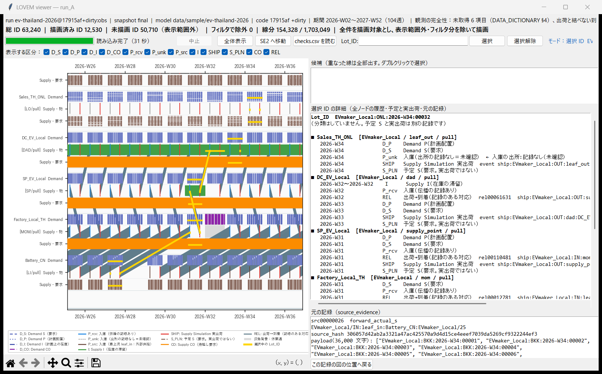
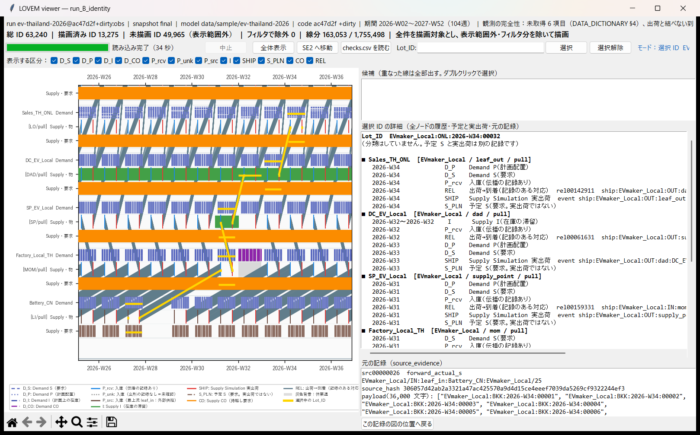

# LotIdentityFlow 報告：Forward を Lot_ID の同一性で一貫させる（例外1・例外2の修正）＋追補1

- 依頼書：`requests/RequestLetter_LotIdentityFlow_to_CodeKun.md`（本体）、`requests/RequestLetter_LotIdentityFlow_Addendum1_to_CodeKun.md`（追補1 v1.1）
- 決定の正本：`docs/design/WOM_Forward_LotID_Decision_Record_2026-09-29.md`（v1.2。D1〜D3、§7 の D4〜D6）
- 実装：Code君（Claude Code, Windows）、2026-09-29
- 作業フォルダ／ブランチ：`wom-v1r5m1_cap_trial`
- **着手時の SHA：`ac47d2f`**（LOVEM 段階 B の commit 後）
- **commit・push はしていない。golden は再生成していない。**
- 検査の生出力：`output/lot_identity/{identity,legacy}/<case>.json`（`tools/lot_identity_checks.py` が書く。`output/` は git の対象外）

---

## 0. 要約

1. **`lot_flow_mode` を新設した。既定は `identity`、`legacy` は変更前の動きを1ビットも変えずに残す。** legacy は、16ケース（13 golden＋alloc 元フォルダ＋P_opt/800＋ev-thailand-2026_update）で、全ノード・全バケット・全週の Lot_ID 列、`_actual_s`、Forward/Backward の結果、headless のスナップショット、**PPC の出力ファイル6種まで、HEAD `ac47d2f` とバイト単位で一致**した（ハッシュシード固定、§2）。
2. **identity では K1・K2・K4・K5・K6 が15ケースすべてで 0 件。** K4（CO の重複）は、中間報告の時点では iphone・rice・smartx・ev_update に残っていたが、原因が **100% Step 0a（cap_hard の封印）** と確かめられたので（追補1 A1）、identity でだけ Step 0a を「翌週の P の先頭へ繰り延べ」に変えて 0 件にした（決定記録 D4）。legacy の重複は既知の欠陥として残した。
3. **identity にすると、上流の不足が市場に届くようになる。** 13 golden のうち **11 モデルで golden が変わる**（変わらないのは apparel-us-2026 と bom-test-2026）。期末注文残は、ほとんどが「計画期間の端（開始）」に分類される（期首に在庫がなく、立ち上がり期の需要に供給が間に合わない）。
4. **9,293（P_opt/800）：** legacy では、Bottling が一度も出荷していない 9,293 ID が、市場で「予定どおり出荷された」ことになっていた。identity では 9,293 ID すべてが**期末注文残**として残り、市場に届かない。
5. **rice は identity の対象外とし、`planning_config.csv` で legacy に固定した**（追補1 A2、決定記録 D5）。identity にすると、HarvestBatch の合成 ID（`OI_…`）が需要と照合できず、市場実績が 235,316 → 142,914 に落ちる（A1 の修正後。修正前は 35,266）。
6. **decouple の配置最適化は legacy で参考候補を選び、選んだ配置を run の方式で評価し直す**（追補1 A3、決定記録 D6）。
7. テスト：**581 passed / 3 skipped / 0 failed**（新規 `tests/test_lot_identity_flow.py` の 15件を含む。golden は据え置きのまま 13件とも legacy で緑）。identity を既定にしたことで legacy の挙動を前提にしていたテスト 12件（中間報告の 5件＋A1 の後の 7件）を legacy に固定した（§1.3、§8）。
8. LOVEM：ev-thailand-2026 を identity で観測した `run_B_identity` で、**Q12（観測 ON/OFF の一致）・区間の復元（37,856 行）とも一致。** run_A（legacy）には無かった **leaf_out への到着 58,220 件**が現れた。`EVmaker_Local:ONL:2026-W34:00032` は、変更前は Sales_TH_ONL の入庫が `P_unk`（出所の記録なし）だったが、変更後は **DC_EV_Local の 2026-W33 の実出荷と同じ ID が、LT 1 週どおり 2026-W34 に1件だけ届き、REL（`ship_to_arrival`）でつながる**（§6）。

---

## 1. 変更内容

### 1.1 本体 C1〜C5（前回の中間報告までに実装）

| 項目 | ファイル | 内容 |
|---|---|---|
| C1 切り替え | `wom/engine/forward_planner.py` | `LOT_FLOW_IDENTITY`／`LOT_FLOW_LEGACY`、`resolve_lot_flow_mode()`（None・空＝identity、大文字小文字を区別しない、それ以外は ValueError）。`ForwardPlanner(..., lot_flow_mode=None)` |
| | `wom/engine/warmup.py` | `read_lot_flow_mode(model_dir)`：`planning_config.csv` の `lot_flow_mode` キー |
| | `tools/run_headless_from_folder.py` | `run(..., lot_flow_mode=None)`（引数 → `planning_config.csv` → identity）。CLI `--lot-flow-mode`。スナップショットの config には、legacy 以外のときだけ `lot_flow_mode` を書く（既存 golden と一致させるため） |
| | `wom/gui/app.py` | `_build_planning_context` が `planning_config.csv` を読み、2か所の ForwardPlanner に渡す。切り替えの画面部品は作っていない |
| | `tools/sweep_flags.py` | `_execute_pipeline(..., lot_flow_mode=None)` |
| | `tests/test_golden.py`、`tests/test_planning_state.py` | golden の config に記録された方式で比較（記録が無ければ legacy） |
| C2 push の照合 | `forward_planner.py` `_process_node` | identity の push 分岐を、legacy の分岐の前に追加。要求（CO＋S）と供給（前週 I＋P）を `_match_by_identity` で照合。休業週は入荷を受け、出荷せず、全供給を I に、全要求を CO[w+1] に回す（同じ ID が I と CO に同時にある＝K2 で許す形）。Step 0a の封印はしない。Step 0b は実出荷で比べる。`_push_shortfall[w]` ＝その週に照合できなかった要求の件数 |
| | `run_headless_from_folder.py`、`app.py` | S3 と「P vs Capacity Limits」の push の処理量を `len(_actual_ship[w])` で描く |
| C3 下流の P | `forward_planner.py` `_push_pull_node`、`_propagate_to_child` | identity では `pull_mode` による P の上書きをせず、デカップリング点の下流でも常に `_propagate_to_child`。`ForwardPlanResult` に `ot_in_transit_at_end`（期末の輸送中）と `ot_unrouted`（どの子にも振り分けられなかった）を追加し、**両方式で記録**（計画は変えない）。`_pull_subtree` は呼び出し元が無いことを確認し、コメントだけ追記 |
| C4 PPC | `wom/ppc/ppc_psi_bridge.py` | leaf の販売数量を `node._actual_ship[w]` の件数に。`run()` の最後で各ノードに `_actual_ship` を付ける。両方式で同じコード |
| C5 非推奨の警告 | `wom/engine/push_pull.py` | Mode 1〜3 の項目が1つでも設定されていたら、指定の文言で `[PushPull] WARNING` を出し、`warnings.warn(UserWarning)`。`PushSetupResult.deprecation_warnings`。動作は変えない。**現行サンプルでは警告は1件も出ない** |
| 観測側 | `wom/lovem/observer.py`、`q12.py`、`tools/lovem_observe.py` | `_propagate_to_child` のラッパーを可変長引数に。`observe_run(..., lot_flow_mode)` を manifest に記録。coverage の注記を方式別に。CLI `--lot-flow-mode` |
| viewer | `wom/lovem/viewer.py` | bench に `06_id_selected_zoom.png`（選んだ ID の全記録へズーム）を追加。CLI `--select` |
| 最適化 | `wom/engine/decouple_optimizer.py`、`wom/plugins/buffering_stock_optimizer.py` | `lot_flow_mode` を受け取る（追補1 A3 で既定を legacy に変更、§1.2） |

旧コードの説明コメントは消さず、identity との違いを追記した。

### 1.2 追補1 A1〜A3（今回）

| 項目 | ファイル | 内容 |
|---|---|---|
| A1 Step 0a（identity だけ） | `forward_planner.py` | cap_hard を超えた P の lot を CO に入れず、**ID を保ったまま翌週の P の先頭へ回す**。翌週が休業なら、その週の E2 が次の開いている週へ送る（順序は保たれる）。最終週の超過分は `ForwardPlanResult.cap_hard_unplaced`（`closure_p_unplaced` と同じ形）に記録。件数は `record_cap_hard_deferred()` で `cap_hard_events`／`cap_hard_sealed` に入れるが、**`co_generated` には入れない**（新しい要求ではないため）。legacy の分岐は変えず、既知の欠陥の注記を追記 |
| A1-3 E2 の順序（identity だけ） | 同上 | 休業週から次の開いている週へ送る lot を、末尾ではなく**先頭**に置く（§4.3） |
| A2 rice | `data/sample/rice-japan-2027-2028/planning_config.csv`（新規） | `key,value` / `lot_flow_mode,legacy` の2行だけ。warmup の materialize は `warmup_lt`・`planning_start` が無いので何もしない（確認済み） |
| A2 方式の記録 | `forward_planner.py`、`observer.py` | `ForwardPlanResult.lot_flow_mode` を追加し、`run()` で設定。LOVEM の forward_result の記録に `lot_flow_mode`・`ot_in_transit_at_end`・`ot_unrouted`・`cap_hard_unplaced` を追加（manifest には前回から記録済み） |
| A3 配置最適化 | `decouple_optimizer.py` | `evaluate_decouple_placement`／`find_optimal_decouple_placement` の `lot_flow_mode` の既定を `"legacy"` に。docstring に「今の実装では、配置の効果が例外2に依存していた」と D6 を記述 |
| | `buffering_stock_optimizer.py` | 候補は常に legacy で評価（参考候補）。run の方式が identity なら、選んだ配置を identity で**評価し直し**、`last_results[prod]` に `legacy_reference`（legacy による参考値）と `re_evaluated` を残す。ログの legacy の値に「legacy による参考値」と付ける。本計画は run の方式で行う（プラグインは P の上書きをせず、フラグを立てるだけ） |

### 1.3 テスト

- 新規 `tests/test_lot_identity_flow.py`（15件）：C1 の解決規則、C3（下流は親の実出荷だけを受け取る・期末の輸送中の記録）、C2（push は要求された ID だけを出荷し CO を持つ・legacy の push は CO を持たない）、K2/K6（休業中の push は物を I に、要求を CO に持つ）、C4（bridge は実出荷を週ごとに数える）、C5（Mode 1〜3 だけ警告）、A1（CO が重複しない・lot を落とさない／先頭への繰り延べと最終週の記録／複数週からの持ち越しの順序／E2 の先頭と末尾／休業週をまたぐ繰り延べ）、A3（候補は legacy、再評価は identity、legacy の run では再評価しない）、統合（`planning_config.csv` → headless → ForwardPlanner）。
- legacy に固定したテスト（A3 の方針で説明がつく）：`test_decouple_optimizer.py` の3呼び出し、`test_buffering_stock_optimizer_plugin.py` の1件、`test_stage3a1_stockyard.py` の ev-europe の輸入チェーン1件、`test_lovem_observer.py` の Q12 比較1件。
- A1 の後に書き換えたテスト：`test_c3_...`・`test_c4_...`。能力不足が繰り延べ（遅配）になったので、「市場で欠品が残る」の代わりに「遅配として見える」「bridge の週ごとの数量が実出荷と一致し、予定 S とは違う」を確かめる。

---

## 2. legacy が変わらないこと（受入 4.1）

- 方法：`legacy_fingerprint.py`（検査用、リポジトリ外）で、各ケースを一時フォルダにコピーして headless で実行し、次を SHA-256 で比べた。
  - 全ノード・全バケット（S/CO/I/P、demand と supply）・全週の Lot_ID 列（順序を含む）
  - `_actual_s`
  - ForwardPlanResult・BackwardPlanResult の全フィールド（今回追加した `ot_in_transit_at_end`・`ot_unrouted`・`cap_hard_unplaced`・`lot_flow_mode` を除く）
  - headless のスナップショット、PPC の出力ファイル6種
- 比較相手：HEAD `ac47d2f` のコード（`git archive`）。入力データは作業ツリーのもの（違いは rice の `planning_config.csv` だけで、HEAD のコードはこのキーを読まない）。
- 結果：**16ケースすべて一致（ALL IDENTICAL: True）。** 追加した記録用のフィールドは legacy ではすべて 0 件。
- 注意：PPC の `ppc_kpi_summary.json` の `trust_event_types` の並び順は、`PYTHONHASHSEED` によって実行ごとに変わる（**変更前からある**非決定性。§7 S5）。シードを固定しない比較では soysauce-jpy 系3ケースで PPC ファイルが一致しないように見えるが、中身の違いはこの並び順だけ。
- golden：`tests/test_golden.py` は 13件とも legacy で緑。
- S3 と「P vs Capacity Limits」の push の処理量（本体 C2）：系列を `len(S) − _push_shortfall` から `len(_actual_s)` に変えたが、legacy では両者が全週で一致するので表示は変わらない。legacy の push は、休業週は実出荷 0・`_push_shortfall`＝予定 S の件数、開いた週は実出荷＝min(供給, 予定 S)・`_push_shortfall`＝max(0, 予定 S − 供給) なので、どの週も `len(S) − _push_shortfall ＝ len(_actual_s)`。headless のスナップショットは、上の比較で HEAD と一致した。

---

## 3. identity の検査 K1〜K6（受入 4.2）

対象：13 golden モデル＋soysauce-jpy-2027-alloc の P_opt/800＋ev-thailand-2026_update ＝ **15ケース**（中間報告で「16ケース」と書いたのは誤りで、K 検査は 15ケース。legacy の不変の確認だけが、alloc の元フォルダを加えた 16ケース）。検査は `tools/lot_identity_checks.py`（読むだけ。ForwardPlanner と `_propagate_to_child` をラップして到着を記録する）。rice は identity の対象外だが（§0-5）、参考として identity で測った。

### 3.1 判定条件

| K | 確かめること |
|---|---|
| K1 | 子の P に届いた ID は、(a) 親の実出荷にあり、(b) 親の出荷週＋子の LT の週に届き、(c) 1回だけ届く。親の出荷＝子への到着＋期末の輸送中＋未割当（保存） |
| K2（訂正後） | 同じ ID が同じノード・同じ週の I と CO に同時にあるのは、休業中の push だけ。そのときも、出荷する週に I と CO から同時に消える |
| K3 | 需要に無い ID（合成 ID）を数える（rice の `OI_` を別に数える） |
| K4 | CO の中で同じ ID が重複しない。CO の件数が「要求の累計−出荷の累計」を超えない。CO の ID は、まだ出荷されていない要求である |
| K5（訂正後） | push と Outbound のノードは、その週の要求（S＋CO）に無い ID を出荷しない（早出しなし）。push_sub は要求の無い ID を上へ送らない |
| K6 | 休業週（処理能力 0）に出荷しない |

### 3.2 結果（identity、A1 の修正後）

| ケース | K1 到着 | K1 違反 (a)(b)(c) | K1 保存の破れ | 期末の輸送中 | 未割当 | K2 | K3 | K4 | K5 | K6 |
|---|---:|---:|---:|---:|---:|---:|---:|---:|---:|---:|
| Cookie-jp-2026 | 322,910 | 0 | 0 | 0 | 0 | 0 | 0 | 0 | 0 | 0 |
| apparel-global-2028-2029 | 522,846 | 0 | 0 | 0 | 0 | 0 | 0 | 0 | 0 | 0 |
| apparel-us-2026 | 498,344 | 0 | 0 | 0 | 0 | 0 | 0 | 0 | 0 | 0 |
| bom-test-2026 | 200 | 0 | 0 | 0 | 0 | 0 | 0 | 0 | 0 | 0 |
| ev-europe-2026 | 98,840 | 0 | 0 | 0 | 0 | 0 | 0 | 0 | 0 | 0 |
| ev-thailand-2026 | 116,440 | 0 | 0 | 0 | 0 | 0 | 0 | 0 | 0 | 0 |
| iphone_global | 746,180 | 0 | 0 | 0 | 0 | 0 | 0 | 0 | 0 | 0 |
| oil-global-2027 | 354,032 | 0 | 0 | 0 | 0 | 0 | 0 | 0 | 0 | 0 |
| rice-japan-2027-2028（参考） | 670,390 | 0 | 0 | 5,286 | 0 | 0 | 58,729（すべて `OI_`） | 0 | 0 | 0 |
| smartx-2027-2029 | 1,385,846 | 0 | 0 | 0 | 0 | 0 | 0 | 0 | 0 | 0 |
| soysauce-eu-2027 | 256,725 | 0 | 0 | 0 | 0 | 0 | 0 | 0 | 0 | 0 |
| soysauce-jpy-2027 | 301,503 | 0 | 0 | 0 | 0 | 0 | 0 | 0 | 0 | 0 |
| soysauce-us-2027 | 257,250 | 0 | 0 | 0 | 0 | 0 | 0 | 0 | 0 | 0 |
| soysauce-jpy-2027-alloc P_opt/800 | 221,721 | 0 | 0 | 0 | 0 | 0 | 0 | 0 | 0 | 0 |
| ev-thailand-2026_update | 126,480 | 0 | 0 | 0 | 0 | 0 | 0 | 0 | 0 | 0 |

- K2 の「休業中の push で I と CO に同じ ID がある」件数も、実データでは 0 件だった（休業週に push が要求と供給の両方を持つ場面が、サンプルには無い）。この形は合成ツリーのテスト `test_k2_k6_closed_push_week_keeps_thing_in_i_and_request_in_co` で確かめた。
- `ot_unrouted`（どの子にも振り分けられなかった lot）は、**15ケースすべて 0 件**（追補1 A4）。
- 期末の輸送中は rice の 5,286 件だけ（legacy では黙って捨てられていた）。

### 3.3 同じ検査を legacy で行った結果（比較）

| ケース | K1 保存の破れ（例外2） | K4 CO の重複 | K5 早出し（例外1） |
|---|---:|---:|---:|
| Cookie-jp-2026 | 293 | 0 | 0 |
| apparel-global-2028-2029 | 577 | 0 | 0 |
| apparel-us-2026 | 116 | 0 | 0 |
| bom-test-2026 | 20 | 0 | 0 |
| ev-europe-2026 | 163 | 0 | 0 |
| ev-thailand-2026 | 190 | 0 | 3,581 |
| iphone_global | 1,047 | 60,333 | 0 |
| oil-global-2027 | 501 | 0 | 0 |
| rice-japan-2027-2028 | 1,207 | 451,309 | 0 |
| smartx-2027-2029 | 1,469 | 220,452 | 0 |
| soysauce-eu-2027 | 503 | 0 | 10,000 |
| soysauce-jpy-2027 | 528 | 0 | 0 |
| soysauce-us-2027 | 400 | 0 | 10,000 |
| P_opt/800 | 526 | 0 | 24,696 |
| ev-thailand-2026_update | 210 | 4,632 | 0 |

- K1 の保存の破れ（セル数）：デカップリング点より下流で、子が親の出荷と無関係に需要 P をもらうため（例外2）。
- K5 の早出し：push が届いた順に出荷するため（例外1）。例：P_opt/800 の Bottling_Noda は 2026-W34 に、市場 2027-W44 の lot を出荷している。
- K4：Step 0a の封印による（§4）。legacy の既知の欠陥として残す。

### 3.4 C6（観測だけ）：Inbound の需要 P のコピー

- 検出方法：ForwardPlanner の Phase 1 と同じ走査（`walk_postorder`、`is_decoupling or in_pull_mode`、leaf_in・push を除く）で、P を `psi4demand[P]` からコピーするノードを探し、その P の ID のうち、どの子も出荷していないものを数えた。
- 結果：**15ケースすべてで、該当するノードは 0 か所。** 現行のサンプルには、Inbound の push でないデカップリング点（`in_pull_mode` の起点）が無い。
- したがって、今回の受入は **Outbound の親子間の移動と push バッファの照合の整合性**を確かめたものであり、Inbound のコピーの経路（決定記録 §6）は、サンプルに現れないだけで**残っている**。「ネットワーク全体の物の整合性が証明された」とは言えない。

---

## 4. 追補1 A1：K4（CO の重複）

### 4.1 原因の確認（probe）

- 方法：`k4_probe.py`（検査用）。`ForwardPlanResult.record_cap_hard_sealed` をラップし、呼ばれた時点の `CO[w+1]` の末尾 `count` 件（＝Step 0a が今入れた lot）を、ノードごとの「封印された ID」として集めた。CO の重複（同じ週・同じノードの CO に同じ ID が2件以上）のうち、封印された ID の分を数えた。
- 結果：**重複の 100% が Step 0a に由来**（両方式、重複のある4モデルすべて）。

| モデル | 方式 | CO の重複（件・週のべ） | うち封印由来 | 主なノード |
|---|---|---:|---:|---|
| rice | identity（A1 前） | 9,029,146 | 100% | Seihaku_E・Seihaku_W（dad） |
| rice | legacy | 451,309 | 100% | 同上 |
| iphone | 両方式 | 60,333 | 100% | Foxconn_CN_i17（mom） |
| smartx | 両方式 | 220,452 | 100% | SensorIN（leaf_in）、AssemblyIN（mom） |
| ev_update | 両方式 | 4,632 | 100% | DC_EV_Import（dad） |

- 例（rice、identity、A1 前）：Seihaku_E の 2026-W45 の CO に `Koshihikari:KANTO:2026-W07:00090` が2件。この ID は封印された ID であり、同じノードの S にもある。
- 仕組み（Claude君のコードの読みのとおり）：Step 0a は、作れなかった**生産（供給側）の lot** を、**要求（CO、需要側）** に入れる。その lot の要求はすでに S にあるので、同じ ID の要求が2件になる。1件は後で照合されて消えるが、もう1件は、封印された lot が二度と作られないため、**計画の終わりまで残る**。
- rice で identity が約20倍になった理由（推定）：identity では、上流の不足が Seihaku（cap_hard のある dad）まで届く。そのため、封印の回数が大きく増える（封印された ID：legacy 8,572、identity 183,888）。

### 4.2 Step 0a の対象（node_type 別、追補1 A1-5）

封印（legacy）・繰り延べ（identity、A1 後）が実際に起きたノードを、node_type 別に数えた。件数は、重複なしの lot 数（カッコ内は、のべ lot 週）。

| モデル | 方式 | 生産の繰り延べ（mom） | 入庫の処理待ち（leaf_in・dad など） | Kitting 組立ノード |
|---|---|---:|---:|---:|
| iphone | legacy | 1,230 | 0 | 0 |
| iphone | identity | 55,413（55,413） | 0 | 0 |
| rice | legacy | 0 | 8,572 | 0 |
| rice | identity（参考） | 0 | 183,888（1,913,694） | 0 |
| smartx | legacy | 190 | 1,457 | 0 |
| smartx | identity | 13,706（13,706） | 6,181（6,181） | 0 |
| ev_update | legacy | 300 | 113 | 0 |
| ev_update | identity | 300（300） | 866（866） | 0 |
| ほか11ケース | 両方式 | 0 | 0 | 0 |

- 生産の繰り延べ：Foxconn_CN_i17（iphone）、AssemblyIN（smartx）、Factory_Local_TH（ev_update）。
- 入庫の処理待ち：Seihaku_E/W（rice、dad）、SensorIN（smartx、leaf_in）、DC_EV_Import（ev_update、dad）。動きは同じ実装だが、業務上の意味は「入庫した物の処理が翌週にずれる」であり、生産の延期ではない。
- **Kitting の組立ノード（子がすべて stockyard）では、Step 0a はどのモデル・どちらの方式でも起きていない。** Kitting Gate が能力を部材の払出の前に適用しているため（追補1 の見込みどおり）。
- identity で数が増える理由：legacy では、封印された lot は P から消え、それきりになる。identity では翌週の先頭に回るので、能力超過が続く週には、毎週その週の末尾がはみ出し、**行列全体が少しずつ後ろへずれる**（iphone：1 週だけ遅れる lot が 55,413 件。のべと重複なしが一致）。rice のように何週も続けて処理しきれない場合は、同じ lot が何週も持ち越される（のべ 1,913,694 件、重複なし 183,888 件）。
- `forward.cap_hard_sealed`（golden とスナップショットの項目）は、identity では「のべ lot 週」を数える。legacy の「封印された lot の数」とは意味が違う（§7 S4）。

### 4.3 E2 の lot の置き場所（先頭か末尾か、追補1 A1-3）

- **identity では先頭が正しいと判断し、先頭にそろえた。** legacy は末尾のまま。
- 理由：Step 0a は `P[:cap_hard]` を残す（先頭から作る）。休業週から送られてきた lot は、次の開いている週にもともとある lot より**古い**。末尾に置くと、次の週に cap_hard が効いたとき、古い lot から先にはみ出してしまう。A1 の Step 0a を「先頭」にしたので、E2 も先頭にしないと、Step 0a の繰り延べと E2 の送りとで順序が食い違う。
- Step 0a の繰り延べ先は、休業週かどうかにかかわらず `P[w+1]` とした。`w+1` が休業なら、その週の処理の始めに E2 が P 全体を次の開いている週の先頭へ送るので、「前の週からの繰り延べ → 休業週の P → 次の週の P」の順序が保たれる（テスト `test_a1_excess_into_closed_week_is_handed_on_by_e2`）。
- 複数の週から持ち越した lot の順序：古い週の lot が先に作られることをテストで確かめた（`test_a1_carry_over_from_several_weeks_keeps_oldest_first`：週 5 に3件・週 6 に2件・週 7 に1件、cap 1 → 週 5〜10 に a1,a2,a3,b1,b2,c1 の順で作られる）。

### 4.4 修正前後の K4 と市場実績（identity）

| モデル | K4（A1 前） | K4（A1 後） | 市場実績（A1 前） | 市場実績（A1 後） | legacy の市場実績 |
|---|---:|---:|---:|---:|---:|
| rice（参考） | 9,029,146 | **0** | 35,266 | 142,914 | 235,316 |
| iphone | 60,333 | **0** | 371,860 | 373,090 | 470,924 |
| smartx | 220,452 | **0** | 691,276 | 692,923 | 709,811 |
| ev_update | 4,632 | **0** | 63,127 | 63,240 | 63,240 |
| ほか11ケース | 0 | 0 | 変化なし | 変化なし | — |

- identity の K4 は、15ケースすべて 0 件。
- legacy の K4 は変わらない（既知の欠陥として残す）。
- ev_update は、A1 の後に期末注文残が 113 → 0 になった（封印で失われていた lot が、遅れて作られるようになった）。
- 「生産がずれても、そのノードの要求週に間に合えば遅配ではない」（追補1 A1-2）：遅配は、市場 leaf の S の週より後に出荷した場合だけ数えている（§5）。

---

## 5. identity と legacy の差（受入 4.3）

数値は A1 の修正後の identity。遅配＝市場 leaf で、その lot の S の週より後に出荷した件数（追補1 A1-2：上流で生産がずれても、市場の要求週に間に合えば遅配ではない）。

### 5.1 市場 leaf と PPC

| ケース | 需要 | 実出荷 legacy → identity | 期末注文残 identity | 遅配 identity | 売上 legacy → identity | 粗利 legacy → identity | 粗利率 legacy → identity |
|---|---:|---|---:|---:|---|---|---|
| Cookie-jp-2026 | 141,990 | 141,990 → 127,818 | 14,172 | 0 | 42.60億 → 38.35億 | 6.862億 → 6.223億 | 16.11% → 16.23% |
| apparel-global-2028-2029 | 181,526 | 181,526 → 174,282 | 7,244 | 0 | 10,387,986 → 9,989,391 | 3,994,720 → 3,836,841 | 38.46% → 38.41% |
| apparel-us-2026 | 249,172 | 変化なし | 0 | 0 | 変化なし | 変化なし | 42.44% |
| bom-test-2026 | 100 | 変化なし | 0 | 0 | 変化なし | 変化なし | 74.78% |
| ev-europe-2026 | 53,140 | 53,140 → 49,420 | 3,720 | 0 | 3,665.1億 → 3,408.4億 | 1,923.3億 → 1,788.0億 | 52.48% → 52.46% |
| ev-thailand-2026 | 63,240 | 63,240 → 58,220 | 5,020 | 0 | 3,191.2億 → 2,929.9億 | 1,802.9億 → 1,657.4億 | 56.50% → 56.57% |
| iphone_global | 470,924 | 470,924 → 373,090 | 97,834 | 0 | 713.3兆 → 583.3兆 | 296.2兆 → 239.7兆 | 41.53% → 41.09% |
| oil-global-2027 | 191,058 | 191,058 → 177,016 | 14,042 | 0 | 1.650兆 → 1.100兆 | 5,795億 → 3,847億 | 35.13% → 34.99% |
| rice（参考。実運用は legacy） | 235,316 | 235,316 → 142,914 | 92,402 | 142,914 | 18.29億 → 11.23億 | 7.051億 → 4.250億 | 38.55% → 37.86% |
| smartx-2027-2029 | 709,811 | 709,811 → 692,923 | 16,888 | 16,073 | 7.023億 → 6.902億 | 6.346億 → 6.238億 | 90.37% → 90.37% |
| soysauce-eu-2027 | 100,501 | 100,501 → 85,575 | 14,926 | 0 | 3,622,501 → 3,060,127 | 985,297 → 827,787 | 27.20% → 27.05% |
| soysauce-jpy-2027 | 100,501 | 変化なし | 0 | 0 | 変化なし | 変化なし | 28.04% |
| soysauce-us-2027 | 100,500 | 100,500 → 85,750 | 14,750 | 0 | 3,585,879 → 3,036,915 | 963,595 → 811,939 | 26.87% → 26.74% |
| P_opt/800 | 83,200 | 83,200 → 73,907 | 9,293 | 0 | 5.486億 → 4.751億 | 1.650億 → 1.404億 | 30.08% → 29.55% |
| ev-thailand-2026_update | 63,240 | 変化なし | 0 | 0 | 変化なし | 変化なし | 56.50% |

- legacy では、どのモデルでも市場の実出荷が需要と一致する。デカップリング点より下流で P を需要 P のコピーで作っていたため（例外2）で、上流の不足が市場に届いていなかった。
- **PPC は、市場の実出荷が金額に届くようになった範囲でだけ変わる**（本体 C4、追補1 A4）。中間ノードの金額（各ノードの実出荷に対応する売上・原価・利益）は今回の範囲外で、PPC はまだ leaf の販売数量から導出している。
- legacy の PPC は変わらない（§2、PPC の出力ファイル6種がバイト一致）。
- 金額の単位は各モデルの基準通貨（ppc_kpi_summary.json の値）。

### 5.2 9,293（soysauce-jpy-2027-alloc、P_opt/800）

| | legacy | identity |
|---|---:|---:|
| Bottling_Noda が一度も出荷していない ID | 9,293 | 9,293 |
| そのうち、市場に予定どおり届いたことになっている | **9,293** | 0 |
| そのうち、遅配として市場に届いた | 0 | 0 |
| そのうち、期末注文残 | 0 | **9,293** |
| Bottling_Noda の実出荷の合計 | 73,907 | 73,907 |
| 市場 leaf の実出荷の合計 | 83,200 | 73,907 |

- legacy では、Bottling が作っていない 9,293 ID が、下流の需要 P のコピーによって市場に現れ、PPC の売上にも入っていた。identity では、市場の実出荷が Bottling の実出荷（73,907）と一致し、9,293 ID は期末注文残として残る。
- 期末注文残 9,293 の原因の分類（§5.6 と同じ方法）：能力 4,491（SP_Soy。Backward の MOM の能力による押し戻しが第0週を越えた）、計画期間の端（開始）4,116（Bottling_Noda。**要求が能力で大きく前倒しされた結果として期間の開始を越えたものを含む**。例：市場 2028-W02 の lot の Bottling への要求が 2026-W33）、ID の照合不能 686（Bottling_Noda、push）。

### 5.3 Cookie の SE1（Factory_GP_CN の不足）

| Cookie_Import | legacy 実出荷 | identity 実出荷 | identity 期末の CO |
|---|---:|---:|---:|
| Factory_GP_CN | 67,274 | 67,274 | 1,600 |
| SP_Cookie_Import | 67,274 | 67,274 | 2,988 |
| DC_Import_Buffer | 67,274 | 67,274 | 9,292 |
| DC_Import_Main | **78,142** | 67,274 | 10,868 |
| 市場 leaf（3チャネル） | **78,930**（＝需要） | 67,274 | 11,656（未出荷） |

- legacy では、DC_Import_Buffer（デカップリング点）が 67,274 しか出荷していないのに、その下の DC_Import_Main が 78,142 を出荷していた（差 10,868 ＝ PPC 入口の実測 §4.4 の 10,868 ID）。
- identity では、Factory_GP_CN の不足が、どの段でも増えも減りもせずに市場まで届く（全段が 67,274）。市場の未出荷は 11,656（Cookie_Import）。
- SE1 の 1,450 lot を ID で追いかけることはしていない（件数の段階的な一致までを確かめた）。

### 5.4 ev-thailand-2026 の SE2（Factory_Import_CN、push）

| 週 | 予定 S | legacy 実出荷 | identity 実出荷 | identity CO | identity I | identity `_push_shortfall` |
|---|---:|---:|---:|---:|---:|---:|
| 2026-W36 | 150 | 150 | 150 | 400 | 300 | 400 |
| 2026-W37 | 150 | 150 | 150 | 400 | 300 | 400 |
| **2026-W38** | 150 | **132** | **150** | 400 | 150 | 400 |
| **2026-W39** | 150 | **0** | **150** | 400 | 0 | 400 |
| 2026-W40（休業） | 0 | 0 | 0 | 400 | 115 | 400 |
| 2026-W41（休業） | 0 | 0 | 0 | 400 | 230 | 400 |
| 2026-W42 | 115 | 115 | 115 | 400 | 230 | 400 |

- legacy の W38・W39 の不足（132・0）は、push が届いた順に出荷し、要求されていない後の週の lot を先に出してしまう（早出し、例外1）ことで、手元の在庫を使い切ったために起きていた。identity では、要求された ID だけを出荷するので、W38・W39 とも予定どおり 150 を出荷する。
- その代わり、**立ち上がり期の 400 件が、全期間 CO に残る**（`_push_shortfall` が常に 400）。§5.7。

### 5.5 identity で golden が変わるモデル（再生成はしていない）

| モデル | 変わる項目 | forward の変化 | psi が変わるノード（例） |
|---|---|---|---|
| Cookie-jp-2026 | ppc・psi | — | DC_Import_Main、Retail_JP_CVS/EC/SM |
| apparel-global-2028-2029 | ppc・psi | — | Garment_BD/PT、DC_JP/US_*、Retail_* |
| apparel-us-2026 | **変わらない** | | |
| bom-test-2026 | **変わらない** | | |
| ev-europe-2026 | ppc・psi | — | Factory_Import_HU、Sales_DE_* |
| ev-thailand-2026 | ppc・psi | — | Factory_Import_CN、SP_EV_Import、Sales_TH_* |
| iphone_global | forward・ppc・psi | cap_hard_sealed 1,230 → 55,413 | Retail_*、Foxconn_CN_i17、DC_*_i17、SP_iPhone17 |
| oil-global-2027 | ppc・psi | — | Retail_* |
| rice-japan-2027-2028 | （legacy に固定したので変わらない。identity にした場合は forward・ppc・psi） | cap_hard_sealed 8,572 → 1,913,694 | Seihaku_E/W、DC_*、Retail_* |
| smartx-2027-2029 | forward・ppc・psi | cap_hard_sealed 1,647 → 19,887 | Retail_*_g1、AssemblyIN、SensorIN |
| soysauce-eu-2027 | ppc・psi | — | Bottling_Noda、DC_*、Rest_*、SP_Soy |
| soysauce-jpy-2027 | **psi だけ**（ppc は変わらない） | — | DC_EU_RTM、DC_US_NY、DC_US_SF（I が立つ：I_max 1,050／525／525） |
| soysauce-us-2027 | ppc・psi | — | Bottling_Noda、DC_*、Rest_*、SP_Soy |

- soysauce-jpy の DC に在庫が立つのは、デカップリング点より下流でも親の実出荷が届くようになり、安全在庫の分だけ早く着いた lot が在庫として見えるため（C3 の意図どおり。欠品は 0 のまま）。
- `cap_hard_sealed` の意味は、identity では「のべ lot 週」に変わる（§4.2、§7 S4）。

### 5.6 期末注文残の原因（追補1 A4）

- 方法：`cause_probe.py`（検査用）。市場で期末までに出荷されなかった lot ごとに、供給の向き（Outbound は子→親、supply_point → Inbound の MOM、Inbound は親→子）に上流へたどり、**その lot を要求しながら出荷しなかった、いちばん上流のノード**を「止まったノード」とした。分類は次の順に当てはめ、どれにも当てはまらなければ「未確認」とする。原因は断定しない（止まったノードと、そこに残る証拠を示すだけ）。
  1. 計画期間の端（終わり）：供給元は出荷したが、到着が計画期間の外。
  2. 能力：止まったノードで Step 0a の繰り延べを受けた、または Backward が MOM の能力で第0週より前へ押し戻した（past_due）。
  3. 休業：その lot が休業週に止まったノードの P（push は I）にあった、または要求週が休業。
  4. 計画期間の端（開始）：上流の要求が、Backward の LT のさかのぼりで第0週より前に落ちた（past_due）、または要求週が、そのノードに初めて供給が届く週より前。
  5. ID の照合不能：供給は届いているが、その ID は一度も届いていない。
  6. 経路の未割当：`ot_unrouted` は全ケース 0 件なので、該当なし。

| モデル | 期末注文残 | 原因（件数の多い順、上位3） | 止まったノード（上位） |
|---|---:|---|---|
| iphone_global | 97,834 | 能力 65,274／計画期間の端（開始）32,560 | SP_iPhone16 38,007・SP_iPhone15 27,267（能力、Backward の押し戻し）、Foxconn_CN 5,600（開始端） |
| rice（参考） | 92,402 | 能力 42,588／ID の照合不能 34,471／計画期間の端（開始）10,057（ほか 終わり 5,286） | Sanchiku_Niigata 34,471（照合不能＝`OI_`）、Seihaku_E 23,171・Seihaku_W 11,229（能力） |
| smartx | 16,888 | 計画期間の端（開始）16,888 | AssemblyCN_g1 10,145、FoundryTW_g1 2,479 |
| soysauce-eu | 14,926 | 計画期間の端（開始）13,926／ID の照合不能 1,000 | Bottling_Noda 5,962（開始端）、FG_WH_Noda 3,475、Bottling_Noda 1,000（照合不能） |
| soysauce-us | 14,750 | 計画期間の端（開始）13,750／ID の照合不能 1,000 | 同上 |
| Cookie | 14,172 | 計画期間の端（開始）12,784／能力 1,388 | DC_Import_Buffer 6,304、Factory_GP_CN 1,600、SP_Cookie_Import 1,388（能力） |
| oil | 14,042 | 計画期間の端（開始）7,955／能力 6,087 | SP_Oil_EU_Local 4,173・SP_Oil_US_Local 1,780（能力）、Refinery_EU 1,950（開始端） |
| P_opt/800 | 9,293 | 能力 4,491／計画期間の端（開始）4,116／ID の照合不能 686 | §5.2 |
| apparel-global | 7,244 | 計画期間の端（開始）7,244 | Garment_BD 4,657、Garment_PT 1,840（どちらも push） |
| ev-thailand | 5,020 | 計画期間の端（開始）4,820／ID の照合不能 200 | Factory_Local_TH 2,000、DC_EV_Local 1,080、DC_EV_Import 616 |
| ev-europe | 3,720 | 計画期間の端（開始）3,720 | DC_EV_Local 1,080、Factory_Local_DE 1,000、Factory_Import_HU 400 |
| apparel-us・bom-test・soysauce-jpy・ev_update | 0 | — | — |

- 「未確認」は、どのモデルでも 0 件だった。
- 「計画期間の端（開始）」が大半を占める：期首在庫が無く、立ち上がり期の需要に、計画期間の中で供給が間に合わない。決定記録 §4（期首在庫を warmup で作る）で扱う候補。
- 「ID の照合不能」は、push のバッファ（Factory_Import_CN、Bottling_Noda）と rice の Sanchiku_Niigata に出る。push の分は、Mode 4 の生産計画が約 LT 週先の需要から始まり、立ち上がり期の ID が作られないため（§5.7）。rice の分は HarvestBatch の `OI_` ID（§5.8）。

### 5.7 ev-thailand：立ち上がり期の 400 件の履歴（追補1 A4）

- 該当するノード：Factory_Import_CN（push、供給元 Components_CN＝push_sub、LT 2 週）。期末の CO に残る 400 件。
- 要求週と市場週：

| 工場への要求週 | 市場週 | 件数 | 計画期間中に、どこかのノードで一度でも作られたか |
|---|---|---:|---|
| 2026-W02 | 2026-W09 | 60 | いいえ |
| 2026-W02 | 2026-W10 | 40 | いいえ |
| 2026-W03 | 2026-W10 | 60 | いいえ |
| 2026-W03 | 2026-W11 | 40 | いいえ |
| 2026-W04 | 2026-W11 | 60 | いいえ |
| 2026-W04 | 2026-W12 | 40 | いいえ |
| 2026-W05 | 2026-W12 | 60 | いいえ |
| 2026-W05 | 2026-W13 | 40 | いいえ |

- 実際の供給の履歴（Factory_Import_CN の P。カッコ内は、その lot の市場週）：2026-W02・W03 は 0。W04 に 92（市場 W13 が 60、W14 が 32）、W05 に 80（W14・W15）、W06 に 88（W15・W16）、以降は毎週約 100（約 9 週先の市場週の lot）。
- 必要な生産週：工場への要求週 W02〜W05 に届くには、Components_CN（LT 2 週）が 2025-W52〜2026-W03 に作っている必要がある。このうち 2026-W02 より前は計画期間の外。
- つまり、市場 W09〜W13 の lot は、計画期間の中では一度も作られていない。**計画期間の開始前に作るべきだった分であることは履歴と合うが、断定はしない**（決定記録 §4 で扱うかどうかは大杉さんの判断）。
- legacy では、この 400 件の要求は CO を持たない push の出荷（早出し）で覆い隠されていた（SE2 の W38・W39 の不足として別の場所に現れていた）。

### 5.8 rice の identity の結果（追補1 A2、参考）

- **rice は identity の対象外**。`planning_config.csv` で `lot_flow_mode=legacy` に固定した。これは従来の動きを保つための暫定措置であり、rice の供給と金額の整合性を確かめたものではない（決定記録 D5）。
- identity で測った市場実績：legacy 235,316 に対して、A1 の修正前 35,266、A1 の修正後 142,914。
  - **K4（Step 0a の封印）による分：107,648 件**（A1 の修正で回復した分）。
  - A1 の修正後に残る差 92,402 件の内訳：能力（Seihaku の繰り延べ）42,588、**`OI_` の照合不能 34,471**（Sanchiku_Niigata。HarvestBatch の収穫在庫は `OI_…` という需要に無い ID で作られ、どの需要とも照合できない）、計画期間の端（開始）10,057、計画期間の端（終わり）5,286。
  - 市場に届いた 142,914 件はすべて遅配（市場の S の週より後の出荷）。
- rice の golden は legacy のままで、`test_golden.py` は緑。

### 5.9 実行時間

`tools/lot_identity_checks.py` で、両方式を同じ条件で順に実行したときの時間（到着を記録するラッパーを含む）。A1 の修正後の再測定は、他の検査と並行して動かしたため比較に使っていない。

| ケース | legacy | identity | ケース | legacy | identity |
|---|---:|---:|---|---:|---:|
| Cookie | 4.96s | 5.57s | rice（参考） | 13.93s | 29.67s |
| apparel-global | 6.52s | 7.43s | smartx | 25.17s | 32.79s |
| apparel-us | 5.09s | 5.73s | soysauce-eu | 7.31s | 6.08s |
| bom-test | 0.29s | 0.31s | soysauce-jpy | 6.46s | 13.59s |
| ev-europe | 4.95s | 5.69s | soysauce-us | 4.23s | 4.26s |
| ev-thailand | 3.46s | 4.17s | P_opt/800 | 6.02s | 5.39s |
| iphone | 16.12s | 20.15s | ev_update | 3.83s | 3.85s |
| oil | 10.36s | 10.09s | | | |

- 多くは 1〜2 割の増加。rice は約2倍（A1 の修正前の測定で、CO の重複が 900万件あった時点）。soysauce-jpy の約2倍は、Outbound の下流で `_propagate_to_child` と照合が増えたため（推定）。

---

## 6. LOVEM の観測（受入 4.4）

### 6.1 run_B_identity

```
python -m tools.lovem_observe --model-dir data/sample/ev-thailand-2026 --out output/lovem/ev-thailand-2026/run_B_identity --q12 --lot-flow-mode identity
```

- 出力：`output/lovem/ev-thailand-2026/run_B_identity/`（git の対象外）。manifest に `lot_flow_mode: identity` を記録。
- **Q12（観測 ON／OFF の一致）：identical=True**（56 セル、PPC の出力ファイル6種を含む）。
- **区間の復元：37,856 行すべて一致**（`verify.json`：all_match=True、区間 3,041,980、重複 0、構造の誤り 0）。
- SE2：2026-W38・W39 とも予定 150・実出荷 150（§5.4）。
- 観測時間：observe 116.9s、verify 118.5s。
- 観測用のラッパーが差し込む関数の変更：`_propagate_to_child` に引数（`result`）が増えたので、ラッパーを可変長引数にした（中間報告までに実施）。追補1 で、forward_result の記録に `lot_flow_mode`・`ot_in_transit_at_end`・`ot_unrouted`・`cap_hard_unplaced` を加えた。

### 6.2 run_A（legacy、段階 A）との比較：到着のイベント

| 到着先の node_type ← 由来 | run_A（legacy） | run_B_identity |
|---|---:|---:|
| mom ← `_propagate_to_parent` | 58,220 | 58,220 |
| dad ← `_propagate_to_child` | 58,220 | 58,220 |
| **leaf_out ← `_propagate_to_child`** | **0** | **58,220** |
| 計 | 116,440 | 174,660 |

- **Outbound の下流ノード（leaf_out）に、親の実出荷と対応する `arrival` が現れた。** legacy では、デカップリング点（DC）より下の leaf_out の P は需要 P のコピーで、到着の記録が無かった。
- ほかのイベント：actual_ship 296,120 → 291,100（push の早出しが無くなった分）、forward_shortfall_weeks 527 → 1,248、push_shortfall 7 → 104、bridge_arrival と backward_past_due は同じ。

### 6.3 `EVmaker_Local:ONL:2026-W34:00032` の変更前・変更後

| 週 | ノード | run_A（legacy） | run_B_identity |
|---|---|---|---|
| 2026-W27 | Battery_CN | 出荷 | 出荷 |
| 2026-W31 | Factory_Local_TH | 到着（Battery_CN の W27 の出荷から、REL あり）・出荷 | 同じ |
| 2026-W31 | SP_EV_Local | ブリッジ到着（REL あり）・出荷 | 同じ |
| 2026-W32 | DC_EV_Local | 到着（SP_EV_Local の W31 の出荷から、REL あり） | 同じ |
| 2026-W33 | DC_EV_Local | 出荷 | 出荷 |
| 2026-W34 | Sales_TH_ONL | 入庫は **`P_unk`（出所の記録なし）**。到着のイベントも REL も無い。出荷 | **到着 1件（DC_EV_Local の W33 の出荷から、LT 1 週）**。REL `ship_to_arrival`（rel00142911）で DC_EV_Local の出荷とつながる。出荷 |

- 同じ ID の到着は、Sales_TH_ONL に 1件だけ、2026-W34 に1回だけ（run_B_identity のイベントを ID で全件検索して確認）。

変更前（run_A、選んだ ID の全記録へズーム）：



変更後（run_B_identity）：



- 画面右の「選択 ID の詳細」で、Sales_TH_ONL の 2026-W34 の行が、変更前は `P_unk 入庫（出所の記録なし＝未確認）`、変更後は `P_rcv 入庫（伝播の記録あり）` と `REL 出荷→到着（記録のある対応） rel00142911` になっている。
- 全体表示で ID を選んだ画面：`lot_identity_flow/before_run_A_lot32_overall.png`、`lot_identity_flow/after_run_B_identity_lot32_overall.png`。
- 撮影は viewer の bench（`python -m wom.lovem.viewer <run> --bench <json> --shots <dir> --select EVmaker_Local:ONL:2026-W34:00032`）で、ウィンドウだけを取り込む方式（PrintWindow）。画面全体は撮っていない。

---

## 7. 副作用（どこで／何が／なぜ（推定）／実機での見方／期待との差）

### S1　rice：identity で市場実績が大きく落ちる（→ legacy に固定）

- どこで：rice-japan-2027-2028、Sanchiku_Niigata（mom）と Seihaku_E/W（dad）。
- 何が：identity にすると、市場実績が 235,316 → 35,266（A1 の修正前）→ 142,914（A1 の修正後）。届いた分もすべて遅配。
- なぜ（推定）：(1) HarvestBatch が需要に無い `OI_…` ID で収穫在庫を作り、照合できない（34,471 件）。(2) Seihaku の cap_hard で繰り延べが長く続く（42,588 件は計画期間の終わりまでに作れない）。
- 実機での見方：rice は `planning_config.csv` で legacy になっているので、`python -m main` では従来どおりに見える。identity の様子を見るには、そのファイルの `lot_flow_mode` を `identity` に書き換えて再計画する（確かめた後は戻す）。
- 期待との差：追補1 A2 の見込みどおり。決定記録 §6（収穫在庫に需要の Lot_ID を付ける設計）が決まるまで対象外。

### S2　legacy の CO の重複（既知の欠陥として残す）

- どこで：legacy の iphone（Foxconn_CN_i17）・smartx（SensorIN、AssemblyIN）・rice（Seihaku_E/W）・ev_update（DC_EV_Import）。
- 何が：同じ ID が CO に2件あり、1件は計画の終わりまで消えない（のべ 60,333／220,452／451,309／4,632）。
- なぜ：Step 0a が、作れなかった生産の lot を要求（CO）に入れる。要求はすでに S にあるので二重になる（§4.1、100% 由来を確認）。
- 実機での見方：Network タブの PSI List で、該当ノードの CO が能力超過の後も下がらない。
- 期待との差：legacy を1ビットも変えないため、直していない。identity では A1 で解消（K4＝0）。

### S3　identity では decouple の配置最適化が候補を区別できない（→ legacy で参考候補を選ぶ）

- どこで：`decouple_optimizer.py`、`BufferingStockOptimizerPlugin`。
- 何が：identity で評価すると、どの配置でも Forward の結果が同じになる。
- なぜ：今の実装では、配置の効果が「下流の P を需要 P のコピーで作ること（例外2）」だけに依存していた。
- 実機での見方：`decouple_optimizer_config.csv` で enabled=1 にしたモデルを実行すると、ログに `[legacy による参考値]` と、`re-evaluated in lot_flow_mode=identity` の値が並ぶ。現行のサンプルはどれも enabled=0 なので、何も出ない。
- 期待との差：追補1 A3・決定記録 D6 の方針で実装した。identity でのデカップリング点の意味（補充の指示・在庫の目標・投入の時期）は別途設計（決定記録 §6）。

### S4　`cap_hard_sealed` の意味が identity で変わる／繰り延べが行列全体をずらす

- どこで：ForwardPlanResult の `cap_hard_sealed`・`cap_hard_events`、golden の `forward.cap_hard_sealed`、画面の封印件数の表示。
- 何が：identity では「のべ lot 週」（同じ lot が2週続けて能力を超えれば2と数える）。iphone は 1,230 → 55,413、smartx は 1,647 → 19,887、rice（参考）は 8,572 → 1,913,694。
- なぜ：封印した lot を捨てずに翌週の先頭へ回すので、能力超過が続くと、毎週その週の末尾がはみ出し、行列全体が少しずつ後ろへずれる（iphone：1週だけ遅れる lot が 55,413 件で、のべと重複なしが一致）。何週も処理しきれない場合は、同じ lot が何週も数えられる（rice：重複なし 183,888 件）。
- 実機での見方：Network → PSI List の「P vs Capacity Limits」で、能力線にぴったり張り付く週が続く。
- 期待との差：`co_generated` には入れていない（新しい要求ではないため）。「のべ」か「重複なし」か、どちらを golden の指標にするかは大杉さんの判断を仰ぎたい（今は「のべ」）。

### S5　PPC の `trust_event_types` の並び順が実行ごとに変わる（変更前から）

- どこで：`output/ppc/ppc_kpi_summary.json`。
- 何が：同じ入力でも、`trust_event_types` のリストの順序が実行ごとに変わる。
- なぜ（推定）：集合（set）の並びが `PYTHONHASHSEED` に依存する。
- 実機での見方：ファイルの差分を取ると、この1行だけが変わる。
- 期待との差：今回の変更とは関係なく、HEAD `ac47d2f` でも起きる。今回は直していない。

### S6　期末注文残の大半は「計画期間の端（開始）」

- どこで：identity の ev-thailand・ev-europe・Cookie・smartx・soysauce-eu/us・apparel-global・oil・iphone。
- 何が：期首在庫が無く、立ち上がり期の需要に、計画期間の中で供給が間に合わない（§5.6）。
- なぜ（推定）：legacy では、デカップリング点より下流の需要 P のコピー（例外2）と push の早出し（例外1）が、この不足を覆い隠していた。
- 実機での見方：該当する DC・工場の PSI で、計画の始めの数週に CO が立ち、以後その件数が下がらずに残る（例：ev-thailand の Factory_Import_CN の CO が全期間 400）。
- 期待との差：決定記録 §4（期首在庫を warmup で作る）で扱う候補。今回は直していない。

### S7　push の立ち上がり期の ID が作られない（ID の照合不能）

- どこで：Factory_Import_CN（ev-thailand、200 件）、Bottling_Noda（soysauce-eu/us 各 1,000 件、P_opt/800 686 件）。
- 何が：push のバッファが要求している ID を、上流（push_sub）が一度も作らない。
- なぜ（推定）：Mode 4 の生産計画が、約 LT 週先の需要の ID から作り始めるため、計画の始めの要求に対応する ID が生まれない（§5.7）。
- 実機での見方：push ノードの PSI で、CO が計画の始めから一定の件数のまま残り、I には後の週の lot が積み上がる。
- 期待との差：legacy では早出しで覆い隠されていた。原因は断定していない。

### S8　デカップリング点より下流の DC に在庫が見えるようになる

- どこで：soysauce-jpy の DC_EU_RTM・DC_US_NY・DC_US_SF など。
- 何が：I が 0 だったノードに、I が立つ（I_max 1,050／525／525）。
- なぜ：親の実出荷が、子の安全在庫の分だけ早く届くようになったため（C3 の意図）。
- 実機での見方：Network タブの DC の PSI に在庫の帯が出る。
- 期待との差：意図どおり。欠品は 0 のまま、PPC も変わらない。

### S9　identity を既定にしたため、legacy の挙動を前提にしていたテストを固定した

- どこで：中間報告の 5件（decouple 最適化 3、プラグイン 1、ev-europe の在庫置場 1）＋A1 の後の 7件（Step 7 の能力 3、Step 8 の push/pull 1、Kitting Gate 2、bom-test の3ケース 1）。
- 何が：いずれも「能力を超えた lot は失われる」「デカップリング点の下は需要 P のコピー」という legacy の挙動を確かめるテストで、identity では期待値が変わる。
- identity での値（参考）：
  - ev-europe の輸入チェーン（Factory_Import_HU）：P 7,945・S 8,345・I 0 は同じ、CO がのべ 34,200、PPC 売上 3,665.1億 → 3,408.4億、粗利率 52.48% → 52.46%。
  - bom-test の battery_short：組み上がる数 40 → 46（Battery_Supply の繰り延べで追いつく）。
  - Kitting Gate（ECU の能力 1/週）：legacy では ECU が欠けた lot が残るが、identity では ECU が繰り延べで追いつき、全 kit が組み上がる（9 lot が 2024-W13 までに）。Kitting List は lot ごとの最終状態を残すので、「ECU 欠け」の記録は残らない。
  - Step 7／8：cap_hard を超えた lot は、ブリッジを遅れて渡る（bridge_lots 2 → 4、3 → 5）。
- 期待との差：固定したテストの docstring とコメントに、identity での違いを書いた。

### S10　pytest の表示パスが別フォルダになる（変更前から）

- どこで：`tests/__pycache__`。
- 何が：失敗の表示に `..\wom-v1r3m0_DEMO\tests\...` のパスが出る。
- なぜ：フォルダをコピーしたときの `.pyc` が元のパスを記録したまま使われている（CLAUDE.md の既知の現象）。実行されているコードは作業フォルダのものと同じ（ソースの時刻が一致するため）。
- 期待との差：今回の変更とは関係ない。

---

## 8. 依頼書からの逸脱

1. **C4 の `_actual_s` を bridge へ渡す経路**：`ppc_runner.py` の呼び出しに引数を足す代わりに、`ForwardPlanner.run()` の最後で各ノードに `_actual_ship` 属性を付け、`ppc_psi_bridge` がそれを読むようにした。呼び出しの経路（GUI・headless・sweep）を増やさずに済むため。属性が無いとき（旧い呼び出し）は従来どおり S の件数を使う。
2. **`cap_hard_sealed` の数え方**（A1）：identity では「のべ lot 週」を数える（§7 S4）。追補1 には数え方の指定が無かったので、Step 0b（cap_soft、週ごとの超過）と同じ週単位の考え方にそろえた。
3. **Step 0a の繰り延べ先**（A1）：追補1 は「休業週は E2 と同じく次の開いている週まで送る」。実装は「常に `P[w+1]` の先頭へ。`w+1` が休業なら、その週の E2 が P 全体を次の開いている週の先頭へ送る」。結果は同じで、前の週からの繰り延べと休業週の P の順序が必ず保たれる（§4.3）。
4. **E2 の送り先の順序を identity で「先頭」に変えた**（A1-3）：依頼どおりだが、Explicit Closure の E2 の動き（identity だけ）が変わる点を明記する。legacy は末尾のまま。
5. **decouple 最適化の関数の既定値**（A3）：`evaluate_decouple_placement`・`find_optimal_decouple_placement` の `lot_flow_mode` の既定を `None`（＝identity）から `"legacy"` に変えた（関数の既定の変更）。
6. **K 検査のケース数**：中間報告で「16ケース」と書いたが、正しくは 15ケース（§3）。
7. **テストの固定**：依頼書は「全テストが緑」を求めているが、identity を既定にしたことで legacy の挙動を前提にしたテスト 12件の期待値が合わなくなった。期待値を書き換えるのではなく、**legacy に固定して legacy の挙動を守らせ**、identity の挙動は新しいテストで確かめた（§7 S9）。`test_c3_*`・`test_c4_*`（今回の新規テスト）は、A1 の後に「欠品」ではなく「遅配」を確かめる形に書き換えた。
8. **headless のスナップショットの config**：legacy のときは `lot_flow_mode` を書かない（既存の golden とバイト一致させるため）。identity のときだけ書く。

---

## 9. `python -m main` で確かめる手順

どのモデルも、`planning_config.csv` に `lot_flow_mode` が無ければ identity で動く（rice だけは legacy に固定）。legacy と見比べるときは、そのモデルの `planning_config.csv` に `lot_flow_mode,legacy` を1行加えて再計画し、確かめた後は元に戻す（ファイルが無いモデルは、`key,value` の見出し行と合わせて新しく作り、確かめた後に消す）。

| 確かめること | モデル | タブ・画面 | ノード・週 | 見え方 |
|---|---|---|---|---|
| SE2 が解消する | ev-thailand-2026 | Network → PSI List（または Debug の PSI） | Factory_Import_CN、2026-W38・W39 | identity：実出荷 150・150。legacy：132・0 |
| 立ち上がり期の 400 件 | ev-thailand-2026 | 同上 | Factory_Import_CN、2026-W02〜 | CO が 400 のまま全期間残る（S6・S7） |
| 上流の不足が市場に届く | Cookie-jp-2026 | Network → PSI | DC_Import_Main、Retail_JP_*（Cookie_Import） | identity：DC_Import_Main の実出荷が DC_Import_Buffer と同じ 67,274。市場に CO が残る |
| 9,293 | soysauce-jpy-2027-alloc（P_opt/800） | GUI ではなく `python -m tools.lot_identity_checks --out output/lot_identity --models soysauce-jpy-2027-alloc__P_opt800`（需要ファイルの作成まで自動） | 市場 leaf 全体 | `output/lot_identity/identity/soysauce-jpy-2027-alloc__P_opt800.json` の `specifics` と `market`：期末注文残 9,293、売上 4.751億（legacy 5.486億） |
| 能力の繰り延べ | iphone_global | Network → PSI List の「P vs Capacity Limits」 | Foxconn_CN_i17 | P が cap_hard に張り付く週が続く。CO の重複が無くなる |
| DC に在庫が立つ | soysauce-jpy-2027 | Network → PSI | DC_EU_RTM、DC_US_NY、DC_US_SF | I の帯が出る（最大 1,050／525／525） |
| push の処理量 | soysauce-eu-2027 | cockpit の S3、Network → PSI List の「P vs Capacity Limits」 | Bottling_Noda | 処理量の系列が実出荷の件数（`len(_actual_s)`） |
| rice は legacy | rice-japan-2027-2028 | どの画面も | — | 従来どおり（`planning_config.csv` で legacy） |
| lot の追跡 | ev-thailand-2026 | `python -m wom.lovem.viewer output/lovem/ev-thailand-2026/run_B_identity` で Lot_ID 欄に `EVmaker_Local:ONL:2026-W34:00032` を入れて「選択」 | Sales_TH_ONL、2026-W34 | `P_rcv` と `REL rel00142911` が出る（run_A では `P_unk`） |

- GUI には方式の切り替えの画面部品を作っていない（本体 C1 のとおり）。どちらの方式で動いたかは、ヘッドレスのスナップショットの config（identity のときだけ `lot_flow_mode` が載る）と、ForwardPlanResult の `lot_flow_mode` に残る。
