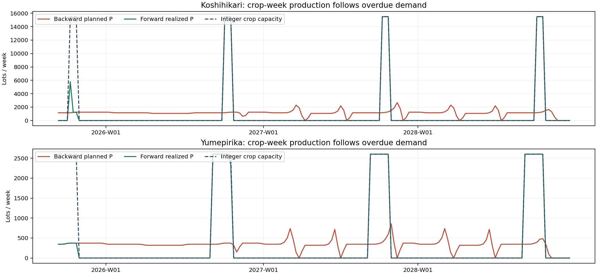
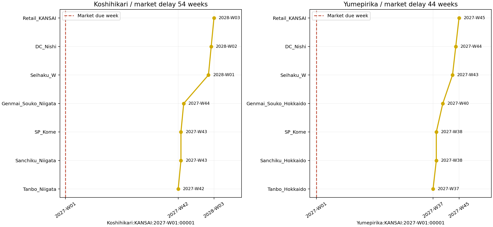
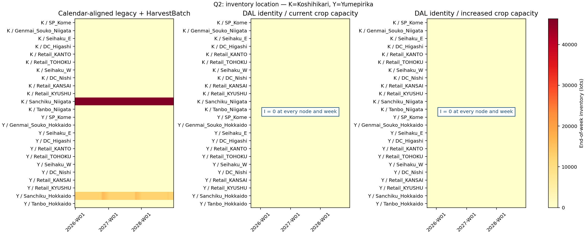
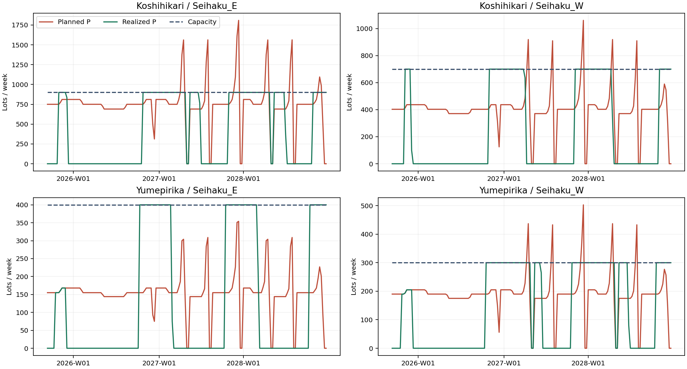

# WOM Rice DAL Trial Report

> 試行のデータ（`data/sample/rice-japan-2027-2028-dal/`）と道具（`tools/probe_rice_dal_trial.py`・`tools/analyze_rice_dal_trial.py`）は 5361206 まで。git の履歴で見られる（2026-10-09 削除、`docs/development/WOM_RiceLegacyRetire_Report.md`）。

- 依頼: `requests/RequestLetter_RiceDAL_Trial_to_CodeKun.md`
- 測定基準: **`d848c5fa0565d70f6817c1a0257341067712deca`**、`wom-v1r5m1_cap_trial`
- 測定日: 2026-10-06 UTC
- 担当: Astra。適合確認済みLinuxでHeadless・pytestを実施
- 種別: 新しい試行モデルと測定道具による調査。core・既存rice・HarvestBatch・goldenの変更なし。commit・pushなし
- 並行する段階D第2回の変更は混ぜていない

## 0. 結論

**需要を過年度へ明示的に延長してHarvestBatchを外すだけでは、現在のエンジンは「前年の収穫→玄米保管→必要週に精米・販売」を形成しない。**
Lot_IDの同一性を保つ計画とLOVEM観測は成立したが、通常のriceをこのモデルへ置き換える段階には達していない。

| 2027-W01〜2028-W52に要求されたLot_IDの照合 | カレンダー補完legacy | DAL・現行能力 | DAL・田の能力増強 |
|---|---:|---:|---:|
| 需要 | 159,094 | 159,094 | 159,094 |
| 当週出荷 | 159,094 | **0** | **0** |
| 遅配して期間内に出荷 | 0 | 62,082 | 89,839 |
| 2028-W52終了時の注文残 | 0 | 97,012 | 69,255 |
| 需要週での充足率 | 100% | 0% | 0% |
| 期間末までのID充足率 | 100% | 39.02% | 56.47% |
| 最大遅配週数 | 0 | 74 | 51 |
| 合成期首在庫 | 58,729 | **0** | **0** |

田の能力増強だけでは、収穫への前倒しと精白工程の山積みは解決しない。
本試行の成果は、追加設計が必要な箇所を、Lot_ID・ノード・週の証拠に分けて示したことである。

## 1. 条件・比較の揃え方

| 条件 | 意味 | 計画期間 |
|---|---|---|
| `baseline` | 原本rice、legacy、4プラグイン。既存goldenとの照合用 | 2026-W01〜2028-W51、156週 |
| `legacy_calendar` | 原本の一時複写。需要2026-W53=0、能力2028-W52を補完。他は同じ | 2026-W01〜2028-W52、157週 |
| `dal_current` | 新モデル、identity、HarvestBatchなし、現行能力 | 2025-W37〜2028-W52、173週 |
| `dal_increased` | DALの一時複写。田の収穫週の能力だけ増強 | 同上 |
| `dal_observed` | `dal_current`と同じ条件でLOVEM観測ON | 同上 |

**観測:** 原本の需要CSVは156種類の週ラベルだが、2026-W53が抜けている。
Headlessは「最初の週＋ラベルの種類数」で連続ISO週を作るため、原本の2028-W52需要が計画に入らない。
原本を変更せず、比較用の複写だけを補完した。したがって主比較は `legacy_calendar` 対DALで行う。

2025-W37は、既存の収穫期の早い方である北海道W37から選んだ。
その週からの需要を2026の同じ週番号から写したもので、実績値ではない。
Q1の検査では、この延長だけで前年収穫へ戻ることは確認できなかった。
さらに前へ延長する自動追加試行は行っていない。

全条件で `cpu_size=1`。DALの有効プラグインはHolidayCalendar・BufferingStockOptimizer・CapacityOverrideの3つ。
田の非収穫週の `max_supply=0.1` は比較条件を保つため残した。既存コードでは整数化されて0になる。
無制限の意味を持つ未設定0への単純置換や、epsilonの本番仕様化は行っていない。

### 報告期間の定義

- 需要の充足・遅配・注文残は、**要求週が2027-W01〜2028-W52のID集合**を追跡する。
- 売上・粗利・期間内販売数は、**実出荷週が同じ期間に入る販売**を集計する。
- この二つは別集合。2025・2026の要求が2027・2028に遅れて売れる分は、後者にだけ入る。
- 期末注文残は、要求されたIDから全期間の実出荷IDを照合して求める。DAL現行能力では最終週のCO・S・実出荷ともID単位で照合した。
- `CO[w]` は週初。最終週の後の `CO[n]` は保存されないので、最後のCO列だけを期末注文残とはしていない。

**コードで確認:** `planning_start` は助走を含む計画開始の指定で、報告開始を分ける指定ではない。
`vc_config.csv` の `report_start` はValue Chainにあるが、本件の標準Planning・PPC・LOVEM全体の除外指定にはならない。
今回は測定道具で2027-W01を明示的にフィルターした。GUIが過年度需要を自動で除外する、とは確認していない。

## 2. Q1 — 田のPは直近の過去の収穫週へ戻るか

**観測: 戻らない。** DALではBackward前後の田のPと、post-backward hooks後のPが同じである。
能力増強条件でもBackward配置は同じだった。

| 全計画期間の田P | Koshihikari | Yumepirika |
|---|---:|---:|
| 田まで配置されたPのID | 194,685 | 57,538 |
| 収穫週に偶然一致したP | 14,576 | 10,666 |
| 非収穫週に置かれたP | **180,109** | **46,872** |
| 田の要求週以前に収穫週が計画内に無いID | 4,612 | 0 |
| 計画開始端等で田Pまで届かなかった市場要求ID | 6,571 | 2,726 |

2027・2028の報告対象だけでは、非収穫週の田PはKoshihikari **115,098**、Yumepirika **31,046**。
報告期間に田まで配置された要求について、過去の収穫週が計画内に無いケースは0だった。
したがって、この期間の非収穫配置を「前年の週がデータに無かったため」とは説明できない。

**コードで確認:** `BackwardPlanner._apply_mom_cap_backward` は `node_type == "mom"` にだけ適用する。
田は `leaf_in` なので、収穫カレンダーの能力を使った前倒し配置の対象外。
現行のMOM前倒しは計画開始週まで探索し、一般的な「最大1年」という上限を持っていない。
今回の問題は上限の長さではなく、田への収穫期配置が実施されないことにある。

**観測＋コード:** 非収穫週のPはForwardで整数能力0に掛かり、IDを保って後の週へ送られる。
その結果、次の収穫週またはさらに次年の収穫で生産される。

具体例（全ノードの出荷履歴は付表 `lot_examples.json`）:

| ID | Backwardの田P | 過去の直近収穫週 | 田の実出荷 | 市場要求 | 市場実出荷 |
|---|---|---|---|---|---|
| `Koshihikari:KANSAI:2027-W01:00001` | 2026-W48 | 2026-W43 | 2027-W42 | 2027-W01 | 2028-W03、54週遅配 |
| `Yumepirika:KANSAI:2027-W01:00001` | 2026-W46 | 2026-W43 | 2027-W37 | 2027-W01 | 2027-W45、44週遅配 |

## 3. Q2 — 在庫の置き場所

**観測:** DAL現行能力・増強能力とも、24個の品目別ノード、173週すべてで期末 `Supply I=0`。
`Genmai_Souko_Niigata`・`Genmai_Souko_Hokkaido` だけでなく、田・集荷センターにもIは形成されなかった。
2027-W01時点のIも全ノード0である。

| 比較条件 | 集荷センターIのピーク（K／Y） | 玄米保管拠点Iのピーク（K／Y） |
|---|---:|---:|
| 原本baseline | 46,297／16,045 | 0／0 |
| カレンダー補完legacy | 46,297／16,045 | 0／0 |
| DAL現行能力 | 0／0 | 0／0 |
| DAL増強能力 | 0／0 | 0／0 |

**解釈:** 「収穫前に作って保管する」計画ではなく、既に遅れた要求のLotを収穫期に作り、届いた先で出荷する計画になった。
玄米保管拠点で、将来の要求まで待つ在庫は成立していない。

**注意:** 能力待ちのLotは、現行Forwardでは翌週以降のPへ繰り延べられる。
その数量は期末Iに含まれない。**I=0は、物理的な加工待ち・輸送中・未処理Lotが存在しない証明ではない。**
例のKoshihikariは玄米拠点を2027-W44に出荷し、精白を2028-W01に出荷するが、精白Iは0。
本実装では、この待ちの物理表現と、在庫原価の対象を合わせて定義する必要がある。

**本実装に向けた案・未実装:** 先に将来需要のIDを直近の実行可能な収穫へ配分し、その後に田→集荷→玄米拠点への先送りを定義する。
保管拠点より下流では同じIDの要求に応じて精米・出荷する。
pushを足すだけでは、現時点の「収穫への前倒しが無い」問題は解けない。

## 4. Q3 — 年間能力とlegacyで埋まって見える差

**観測:** CSV原形の年間需要は依頼書どおりだが、HolidayCalendarを適用した2027・2028の要求は増える。

| 品目 | 原形の年需要 | 2027／2028の計画要求 | 現行の田の年能力 | 計画要求との差 |
|---|---:|---:|---:|---:|
| Koshihikari | 59,903 | 61,215 | 46,500（15,500×3） | **14,715不足** |
| Yumepirika | 17,940 | 18,332 | 18,200（2,600×7） | **132不足** |

増強条件は、完全な年の実測需要の最大値を基準に切り上げた。
新潟 **20,405×3=61,215**、北海道 **2,619×7=18,333**。
収穫週の数・他工程の能力・需要・プラグインは変えていない。原本とDAL配布用マスターの能力は変更していない。

### legacyの差を、期首在庫だけに帰属させない

**観測:** 原本のHarvestBatch後は、Koshihikariの田Pが173,971→139,500になり、**34,471 IDが田Pから外れる**。
カレンダー補完条件では175,219→139,500、35,719 IDが外れる。
HarvestBatchは、期間全体のPを早い収穫週から詰め、能力が尽きると残りを配置しない。需要年ごとの配分でも、直近の過去収穫への配置でもない。

合成期首在庫はKoshihikari 46,297、Yumepirika 12,432、計58,729。
ただし、**`OI_` IDの実出荷は全ノード合計で0件**だった。
この在庫が同じ需要IDへ置き換わって不足を埋めた、とする説明は今回の結果に当てはまらない。

カレンダー補完legacyの全期間について:

| 系列 | Koshihikari実出荷 | Yumepirika実出荷 |
|---|---:|---:|
| 田／集荷／SP／玄米拠点 | 各139,500 | 各51,661 |
| 精白E＋W | 171,582 | 52,887 |
| DC東＋西 | 180,648 | 54,100 |
| 最終市場4拠点合計 | **182,333** | **54,604** |

**コードで確認:** legacyは下流のPを需要Pからコピーするため、親の実出荷が足りなくても下流で供給があるように計画できる。
上表の増加と、市場の充足100%はこの経路と整合する。identityではこのPコピーを使わない。
合成在庫の問題と、下流Pコピーによる供給成立の問題を分ける必要がある。

## 5. Q4 — 精白工程の週能力

**観測:** 精白工程は季節生産の山積みを処理し切れず、identityでは未処理Pの繰延が発生する。
元の需要Pが能力以内の週でも、収穫後の入荷集中で能力待ちが発生する。

| 現行能力DAL・全計画期間 | 週能力 | 需要Pが能力を超える週 | 需要Pピーク | 実現P合計 | 能力による繰延（のべLot週） |
|---|---:|---:|---:|---:|---:|
| Koshihikari／Seihaku_E | 900 | 15 | 1,809 | 73,969 | 1,139,187 |
| Koshihikari／Seihaku_W | 700 | 6 | 1,061 | 40,965 | 420,078 |
| Yumepirika／Seihaku_E | 400 | 0 | 354 | 21,825 | 149,338 |
| Yumepirika／Seihaku_W | 300 | 8 | 503 | 24,239 | 311,995 |

実現Pは全週で与えられた週能力以下。繰延は、同じLotが複数週待てば複数回数える。
能力増強条件では田から届く量が増え、Koshihikari精白E／Wの繰延は1,872,105／697,783 Lot週へ増えた。
これは「不足Lotがその件数だけ増えた」という意味ではない。

**モデルの限界:** 同じ `Seihaku_E/W` 名でも、現モデルは品目別PlanNode・品目別能力を持つ。
両品目で共有する設備能力の制約を検査した結果ではない。
Q4の答えは、**現モデルの与えられた週能力では、観測した季節入荷を販売の要求週に間に合わせられない**。
収穫の前倒しが未実施なので、遅配全数を精白だけに帰属させない。

## 6. Q5 — 数量・金額の比較

### 報告期間の需要ID集合（品目別）

| 条件 | 品目 | 需要 | 当週出荷 | 遅配出荷 | 期末注文残 |
|---|---|---:|---:|---:|---:|
| DAL現行 | Koshihikari | 122,430 | 0 | 38,525 | 83,905 |
| DAL現行 | Yumepirika | 36,664 | 0 | 23,557 | 13,107 |
| DAL増強 | Koshihikari | 122,430 | 0 | 66,171 | 56,259 |
| DAL増強 | Yumepirika | 36,664 | 0 | 23,668 | 12,996 |

全計画期間ではDAL現行の要求261,520、当週2,524、遅配152,687、期末注文残106,309。
増強は当週2,524、遅配180,444、期末注文残78,552。
早出しは市場・通常ノードとも0。合成期首在庫・合成IDの出荷も0。

### 実出荷週が報告期間に入る販売・PPC

| 条件 | 期間内販売Lot数 | 売上JPY | 粗利JPY | 粗利率 |
|---|---:|---:|---:|---:|
| 原本baseline（W52が計画外） | 157,473 | 1,236,342,900 | 479,090,626 | 38.75% |
| カレンダー補完legacy | 159,094 | 1,249,138,700 | 483,529,130 | 38.71% |
| DAL現行 | **126,549** | **1,005,488,300** | **385,537,829** | 38.34% |
| DAL増強 | **154,306** | **1,231,077,400** | **477,884,483** | 38.82% |

DAL現行の126,549は、報告期間の需要を満たした62,082とは別の数。
過年度の要求に対応する遅配販売が含まれる。増強の154,306と89,839も同様。

**観測:** 全条件でPPC入口は `sales_source="psi"`。サンプル販売fallbackは発生していない。
`ppc_lot_reconciliation.csv` の `qty × market_revenue_base`、`qty × forward_cost_base` を実出荷週で集計し、
市場の実出荷件数と `qty` 合計を照合した。

**評価の範囲:** このモデルには独自のPPCマスターが無く、既存 `data/ppc` のRice設定を使う。
台帳の経路は `Farm_JP / Coop_Seihaku / DC_Rice / JP_Channel` で、試行の全物理ノードと同じ粒度ではない。
PPCの `total_lots` は週次集約された販売レコード件数であり、物理Lot_ID数ではない（baselineは1,240レコード／235,316 Lot）。
4市場の同一週が同じPPC合成IDになるため、金融レコードをIDでdeduplicateしてはいけない。
今回の金額は既存PPCの比較であり、段階D第2回の台帳・法人別／連結評価を測定したものではない。

## 7. Q6 — LOVEMの独立照合

既存の `wom.lovem.verify`、interval decoder、digest実装を輸入せず、別の測定道具で照合した。

| 検査 | 結果 |
|---|---|
| manifest code_sha | 基準SHAと一致 |
| lot_flow_mode | identity |
| HarvestBatch | 無効 |
| 観測ON／OFF | 全ノードDemand/Supplyの順序付きハッシュ・実出荷・Backward/Forward結果・snapshot・PPC全ファイルが一致 |
| 出荷イベントの1対1 | **1,293,299／1,293,299一致**。商品・node_id・週・sequence・lot_id・quantity=1を照合。余り0 |
| 区間の復元 | **99,648／99,648セル一致**。個数・数量・Lot/role/quantityのmultiset SHAを照合 |
| 区間 | 18,444,584件。全10 snapshots、85,454,676のべ出現 |
| 区間の構造 | 週範囲・P/S単週・同一キーの非重複・interval_idの連続性を確認 |
| 最終市場の期末注文残 | 全期間106,309 IDを、最終週CO＋最終週要求−最終週実出荷とID単位で照合 |
| 早出し／遅配 | 通常ノードの出荷出現件数で0／1,257,099。市場の遅配ID数は152,687（全期間） |

出荷出現件数は同じIDが複数ノードを通ると複数回数える。市場IDの件数と混ぜない。
区間から元リストの並び順を復元したとは主張しない。並び順の不変性はON/OFF側のハッシュで確認した。

**manifestのdirty:** 未commitの新モデルと新測定道具があるためtrue。保護対象のtrackedファイルは全件ハッシュ一致。
README・報告書は測定後に追加した説明資料で、測定時の入力CSVを変更していない。

**観測の境界:** LOVEM `demand_anchors.jsonl.gz` はHolidayCalendar前の258,112 IDを記録する。
計画に使う最終要求は261,520 ID。Holidayの `HOL:` IDが4,304追加され、元の896 IDが削減された。
本報告の充足判定にはHoliday適用後のDemand Sを使った。pre-hook anchorsだけでは同じ集合にならない。
これは出荷1対1照合の失敗ではなく、要求の観測時点の違いである。

LOVEM runは約213 MiBで、finalだけでも8,178,745区間。
Windows viewerの全件描画・メモリ・操作性能は未確認。代表IDの図は生の実出荷から作った静的図である。

## 8. 本実装前に決める事項

| 論点 | 今回の事実 | 次に決めること |
|---|---|---|
| 収穫への配分 | leaf_inのBackwardは収穫能力で前倒ししない | 将来需要IDをどの収穫へ割り当てるか。直近週に満杯なら前の収穫も使うか、供給不足として残すか |
| 保管位置・push | GenmaiにIが立たない | 田→集荷→Genmaiを先送りし、同じIDを玄米で保管する区間と条件。下流の要求照合は保つ |
| 年間収穫量と週能力 | 田の年不足＋精白の週待ちが別々にある | 年間の作付け・収穫量制約と、精白設備の週次処理制約を分ける。品目で共有する設備の識別も定義する |
| 非収穫週の意味 | 現マスターは0.1の整数化に依存 | 物理CapHardと操業／季節の状態を分け、明示的な操業カレンダーで表す範囲 |
| 加工待ちの物理表現 | Pを次週へ動かすため、待ちがIに現れない | 保管Lot、未処理Lot、工程中Lotと、それぞれの原価台帳上の扱い |
| 過年度需要と報告期間 | planning_startでは2027報告開始を設定できない | 計画開始・初期在庫形成・報告開始を独立に持つ。過年度の要求は実績を再現するのか、先行生産の計画なのか |
| 元riceとHarvestBatch | 既存goldenは一致。新モデルは季節保管を未達 | 元riceは比較用legacyのまま保持。本実装の受入後に移行・廃止を判断する |

**推奨する次の単位:** 一つの品目・一つの将来需要IDについて、過去収穫への配分、Genmaiでの保管、要求週に向けた精米、実出荷までを手計算で合意する。
年間能力が足りない場合と、精白週能力が足りない場合を別の例にする。
その規則を本実装依頼へ渡す。今回、エンジン修正やpush追加はしていない。

## 9. 検証・未確認・成果物

- 既存rice golden: **1 passed**。基準SHAの原本結果が一致。
- 関連する区間・能力・休業・Backwardテスト: **44 passed**。既存の非推奨pushモードのテストで警告1件。
- raw gzip 50ファイルを最後まで読めることを検査。
- 全trackedファイルのSHA-256を開始前後で照合。core・元CSV・goldenの変更0。
- 一度取得したDAL OFFのQ1 CSVにgzip末尾の欠損があった。完全に一致したON再測定の同一CSVで復元し、復元元・旧ハッシュ・新ハッシュを `raw/q1_file_recovery.json` に記録した。欠損原因は未特定。出荷・PSI・PPCの測定結果には不一致が無い。
- Windows GUI、全体テストの再実行、段階D第2回との統合、物理設備の共有能力、別の2025開始週は未確認。本件の調査範囲を自動延長していない。

成果物:

1. `data/sample/rice-japan-2027-2028-dal/`（試行README付き）
2. `tools/probe_rice_dal_trial.py`（固定SHA検査、複写モデルでの測定）
3. `tools/analyze_rice_dal_trial.py`（集計・図・独立照合。WOM checkerを使わない）
4. 本報告書と `docs/development/rice_dal_trial/` の付表・図
5. 4条件＋ONの生データ、qualification、再実行手順、LOVEM run、ファイル別ハッシュ一覧

再実行と配置は配布物の `RERUN.md` を参照。既存ファイルを上書きするpatchやgit操作は含めていない。

### 根拠となる基準コード

- `wom/engine/backward_planner.py`: `_in_propagate`、`_apply_mom_cap_backward`
- `wom/engine/forward_planner.py`: `_compute_node` Step0a、実出荷・identityの子への伝播
- `wom/engine/harvest_batch_plugin.py`: `on_post_backward`、`_inject_opening_inv`
- `tools/run_headless_from_folder.py`: `_detect_period`、プラグイン選択、PPC起動
- `wom/engine/warmup.py`: `resolve_effective_start`、`read_planning_config`
- `wom/lovem/observer.py`: anchorsの観測位置、actual_ship、final snapshot
- `wom/valuechain/run.py`: Value Chainの独立したreport_start

以上はすべて [基準SHAのソース](https://github.com/Yasushi-Osugi/wom_development_composite_node/tree/d848c5fa0565d70f6817c1a0257341067712deca) から読んだ。
測定ハッシュは付表 `rice_dal_trial/file_hashes.csv` と配布物の `SHA256SUMS` で確認できる。

## 10. データ保全のハッシュ

ファイル別一覧: `rice_dal_trial/file_hashes.csv`（221ファイル）。一覧自体のSHA-256:

`74c7582722d7e3a46168e818ae09c8dfa0985e90a0c6b5c48575b87c9f46bae5`

| 照合資料 | SHA-256 |
|---|---|
| `lovem_independent_verification.json` | `fb83793bc3486b36b9ac43d0b5f386e10c5a91e8406b662741b97870d410bc5c` |
| `protected_file_integrity.json` | `e65b8c8ed8395c3e9fad0c4401ede3c4f9bd250b8c1d2eee16ab82d0cd7d561e` |
| `raw_validation.json` | `20b6852e33cce5c4401bfba330d9b82a737107aeed91df191d5c4b8bda691c34` |
| `case_comparison.csv` | `d8618607d13f6d30e2c2812d3e8bce649792c3243f02ad1d7997977508f56dfc` |
