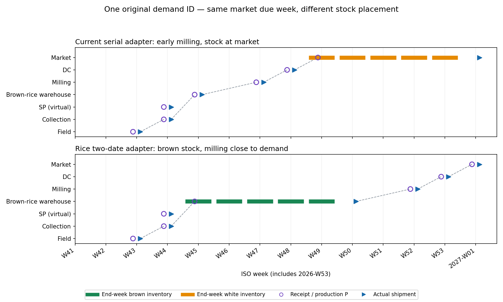

# WOM Rice Seasonal Definition — 最新コード検証・手計算・独立試作

- 測定日: 2026-10-08 UTC
- 担当: Sol（Astra君の独立検証を引き継ぐ）
- GitHub: Yasushi-Osugi/wom_development_composite_node、default branch wom-v1r5m1_cap_trial
- **基準SHA: 26a1e8eb7bc2f899246168a60c8f480857a0b614**
- 作業: 最新コードの確認、1品目・1需要IDの定義、独立試作、Code君への依頼書案。
- core/元Rice/HarvestBatch/goldenの変更0。commit・pushなし。

## 0. 到達点

**収穫週と精米週を独立に選ぶことで、同じ需要IDを玄米倉庫で5週間保管し、要求週に販売する計画を、現在のidentity Forwardで再現した。**

| 1品目・1需要IDの検査 | 現行Backwardのみ | 現行serial上位層 | Rice二日付試作 |
|---|---:|---:|---:|
| 元市場要求の変更 | 0 | 0 | 0 |
| 当週出荷 / 期末注文残 | 0 / 1 | 1 / 0 | **1 / 0** |
| 早出し / 遅配 | 0 / 0 | 0 / 0 | **0 / 0** |
| 玄米倉庫のI（需要lot週） | 0 | 0 | **5** |
| 市場の精米I（需要lot週） | 0 | **5** | **0** |
| 実出荷記録（仮想SP含む） | 0 | 7 | **7** |

この結果は隔離した検算用入力のもの。通常Rice両品目・全市場を移行した結果ではない。
単位・歩留まり・能力・保存方針は検算用の仮定で、Owner承認済みの業務値ではない。

## 1. 最新コミットの検証

### 1.1 取得と実行環境

GitHubコネクターでdefault branchと先頭SHAを取得し、独立Linux cloneのHEADと照合した。
先頭は26a1e8e（入口文書追加）、親はe72b67a（smartx世代ラインと上位層）。
先頭のcommit時刻は2026-10-07 22:05:42 UTC＝10月8日07:05:42 JST。
計測中の後続pushは取り込まない。

Git fsck --fullはexit 0。取得時に1202 trackedファイルをSHA-256で記録した。
前のvenvのPythonリンクが使えなかったため、新しい隔離venvでpytest/networkxを用意して適合確認をやり直した。

| 項目 | 実行した環境 |
|---|---|
| Python | 3.12.14 |
| numpy / pandas / scipy | 2.3.5 / 2.2.3 / 1.17.0 |
| matplotlib / networkx / pytest | 3.10.8 / 3.7 / 9.1.1 |
| 条件 | PYTHONHASHSEED=0、MPLBACKEND=Agg、PYTHONDONTWRITEBYTECODE=1 |

### 1.2 既存コードのテスト

能力0/空欄、capacity_layer trial、世代ライン、goldenの4テストファイルを実行。
**69 passed、失敗0、skip0**。内訳にcanonical13＋legacy3のgoldenを含む。
ev-europeの能力表の期間外90行について既存の警告が1件。期待値を変更せず通過した。
全767件の再実行・Windows GUIの独立再確認を行った、とは主張しない。

現在のRice goldenはlegacyの4プラグインで、2026-W01開始、157週、需要CSVの欠落2026-W53を補完する。
以前のRice DAL報告はd848c5fでの測定なので、その156週のbaselineを最新コードの結果と混ぜない。

### 1.3 Riceに関係する確認

| 確認対象 | 最新コードの事実 | Riceへの意味 |
|---|---|---|
| 能力の値 | Noneと0を区別。0で生産を封印/繰延 | epsilonを新モデルに持ち込む必要がない |
| leaf_inのBackward | MOMの能力押戻しと異なり、収穫週への割当は行わない | 過年度需要の延長だけでは不足 |
| SerialLineAdapter | 内部計画週を一つ選び、経路全体の位置を前倒し | 玄米保管と需要直前の精米を別々には選べない |
| 既存CapacityLayerPlugin | 品目ごとに問題を解く。Hookも品目ごとのBwd/Copy/Fwdの間 | 共通の精米設備を二品目で使うには共同問題の計算点が必要 |
| 現行Rice能力 | 非収穫週の0.1とHarvestBatch/legacyが残る | 元モデルを合格と呼んでidentityへ切替えない |
| 需要の単位 | headlessはCSV quantityをlot数としてID生成し、cpu_size=1を固定 | cpu_sizeの物量換算で需要IDを二重に割らない |

今回の範囲で、既存テストを止める新しい退行は検出しなかった。
上表のRice接続・共有設備は**現行機能の対応範囲と本実装の設計課題**。
capacity_layer/__init__.pyには「GUI/Planning未有効」という古い説明が残る一方、専用pluginは既に存在し既定OFF。
この記述は説明の更新対象で、計算不一致としては扱わない。

## 2. 作業1 — 1品目・1需要IDの手計算

対象: Koshihikari:KANSAI:2027-W01:00001。
経路とLTは現行RiceのKANSAI経路のCSVから7ノードを抽出した。
仮定は精米10 kg/需要lot、精米歩留まり9/10、玄米100/9 kg。
通常RiceのCSVではkgとの対応が未確定なので、この数字を元マスターの事実とはしない。

| 週 | 出来事 | 物量の状態 |
|---|---|---|
| 2026-W43 | 田で収穫・出荷 | 玄米100/9 kg、同じ需要ID |
| W44 | 集荷に到着・出荷 | 玄米、供給点は仮想の引渡し |
| W45 | 玄米倉庫に到着 | 玄米Iに入る |
| W45〜W49 | 倉庫の期末I | 5週 × 100/9 kg |
| W50 | 倉庫から払出し | 倉庫Iから抜ける |
| W50〜W51 | 倉庫→精米の輸送中 | 玄米100/9 kg。倉庫Iではない |
| W52 | 精米・出荷 | 精米10 kg＋その他の産出10/9 kg |
| W53 | DCに到着・出荷 | 精米10 kg |
| 2027-W01 | 市場に到着・販売 | 元IDの当週出荷1 |

収穫から要求までは11週。これは玄米Iの5週とは別の値。
玄米保管量は500/9＝約55.556 kg週。
保管容量の検査は「前週末I＋今週P、払出し前」の保守的な週内ピーク。
W50に期末Iが0でも、その週の倉庫容量を不要としない。

### 報告期首・加工の境界

報告開始をW48に置けば、前週末W47の倉庫Iは同じIDの玄米100/9 kg。
2027-W01開始なら、このIDは前年末W53に精米の輸送中で、玄米倉庫Iではない。
期首在庫を一律に玄米在庫と呼ばず、実際の状態/所有/輸送を確認する必要がある。

100/9＝10＋10/9はFractionで各週検算した。
その他の産出は未価格・未処分先であり、売上や廃棄と決めていない。
物量台帳は週末状態と累計産出の記録で、kgを週方向に合計して収穫量と呼ばない。
価格・在庫原価・Value Chainへの歩留まり接続は今回の測定外。

## 3. 作業2 — 独立試作

### 3.1 追加したもの

- wom/capacity_layer/rice_trial.py: h/p候補、資源予約、整数ID割当、段階別物量、内部位置の橋渡し。
- data/trial/rice-seasonal-one-id/: 最少のCSV経路/能力/需要、仮定と手計算expected。
- tools/probe_rice_seasonal_definition.py: SHA固定、3条件のPSI全量出力、独立ID照合、元ファイルの保全検査。
- tools/plot_rice_seasonal_definition.py: 実測PSIの比較図。
- tests/test_rice_seasonal_trial.py: 正常系と能力/在庫/品質/共有設備/分数/Forward負例。

既存solverのRequest/Option/Problemと検証関数を使う。
Riceの候補は田→集荷→倉庫を早く通し、精米の要求に向けて倉庫から払出す。
今回の直列・非休業の検算経路では、既存Forwardの変更を必要としなかった。
InboundのデカップリングPコピー、Kitting、休業でLTが変わる経路は橋渡しの対象外としてエラーにする。

### 3.2 制約と解法

- 収穫・集荷・倉庫受入れ・精米は玄米kg/週、DC/市場は精米kg/週、保管は玄米kg。
- 季節の供給可能週と年産収穫量を別々に持つ。
- 収穫遡及13週・玄米最大保管10週・精米前倒し許容0週を、仮の検算方針として指定。
- 欠落はエラー、明示Noneは上限なし、0はゼロ。違う物量単位/保管と処理量を一つのresource_idに混ぜるとエラー。
- MILPの順序は、当週までの整数ID割当数最大→精米前倒しlot週最小→玄米kg週最小。

| 解法・主例 | 割当ID | 収穫前倒しlot週 | 精米の追加前倒し | 玄米kg週 |
|---|---:|---:|---:|---:|
| 貪欲 | 1 | 11 | 0 | 55.556 |
| 既存LP | 1 | 11 | 0 | 55.556 |
| Rice MILP | 1 | 11 | 0 | 55.556 |

主例は3候補の小問題。結果を通常Rice全量の最適性/性能と呼ばない。
半lot分の収穫能力を複数週へ置く負例ではLPの連続上界1でも整数ID割当0となることを確認。
通常モデルでは同じ条件の要求を集約した整数数量変数にして、元IDへ展開する設計が必要。

### 3.3 独立照合

実出荷とP/I/COをCounterで照合し、既存Flow CheckやLOVEM verifierの「合格」を根拠にはしていない。
3条件とも元市場Sは同一。Rice試作の7出荷記録は同じ1IDが全7ノードを通った出現数で、販売IDが7件という意味ではない。
非sourceのPが上流実出荷＋LTと一致、数量保存/CO/不正重複の差異0。
源泉は需要から作られたIDで、OI_等の合成期首在庫は0。

上位の割当後に精米のcore能力を0へ変える負例ではForwardが繰延し、要求週の充足0・期末未充足1となった。
「割り当てた」だけで供給成立とする検査にはしていない。
段階別kg台帳は成功したスケジュールの物量検算で、Forwardのkg変換機能を新実装したものではない。

緑は玄米倉庫I、橙は市場の精米I。灰線は実出荷→相手Pの物理区間。仮想SPを物理区間から除いた。
この図は測定PSIから作った静的な比較で、Windows LOVEM viewerの受入結果ではない。

## 4. テスト・保全・未確認

| 検査 | 結果 |
|---|---|
| 既存能力/世代/上位層/全16 golden | 69 passed |
| Rice試作の新規テスト | 22 passed |
| 元のtrackedファイル | 1202件、変更0 |
| 正常1IDのForward能力繰延 | 0 |
| 元市場のID/要求週の変更 | 0 |
| core・元Rice・HarvestBatch・canonical golden | 変更0 |

22件では、収穫週0、年産量の独立上限、倉庫kg不足、精米週0と前倒し代案、
保存年齢/収穫窓、欠落/None、共有精米資源、分数ID、歩留まり異常、需要ID不一致、
Forwardの独立した不足検出、未対応休業、保管ピーク、cpu_sizeの二重除算防止を確認した。

未確認: 通常Rice両品目/全市場の新方式実行、年間の配賦/余剰/品質、全量MILPの性能、
GUI/LOVEM run生成と区間復元、PPC/Value Chainのstage原価、実際のkg単位、共有設備の実データ。
既存69件と新規22件は別の実行であり、「最新の全テストが一回で緑」とは記載しない。

## 5. 作業3 — Code君への依頼書

requests/RequestLetter_RiceSeasonal_Implementation_to_CodeKun.mdを作成。
順序はA（同じ1ID）→B（専用アダプター/共同資源/フック順序）→C（通常Rice移行用コピー）。
doc更新案も別ファイルで渡し、docs/WOM_Start_Here.md §3/§7を今回無断で正典に変更しない。
実装担当への送信・git操作は行っていない。

### 通常モデルの値として確定するもの

1. 最終需要lotと玄米/精米kgの対応、歩留まり・その他の産出。
2. 年産収穫量、週設備上限、季節の供給可能量、玄米保管能力。
3. 品目間で共有する精米設備/倉庫のresource_id。
4. 収穫遡及窓・品質年齢・精米の前倒し方針・報告期首と過年度需要の役割。

今回の手計算の数値は検算案。通常モデルの値を合意済みと呼ばない。
これらの値と全量検証が揃うまで、現在のRice legacyを保持する。

## 6. 成果物・再実行・ハッシュ

リポジトリ用ファイルはWOM_Rice_Seasonal_Definition_Files.zipのrepo_additionsにまとめた。
生PSI/物量/資源問題/検査ログ/保全ハッシュは別のEvidence.zip。
RERUN.mdと各ZIP内部のSHA256SUMSで配置/再実行/内容検査を行う。

| 主な生データ | SHA-256 |
|---|---|
| prototype/manifest.json | d7ce51f960ad3a7c1a600e27efa9807fd65ba4195827078769e92ccc239988d7 |
| prototype/forward_verification.json | a3f70370ece60e896532f8426a4e674aa114afe2dd2537d7ad09774bd03b4b05 |
| prototype/physical_ledger.json | 04b53af7f10c5c626dfca6ed2072fb895d5224620758cbb5f870fe8be40bc253 |
| prototype/tracked_integrity.json | 5d538293900b992022c5698153c943ff2dd679eb2db3294e38a11acef525193e |

測定SHAの照合と元trackedファイル保全はprobeに組み込んだ。
最終ZIPのハッシュは配布物のSHA256SUMSを参照。

## 7. コード根拠（固定SHA）

- [最新基準commit](https://github.com/Yasushi-Osugi/wom_development_composite_node/commit/26a1e8eb7bc2f899246168a60c8f480857a0b614)
- [上位層のSerialLineAdapter](https://github.com/Yasushi-Osugi/wom_development_composite_node/blob/26a1e8eb7bc2f899246168a60c8f480857a0b614/wom/capacity_layer/serial_adapter.py)
- [CapacityLayerPlugin](https://github.com/Yasushi-Osugi/wom_development_composite_node/blob/26a1e8eb7bc2f899246168a60c8f480857a0b614/wom/plugins/capacity_layer.py)
- [headlessの品目ごとの実行・需要生成](https://github.com/Yasushi-Osugi/wom_development_composite_node/blob/26a1e8eb7bc2f899246168a60c8f480857a0b614/tools/run_headless_from_folder.py)
- [Forward](https://github.com/Yasushi-Osugi/wom_development_composite_node/blob/26a1e8eb7bc2f899246168a60c8f480857a0b614/wom/engine/forward_planner.py)
- [現行Riceの経路](https://github.com/Yasushi-Osugi/wom_development_composite_node/blob/26a1e8eb7bc2f899246168a60c8f480857a0b614/data/sample/rice-japan-2027-2028/sc_tree_master.csv)
