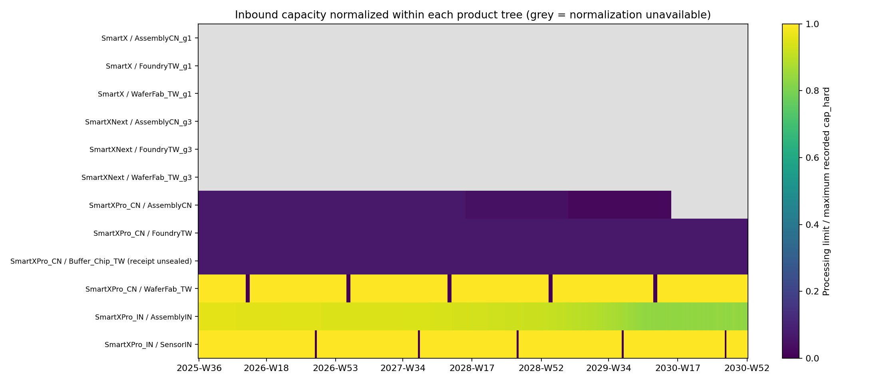
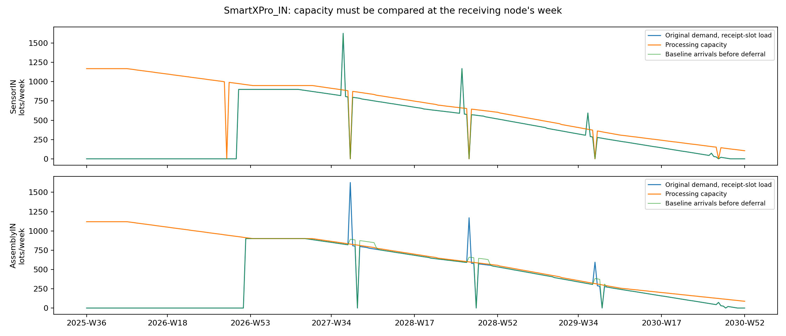
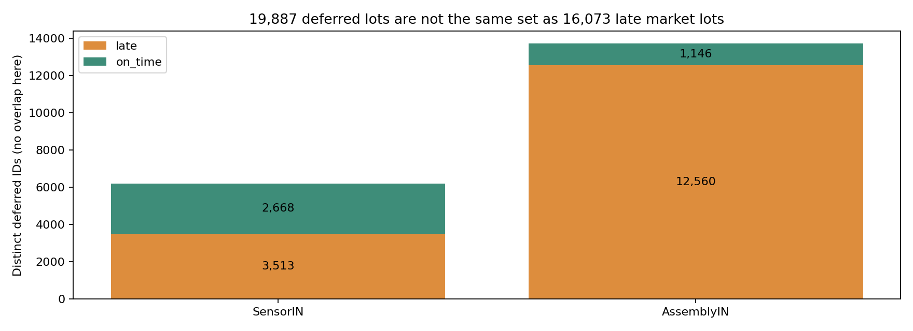
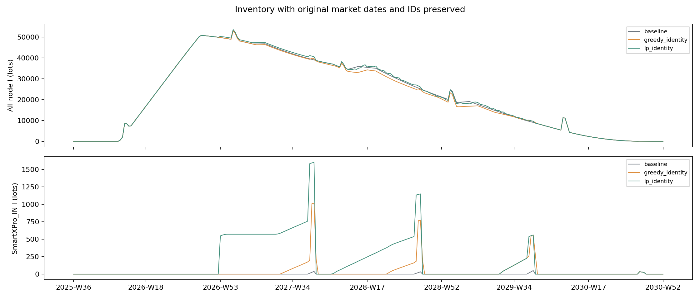

# WOM Smartx Bottleneck — 上位能力層の調査・試作報告

- 調査日：2026-10-06／担当：GPT-6 Astra
- 依頼：`requests/RequestLetter_SmartxBottleneck_UpperLayer_to_CodeKun.md` と大杉さんの季節能力に関する追加指示。
- リポジトリ：`Yasushi-Osugi/wom_development_composite_node`、`wom-v1r5m1_cap_trial`。
- **着手時・全測定の基準 SHA：`e355908b0a480b78d2d3a3f445fac38c27e93f43`**。最新 push を取得後、この SHA に固定。並行中の PeriodDetection／段階 D 第 2 回の変更は混ぜていない。
- 区分：調査と試作。本実装・既定方式の変更・commit・push・PR・golden 再生成は行っていない。

## 0. 結論

**現行コードが実際に読み込んでいる能力を前提にすると、上位の LP で内部計画週を割り当て、元の市場要求週と Lot_ID を保ったまま、遅配 16,073 件を 0 件にできた。** 全 709,811 件を全数照合し、早出し・期末注文残・Forward の能力繰り延べも 0。能力値を増やしていない。

ただし、これは実設備の能力保証とは別である。SmartX／SmartXNext の AssemblyCN の **408 行がノード名不一致で未適用**であり、3 製品が設備を共有するかも未定義。未設定能力を現行エンジン同様に上限制約なしとすることを、試行の明示的な条件にした。共有／独立の別仮説では結果が大きく変わる。

進め方を一つ改善した。依頼どおりの「調整した需要 CSV」だけでは、市場の要求週と生成される ID も変わり、改善を見誤り得る。CSV 方式も測定したうえで、**市場要求を固定し、内部の需要計画位置だけを渡す試行用アダプター**を追加した。これは独立した一時実行の POST_BACKWARD フックであり、通常の WOM／GUI には登録しない。

## 1. 環境・対象・保全

Python 3.12.14、numpy 2.3.5、pandas 2.2.3、matplotlib 3.10.8、scipy 1.17.0、pytest 9.1.1、networkx 3.7。Linux headless、`PYTHONHASHSEED=0`、`MPLBACKEND=Agg`。Windows GUI は実行していない。

対象は smartx-2027-2029 の 4 製品、34 ノード、2025-W36〜2030-W52 の **連続 278 週**、市場需要 709,811 lot。需要 CSV の ISO 週の抜けは 0。期首／warmup を含む同じ期間で全試行を比較した。

各実行はモデルを一時フォルダへ複写。元モデルの全ファイルの SHA-256 は実行前後一致。リポジトリの追跡済み **1,039 ファイルもすべて着手時と一致**。基準計測の headless snapshot は既存 smartx golden と完全一致した。

## 2. Part 1：能力の単位と読み込み

### 2.1 換算の根拠と限界

このモデルは `cpu_size=1`、全 `bom_qty=1`。能力ローダーは `max_supply` を `cap_hard` に入れ、Forward は P の Lot_ID リストの件数を制限する。したがって**今回のコード上の換算は 1 能力単位＝1 完成品需要 lot**。`cap_pieces` はこの経路では使われない。

CSV 自体には「個／lot／時間」などの単位定義がなく、一般のモデルで同じ換算を適用できるとまでは言えない。BOM が異なる場合は、各資源の使用量を完成品 lot 当たりの係数として明示する必要がある。

| 製品 | CSV の node_name | 行数 | 実際の対象 | max_supply の範囲 | 観測 |
|---|---|---:|---|---:|---|
| SmartX | AssemblyCN | 278 | AssemblyCN_g1 | 0〜633 | 名前不一致、未適用 |
| SmartXNext | AssemblyCN | 130 | AssemblyCN_g3 | 26〜1,600 | 名前不一致、未適用 |
| SmartXPro_CN | AssemblyCN | 278 | AssemblyCN | 0〜1,350 | 適用 |
| SmartXPro_CN | Buffer_Chip_TW | 278 | 同名 | 1,350 | 適用。ただし push の入庫は封印しない |
| SmartXPro_CN | FoundryTW | 278 | 同名 | 1,350 | 適用 |
| SmartXPro_CN | WaferFab_TW | 278 | 同名 | 20,000 | 適用 |
| SmartXPro_IN | AssemblyIN | 278 | 同名 | 88〜1,119 | 適用 |
| SmartXPro_IN | SensorIN | 278 | 同名 | 105〜1,169 | 適用 |

計 2,076 行のうち適用 1,668、`node_not_found` 408、期間外 0。元 CSV は直していない。

### 2.2 0・未設定・休業・共有を区別する

- 現行 `processing_limit()`：休業は 0、開いていて `cap_hard<=0` は None（未設定）。**CSV の 0 を物理的な能力ゼロと読んではいけない。**
- SensorIN は 5 週休業、台湾の各 WaferFab は 10 週休業。休業状態は既存の週状態を読む。CapHard を書き換えていない。
- 世代別ノードは製品別の PlanNode として存在し、共有設備 ID や 3 製品の合計能力制約はない。**コード上は別、現実の設備が別とは未確認**。
- CapHard のプロファイルは週によって変わる。この値が物理設備上限なのか、SKU 別の操業割当なのかはデータだけでは確定できない。大杉さんの「物理上限と計画能力を分ける」原則への整理は、本実装前の判断事項。

### 2.3 正規化・ボトルネックの移動

製品の Inbound Tree ごと・週ごとに、記録された正の CapHard の最大を分母にし、各ノードの処理上限を割った。未設定は欠測として保持する。物理上限の比較と休業を反映した処理上限の比較を別列にした。列名 `physical_cap_max_denominator` は記録 CapHard の最大を表し、物理仕様の認定を意味しない。

| 製品 | 代表的な正規化の結果 | 限界／移動 |
|---|---|---|
| SmartX／Next | 通常週は分母を作れない | 未適用／未設定を 0 とみなして順位付けしない |
| Pro_CN | WaferFab=1、Foundry・Buffer=0.0675、Assembly の週別比率が変化 | Assembly と Foundry 等の同率、WaferFab の休業、終盤の Assembly 未設定を区別 |
| Pro_IN | Sensor=1、Assembly の週別比率の中央値 0.932930 | 通常週は Assembly、Sensor の休業週は Sensor の処理上限 0 |

Buffer の表示能力は比較表には載せたが、現行 push の入庫制約として LP に二重に入れていない。**最小比率だけで実現可能量は決まらず、資源を使う週と需要量も必要**。

### 2.4 16,073 件と 19,887 件を ID で照合

| 能力繰り延べのノード | 繰り延べ ID | 市場では 1 週遅配 | 市場の要求週に回復 |
|---|---:|---:|---:|
| SensorIN | 6,181 | 3,513 | 2,668 |
| AssemblyIN | 13,706 | 12,560 | 1,146 |
| 合計 | **19,887** | **16,073** | **3,814** |

両ノードの繰り延べ ID の交差は 0。遅配 ID はすべて SmartXPro_IN、すべて 1 週遅れ、すべて上の繰り延べ記録に存在する。今回、繰り延べの distinct ID と lot・週件数はともに 19,887 だった。他のケースにも等しいとは限らない。期末注文残は 0 で、総需要量が永遠に供給不能という結果ではない。

要求を LT でずらしただけの S と、Forward が能力を消費する P の到着週は一致しないことがある。休業を避ける Backward の位置と物理輸送 LT を併せて調べると、Sensor への集中と、週別能力に対する Assembly の入庫集中が見える。上位層は **ノードの P／処理週に能力枠を予約**する必要がある。Buffer_Chip_TW の LT=39 をインド系統の原因と混同しない。

以下は全数照合に加えた代表履歴。全 ID と全ノードの出荷・需要位置は生データに保持した。

| Lot_ID（すべて SmartXPro_IN:AMER:） | 繰り延べ | 元の市場要求 | 実出荷 | 判定 |
|---|---|---|---|---|
| 2027-W48:00230 | Sensor W41 | W48 | W49 | 遅配 |
| 2027-W46:00077 | Sensor W39 | W46 | W46 | 回復 |
| 2027-W49:00239 | Assembly W46 | W49 | W50 | 遅配 |
| 2027-W46:00014 | Assembly W42 | W46 | W46 | 回復 |

## 3. Part 2：上位層の試作

### 3.1 定式化と明示的な試行条件

新規 `wom/capacity_layer/` はエンジンを呼ばない汎用ソルバーと、smartx の時刻・資源の変換を分けた。

- 要求 r：製品・市場・元の要求週・数量。選択肢 o：内部計画週と、使う各資源の週・完成品 lot 当たりの使用量。
- 変数 x_o：選択肢へ割り当てる lot。要求ごと `Σx_o<=q_r`、資源×週ごと `Σa_o,k,w x_o<=C_k,w`。
- root の Backward S の能力包絡も、現行 CSV 経路との整合のため別の不等式として保持。同じ設備の追加能力ではない。
- 貪欲法：早い要求週から、直前の実行可能な週へ割当。製品・市場名を同順位の順序として明示。
- LP：まず**元の要求週までに割当可能な lot 数を最大化**、同じ最大量の範囲で前倒し lot・週を最小化。利益・優先市場・サービス公平性は目的に入れていない。
- 前倒し窓は **最大 17 週**を試行パラメーターとして設定。恒久的な業務規則として承認された値ではない。遅配を許す選択肢は今回は作らず、割り当て不能を一覧に残す。
- 未設定能力をエンジンと同様に扱うことは、`explicit_engine_unbounded` として必須指定し、ノード・週の未設定を出力。汎用ソルバー自体では能力キーの欠落はエラー、None と 0 は別。
- Mode 4 の 39 週は push_config から読む。計画 LT と物理輸送 LT、休業を避ける位置、バッファで待つ時間を分けて資源週を求める。

| 現行能力の試行 | 元の要求 | 割当済み | 未割当 | 前倒し lot・週 |
|---|---:|---:|---:|---:|
| 貪欲法 | 709,811 | 707,130 | **2,681** | 29,532 |
| LP | 709,811 | 709,811 | **0** | 122,101 |

貪欲法の未割当は Pro_CN 1,721、Pro_IN 960。先に決めた配置が後の要求に必要な枠を使い、全体を組み直す LP との差が 2,681 lot になった。LP は今回の制約の下で全量を満たし、分数解は 0。上限も 709,811 なので、この定式化での整数スループット最適性を確認できる。

### 3.2 AssemblyCN の独立／共有仮説

名前の修正や共有設備の定義を元モデルへ適用せず、**上位の別仮説**で比較した。CSV の 3 SKU プロファイルを品種別の処理速度と仮置きし、独立なら専用ライン、共有なら 1 machine・週を `1/速度` ずつ使う。未記録週の選択肢は除外し、0 はこの仮説に限り品種の稼働不可とした。現行エンジンの 0 の意味とは異なる。下表はソルバーの比較であり、これら 2 仮説の Forward 実行はしていない。

| 仮説 | 貪欲法の割当 | LP の実行可能な整数割当 | 取りこぼしの差 |
|---|---:|---:|---:|
| CSV プロファイルを専用ラインとする | 486,940 | 491,308 | 4,368 |
| CSV プロファイルを同じ設備の品種別速度とする | 262,145 | 399,111 | 136,966 |

共有仮説の連続 LP 上限は **399,123.615341**。25 セルに分数があり、切り下げによる差 12.615341 lot を残した。399,111 は能力を超えない整数実行可能解であり、**整数最適解とは断定しない**。仮説の設備・速度・世代切替・0／未記録週の意味は、大杉さんの判断が必要。

## 4. 元の要求を固定したエンジン比較

### 4.1 全件の結果

全列を**元の 709,811 要求の ID・要求週**で数え直した。CSV 方式では再生成 ID と元 ID の対応表を使い、CSV から消えた未割当も残す。identity アダプターでは元の市場 S と ID をそのまま保持する。

| 実行 | 元の要求週に出荷 | 遅配 | 早出し | 期末注文残 | 能力繰り延べ |
|---|---:|---:|---:|---:|---:|
| 基準 | 693,738 | 16,073 | 0 | 0 | 19,887 |
| 貪欲法・需要 CSV のみ | 703,546 | 0 | **3,584** | 2,681 | 0 |
| LP・需要 CSV のみ | 669,532 | 0 | **40,279** | 0 | 0 |
| 貪欲法・元 ID／要求週保持 | 707,130 | 0 | 0 | **2,681** | 0 |
| **LP・元 ID／要求週保持** | **709,811** | **0** | **0** | **0** | **0** |

CSV 方式自身の「新しい要求週に対する充足」は全件定刻でも、元の顧客要求から見ると早出しになる。これを遅配解消の唯一の根拠にはしなかった。未割当は実際の市場注文残としても見える。

5 実行とも、ノードの全出荷イベント数と distinct ID 件数の差は 0。push_sub を除く自ノード要求より早い実出荷は 0。push の入庫を除いて、処理済み P が有限の処理上限を超えるノード・週も 0。

### 4.2 Backward の前倒しと在庫

元の要求から能力を考えず求めた root Demand S の週に対して、基準は CN の 4,618 ID を前倒しし、計 **79,094 lot・週**。上位の LP では CN 24,724 ID／79,094 lot・週、IN 15,555 ID／43,007 lot・週、計 **40,279 ID／122,101 lot・週**となった。

これは root **計画 S の位置**の比較であり、生産数量や市場の早出しではない。元 ID 方式では先に内部へ流し、市場で元の要求週まで在庫として待つ。基準の Demand CO の合計 79,094 も前倒し処理の lot・週記録であり、期末注文残 79,094 件という意味ではない。

元 ID アダプターは既存 Backward の後に内部配置を上位解で置き換える。そのため、置換前の Backward 実行結果と置換後の PSI を混同しない。既存 Backward のアルゴリズムそのものは直していない。

| 元 ID を保つ実行 | 全ノード I の lot・週 | Pro_IN の I lot・週 | PPC 売上 USD | PPC 粗利 USD |
|---|---:|---:|---:|---:|
| 基準 | 6,216,538 | 335 | 702,250,439.00 | 634,628,759.84 |
| 貪欲法 | 6,104,427 | 10,192 | 699,400,020.00 | 632,093,569.63 |
| LP | **6,264,324** | **48,121** | 702,250,439.00 | 634,628,759.84 |

LP の I は基準より **47,786 lot・週（約 0.77%）増加**。CN の在庫 lot・週は同じで、増加は IN 側。各実行のノード単位最大 I は 50,979 lot。P の滞留や CO を I に加算しておらず、PSI の I の観測値を使った。

LP の PPC が同じなのは、全量が同じ元の販売週に出荷されるため。**今回の既存 PPC の金額が同じでも、在庫の保有負担まで同じとは言えない**。段階 D 第 2 回の新しい原価処理・未実現利益消去は、この基準に含めていない。

## 5. Rice の季節能力に同じ仕組みを使えるか

**資源×週の定式化は再利用できる。現在の smartx 専用アダプターをそのまま Rice に使うことはできない。Rice の実行はしていない。**

汎用ソルバーでは「収穫できる週だけ能力があり、それ以外は 0」を明示できる。0 始まりの週番号で、収穫週 3 に能力 3、需要週 5 に 4 lot という手計算のテストを両ソルバーで実行し、収穫週への 3 lot 割当と未割当 1 lot を確認した。要求週より後の資源使用を定刻供給とする選択肢も拒否する。通常の未設定 None と季節能力 0 は混同しない。これを既存 capacity CSV の `max_supply=0` へそのまま書くと、エンジンでは未設定になるので接続設計が必要。

| 観点 | 今回の仕組みで扱えるもの | Rice の本実装に不足するもの |
|---|---|---|
| 季節能力 | 資源週の 0／正値、複数の収穫週、元需要 ID の割当 | 収穫量・単位・年度の能力表、操業状態との対応 |
| 工程と時間 | 1 選択肢で複数資源の異なる週を予約 | 収穫→玄米保管→精白→出荷を独立して時刻配置するアダプター |
| 物と需要 | 元の需要 ID を残し、未割当を可視化 | 収穫物と完成品の単位／歩留まり／BOM、需要への物の割当記録 |
| 在庫 | 元の要求週より早い物を市場要求まで待たせる | 玄米の保管場所・容量・品質／賞味期間・P 待ちと I の区別 |
| 計画範囲 | 任意の週別容量を受け取れる | 前年度・前々年度を含む期間と生産窓、17 週とは異なる候補範囲 |
| 金額 | 出荷 ID と選択肢を接続できる | warmup 原価、季節保管費・資金負担の台帳接続 |

特に、**将来需要 lot をどの収穫週へ置くか**と、**需要が近づいてから精白する週**を一緒にずらしてはいけない。今回の serial／単一供給元／BOM=1 アダプターは、その違いを表現していない。汎用ソルバーの選択肢として「収穫 h・精白 p・需要 d」を列挙し、工程間の保管と順序を保証する部分が必要になる。DBR／Kitting や収穫プラグインの本改修は今回の範囲外。

## 6. 本実装前に大杉さんが決めること

1. **能力の正本**：408 行の対象ノード、3 品種の共有設備、CapHard の固定設備上限と品種別計画能力／季節操業の分離。未設定を物理無限とみなさない。
2. **目的と制約**：数量スループット、利益、優先市場、遅配許容のどれを先に置くか。17 週の前倒し、保管容量、保有費用も業務上の承認が必要。
3. **エンジンへの渡し方**：元市場要求を不変の正本とし、内部スケジュールを別で渡す方式を推奨。今回の opt-in フックは受渡しの実験であり、通常の Planning Engine に組み込まれた機能ではない。
4. **生産配分との関係**：`ask_global_allocation` の数量・市場優先の意思入れ→上位能力層の週別実現可能性→Forward の物量照合、という役割分担。能力層から未割当・実現可能上限を返して配分を再検討する。再計算時に需要 ID を作り直さない。今回は A 系統との実 API 接続は行っていない。
5. **季節能力の接続**：Rice の工程別割当・在庫条件・季節能力表を定義し、汎用ソルバーと専用アダプターの責務を分ける。

次の一手は、ソルバーの高度化より先に **1 の能力マッピングと共有の意味を確定**すること。その正本から LP を再試行し、選んだ目的・在庫制約の下で Forward と金額を照合する。現時点で smartx の既定計画や golden を上位解に置き換える根拠は揃っていない。

## 7. 検証と未確認

- 既存能力関連＋新規ソルバーの 46 テスト成功（新規ソルバー 10 件を含む）。既存非推奨 push Mode 1〜3 の警告 1 件。
- 証拠の可逆保存の新規 3 テスト成功。
- smartx の golden テスト 1 件成功、他 golden 15 件は選択から除外。**今回、全テスト／全モデルは再実行していない**。
- 合計では重複を除いて 50 件のテストを確認。5 回の headless 計画実測と、市場全 ID・ノード件数・処理能力の独立照合を追加。
- 未確認：Windows の GUI／手操作、共有設備の実仕様、一般 BOM／cpu_size での物理換算、共有仮説の整数最適性、Rice 実行、段階 D 第 2 回の金額への影響。

## 8. 成果物・再実行・生データ

- `WOM_SmartxBottleneck_Files.zip`：`repo_additions/`（この報告書、付表・図、試作、測定・照合道具、テスト、試行モデル）、`RERUN.md`、`SHA256SUMS`。
- `WOM_SmartxBottleneck_Evidence.zip`：5 実行の全数記録、仮説・上位解・モデル条件・検査ログ。リポジトリには置かない。
- 大きな CSV は **順序と重複を保った可逆区間形式**に保存。間引き・ID の改名・重複除去は行わない。`tools/smartx_evidence_ranges.py` で通常の CSV／CSV.gz に復元できる。
- `RAW_FILE_INDEX.json` に元ファイルパス・全行数・元の CSV バイト SHA-256・保存ファイル SHA-256 を掲載。全区間ファイルは全行復元して元 CSV のバイト SHA-256 と一致することを確認。gzip 容器のバイト一致は環境差のため保証対象にしない。
- ZIP 内の `SHA256SUMS` は配布ファイルの全ハッシュ、外側の `SHA256SUMS` は配布 ZIP と単独報告書のハッシュ。再実行は基準 SHA で行い、出力先は新規フォルダとする。

主要な独立照合表は `smartx_bottleneck/engine_comparison.csv`、`root_demand_position_comparison.csv`、`independent_node_checks.json`。週別能力・要求・在庫と 4 ID の全ノード履歴も同フォルダにある。全件の需要位置／実出荷／市場状態と Lot 割当は Evidence にある。

## 9. 根拠の場所

基準 SHA の以下を読解し、実測と照合した。固定版の入口：[リポジトリ](https://github.com/Yasushi-Osugi/wom_development_composite_node/tree/e355908b0a480b78d2d3a3f445fac38c27e93f43)。

- `wom/engine/capacity_sealer.py`：`load_capacity_dataframe`、ノード名照合、max_supply、運転カレンダー。
- `wom/model/plan_node.py`：`cap_hard`、`processing_limit`、`is_open`、cap_soft と設備／週状態の分離。
- `wom/engine/backward_planner.py`：`_offset_week`、`_apply_mom_cap_backward`、Inbound の LT 配置。
- `wom/engine/forward_planner.py`：Step 0a の P 繰り延べ、push の入庫、identity の ID 照合、物理輸送 LT。
- `tools/run_headless_from_folder.py`：製品別計画、Mode 4、snapshot と PPC 接続。
- `data/sample/smartx-2027-2029/`：需要、能力、木、休業、push、planning の各 CSV。
- `docs/design/WOM_Forward_LotID_Decision_Record_2026-09-29.md` §3：Inbound ボトルネックを上位で扱う判断。

本報告では測定値とコードの挙動を「観測」、未承認の能力共有・前倒し窓等を「試行条件」、本実装の選択を「業務判断」、実行していないものを「未確認」として分けた。

## 10. 配布データの検証記録

大きな CSV 19 ファイル、計 **49,443,471 行**を **124,230 区間**へ保存。全行復元で CSV バイト SHA-256 が一致した。ファイル間で同じ ID が出荷・需要などに登場するため、行数は distinct lot 数ではない。

`WOM_SmartxBottleneck_Evidence.zip`：4,664,406 bytes、SHA-256：`ceecf410271f787d8652008711a70becd6f4fe7a3198281e72345e816b18cd78`。ZIP 内の全 221 ファイルの展開 CRC と SHA-256 を確認済み。

Files.zip 自身のハッシュは外側の SHA256SUMS に掲載する（報告書を含む ZIP の循環ハッシュを避けるため）。
